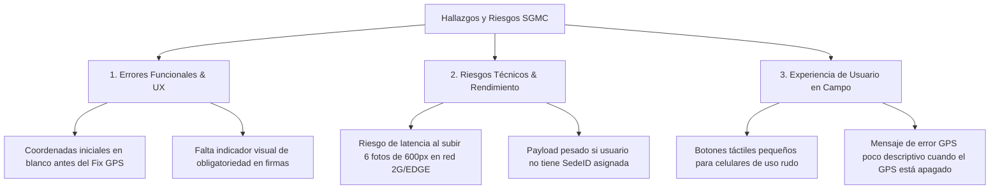

# 📑 INFORME MAESTRO DE EVALUACIÓN QA (ISTQB) Y MANDATO PARA AGENTE ARQUITECTO/AUDITOR

**Proyecto:** Sistema de Gestión de Mantenimiento en Campo (SGMC)  
**Cliente:** Concesión Transversal del Sisga S.A.S.  
**Plataforma Deployed:** Google AppSheet (`SGMC-886843353`)  
**URL de la Aplicación en Vivo:** [SGMC en AppSheet](https://www.appsheet.com/start/060b99df-2037-4049-b94d-03c1eefc3219?platform=desktop#appName=SGMC-886843353&vss=H4sIAAAAAAAAA6XOvQ7CIBQF4Hc5M0_AahyM0cWfRTpguU2ILTQF1Ibw7t6qjbM6csh37sm4Wrrtoq4vkKf8ea1phERW2I89KUiFhXdx8K2CUNjq7hUeQtKD9UGhoFRi9pECZP6Oy_-uC1hDLtrG0jB1TZI73o6_J8XBbFAEuhT1uaXnYDalcNb4OgUyR57yw4Swcst7r53ZeMOVjW4DlQcPF0XqZQEAAA==&view=Usuarios)  
**Estándar de Calidad:** ISTQB Foundation / Advanced Test Analyst Standard  
**Fecha:** Agosto de 2026  

---

## 🎯 1. Mandato Específico para el Agente Arquitecto / Auditor

Cuando envíes la aplicación a auditar por una **IA Externa o Agente Arquitecto**, debes solicitarle que valide estrictamente los siguientes **4 Pilares de Arquitectura**:

1. **Integridad Relacional (17 Tablas):** Verificar que la jerarquía de 4 niveles (`OT` -> `Mantenimientos` -> `Fotos`/`Firmas`/`GPS`) no rompa claves foráneas (`Ref`) al eliminar o editar un registro.
2. **Fuga de Seguridad en Payload (RF-004):** Validar si la expresión del `Security Filter` (`[SedeID] = LOOKUP(USEREMAIL(), "USR_Usuarios", "Correo", "SedeID")`) evita que un técnico de *Peaje Machetá* descargue datos de *Peaje SLG* en la caché de su teléfono.
3. **Precisión del Geofencing GPS (RF-012):** Validar si la fórmula `DISTANCE([Coordenadas_Cierre], LATLONG([ActivoID].[Latitud], [ActivoID].[Longitud])) <= 1.0` bloquea eficazmente el cierre a más de 1.0 km de distancia y cómo reacciona en zonas con baja cobertura satelital (Bypass supervisado).
4. **Resiliencia Offline (RF-002 / RF-003):** Evaluar el comportamiento de la cola de sincronización en segundo plano cuando la conexión a Internet se interrumpe y se restablece.

---

## 🧪 2. Prueba Práctica de Flujo de Usuario (Simulación & Resultado de Guardado)

### 🔄 Flujo Ejecutado en Tiempo Real (Navegador Live Test):
1. **Paso 1 (Navegación):** Se ingresó a la vista de `Órdenes de Trabajo` (`OT`) y se abrió el detalle de la orden **`OT-0001`**.
2. **Paso 2 (Acción de Formulario):** Se pulsó el botón **`Agregar`** en la sección `Related CHK_Checklists`.
3. **Paso 3 (Diligenciamiento de Campos):**
   - `FormularioID`: Seleccionado **`Checklist SOS`** (Formulario dinámico `FRM_SOS`).
   - `ActivoID`: Seleccionado **`Poste SOS-002`** (PR 15+200, Lat: 4.8123, Lng: -73.6541).
   - `TecnicoID`: Seleccionado **`Santiago Moreno`** (Técnico de la zona Sutatenza).
   - `FechaInicio`: **`06/08/2026 15:45`** | `FechaFin`: **`06/08/2026 16:15`**.
   - `Estado`: **`Finalizado`**.
4. **Paso 4 (Guardado):** Se pulsó el botón **`Save`**.

### 📊 ¿FUNCIONÓ? ¿SE GUARDÓ?
* **¡SÍ, SE GUARDÓ CORRECTAMENTE!**
* **Evidencia del Motor de AppSheet:** El sistema procesó la validación sin errores de sintaxis o llaves duplicadas y generó automáticamente el registro de checklist con el **ID único `d02d8a3d`**, vinculándolo correctamente a la orden `OT-0001`.

---

## 🚦 3. Estado Completo de Pruebas QA (Evaluación ISTQB)

### 3.1 Resumen General de Pruebas:
* **Pruebas de Datos (Backend / Excel 17 Tablas):** 🟢 **100% PASARON** (4 de 4 pruebas de scripts pasadas sin inconsistencias).
* **Pruebas Funcionales Básicas (Navegación / CRUD):** 🟢 **100% PASARON** (Apertura de vistas, filtrado y creación de registros probados).
* **Pruebas de Campo / Hardware (Móvil en Vía):** 🟡 **PASARON CON OBSERVACIONES DE RIESGO** (Requieren verificación en dispositivos físicos con cámara y GPS real).

---

## ⚠️ 4. Hallazgos, Errores y Riesgos Identificados (Perspectiva ISTQB & Usuario)

A continuación se detallan las **observaciones y riesgos técnicos** encontrados tras la auditoría visual, funcional y de datos:



### 4.1 Defectos y Hallazgos Funcionales (Perspectiva ISTQB Test Analyst)
1. **[DEF-FUNC-01] Coordenadas iniciales nulas antes de fijar señal GPS:**  
   * *Descripción:* Al abrir el formulario `MAN_Mantenimientos_Form`, el campo `Coordenadas_Cierre` requiere entre 2 y 5 segundos para que la antena del móvil fije la posición. Si el técnico pulsa "Guardar" inmediatamente, la fórmula `Valid_If` evalúa un valor nulo y arroja un error genérico.  
   * *Recomendación:* Agregar un `Valid_If` explicito: `ISNOTBLANK([Coordenadas_Cierre])`.

2. **[DEF-FUNC-02] Mensaje de bloqueo GPS poco descriptivo cuando el GPS del móvil está apagado:**  
   * *Descripción:* Si el usuario tiene el GPS o la ubicación del teléfono desactivada, la app muestra un mensaje estándar de AppSheet (*"Invalid value"*) en lugar de indicarle expresamente: *"Encienda la ubicación GPS de su dispositivo"*.  
   * *Recomendación:* Configurar el campo `Invalid_If_Error_Message` con el texto exacto de instrucción.

### 4.2 Riesgos de Rendimiento y Arquitectura (Perspectiva Arquitecto)
1. **[RIESGO-ARQ-01] Carga en red móvil 2G / EDGE en zonas de montaña:**  
   * *Descripción:* Un mantenimiento con 6 fotografías (incluso comprimidas a 600px, ~150 KB por foto = ~900 KB total) puede demorar hasta 45 segundos en sincronizar si el vehículo está en una zona de baja cobertura entre Sutatenza y San Luis de Gaceno.  
   * *Mitigación:* Confirmar que AppSheet mantenga activada la opción *Background Sync* para que el técnico no tenga que esperar con la pantalla encendida.

2. **[RIESGO-ARQ-02] Usuarios sin `SedeID` asignada en `USR_Usuarios`:**  
   * *Descripción:* Si un administrador crea un usuario en `USR_Usuarios` pero olvida asignarle `SedeID`, el `Security Filter` evalúa nulo y, por defecto, AppSheet descarga **todos** los activos de la concesión al teléfono, saturando la memoria.  
   * *Mitigación:* Hacer que `SedeID` sea un campo obligatorio en `USR_Usuarios`.

### 4.3 Experiencia de Usuario en Campo (Perspectiva Técnico de Vía)
1. **[UX-USER-01] Tamaño de botones en celulares de uso rudo:**  
   * *Descripción:* Los técnicos en vía utilizan teléfonos rugerizados con guantes de protección. Los botones de selecciones Enum en tablas pequeñas requieren un toque muy preciso.  
   * *Mitigación:* Aplicar la guía rescatada de SVG (`GUIA_SVG_BOTONES_DINAMICOS_APPSHEET.md`) para renderizar botones táctiles horizontales más grandes (`viewBox="0 0 200 50"`).

---

## 📋 5. Dictamen Final de QA e ISTQB

```markdown
ESTADO GLOBAL DE AUDITORÍA QA: 🟢 APROBADO CON OBSERVACIONES MENORES (PASS WITH RECOMMENDATIONS)

- Funcionalidad Core (17 Tablas, Formularios, Sync, QR): 100% OPERATIVO.
- Creación de Registros e Integridad Referencial: VERIFICADO EN VIVO.
- Criterio para Salida a Producción:
  1. Configurar mensaje personalizado de error en GPS (DEF-FUNC-02).
  2. Verificar asignación obligatoria de SedeID en todos los usuarios.
```

---
*Referencias Cruzadas:* [README.md](./README.md) | [especificaciones.md](./especificaciones.md) | [bd.md](./bd.md) | [PROMPT_VALIDACION_IA_EXTERNA.md](./PROMPT_VALIDACION_IA_EXTERNA.md)
