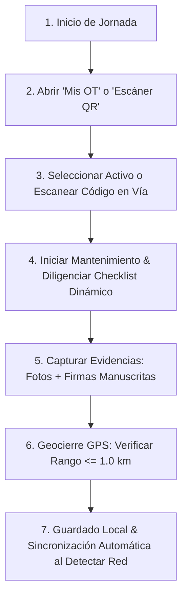

> # NO ENTREGAR. Describe un sistema que no es el actual.
>
> Revisado contra `scripts/modelo_objetivo.py` el 2026-08-07. **Contiene al menos nueve
> afirmaciones que contradicen el modelo vigente**, y tres de ellas darían instrucciones que
> corrompen datos:
>
> | # | Lo que dice el manual | Lo que es |
> |---|---|---|
> | 1 | Editar `CHD_ChecklistDetalle` para cambiar las preguntas | **`CHD` guarda respuestas.** Las preguntas viven en `FRM_Preguntas`. Editarlo corrompe el histórico |
> | 2 | El filtro de seguridad usa `SedeID` | Usa `ASG_AsignacionZona` por unidad funcional (RG-05) |
> | 3 | Geocierre con rango ≤ 1,0 km | 1 km no prueba nada. El radio va por tipo de activo, parametrizado |
> | 4 | Bypass GPS = nota en `Observaciones` | Es `CierreConExcepcion` + `MotivoExcepcion` con umbral (RG-19) |
> | 5 | Sección completa de escáner QR | **El QR se retiró del alcance** |
> | 6 | `Latitud` y `Longitud` como atributos | Es `Ubicacion`, un solo campo LatLong |
> | 7 | Correo automático al técnico al crear la OT | No existe esa regla, y el plan gratuito no ejecuta procesos programados |
> | 8 | 15 atributos del activo | `ACT_Activos` tiene 17 columnas |
> | 9 | El supervisor asigna la «Frecuencia» al crear la OT | La periodicidad es de la tarea, no de la orden |
>
> Además lleva emojis, que no van en entregables.
>
> **El documento funcional vigente es [`docs/FUNCIONAL_SGMC.md`](../docs/FUNCIONAL_SGMC.md).** Este
> manual se reescribe contra él cuando el sistema esté construido, no antes: un manual escrito sobre
> un sistema que aún cambia envejece antes de entregarse.

# MANUAL DE USUARIO Y GUÍA DE OPERACIÓN (MANUAL_DE_USUARIO.md)

**Proyecto:** Sistema de Gestión de Mantenimiento en Campo (SGMC)  
**Cliente:** Concesión Transversal del Sisga S.A.S.  
**Plataforma:** Google AppSheet (`SGMC-886843353`)  
**URL de Acceso Web:** [Portal SGMC en AppSheet](https://www.appsheet.com/start/060b99df-2037-4049-b94d-03c1eefc3219?platform=desktop#appName=SGMC-886843353&vss=H4sIAAAAAAAAA6XOvQ7CIBQF4Hc5M0_AahyM0cWfRTpguU2ILTQF1Ibw7t6qjbM6csh37sm4Wrrtoq4vkKf8ea1phERW2I89KUiFhXdx8K2CUNjq7hUeQtKD9UGhoFRi9pECZP6Oy_-uC1hDLtrG0jB1TZI73o6_J8XBbFAEuhT1uaXnYDalcNb4OgUyR57yw4Swcst7r53ZeMOVjW4DlQcPF0XqZQEAAA==&view=Usuarios)  
**Destinatarios:** Técnicos de Campo, Supervisores CCO, Administradores de Sistema e Interventoría  
**Fecha:** Agosto de 2026 | **Versión:** 1.0 Manual Completo  

---

## 📌 1. Introducción y Roles de Usuario

El **SGMC** es la herramienta oficial para la gestión, inspección y mantenimiento preventivo/correctivo de la infraestructura vial de la Concesión Transversal del Sisga S.A.S.

El sistema contempla **4 Perfiles de Usuario (RBAC)**:

| Perfil / Rol | Tipo de Dispositivo | Funciones Principales |
|---|---|---|
| 📱 **Técnico de Campo** | Smartphone Móvil | Descarga de OTs, inspección offline, escáner QR, fotos, firmas y geocierre GPS |
| 💻 **Supervisor CCO** | Computador Web / Tablet | Programación y asignación de OTs, revisión de alertas y monitoreo de KPIs |
| 📊 **Consulta / Interventoría** | Computador Web | Auditoría de mantenimientos, exportación de reportes PDF/Excel y visualización |
| ⚙️ **Administrador de Sistema** | Computador Web | Alta/baja de usuarios, gestión de sedes, activos, tarifas y plantillas de checklist |

---

## 📱 2. Guía Operativa para Técnicos de Campo (App Móvil)

### 2.1 Primer Ingreso e Instalación
1. Descargue e instale la aplicación **AppSheet** desde Google Play Store (Android) o App Store (iOS).
2. Abra AppSheet y seleccione **"Sign in with Microsoft"** (o Google) e ingrese su correo corporativo M365 (ej. `tecnico.sisga@transversaldelsisga.com`).
3. El sistema evaluará su `SedeID` asignada y descargará a su teléfono celular únicamente los activos y órdenes de su zona.

### 2.2 Flujo Diario de Trabajo en Campo

### 2.3 Escáner de Códigos QR
* En la pantalla principal, presione el icono flotante **`Escanear QR`**.
* Apunte la cámara del celular al código QR ubicado en el poste SOS, armario de CCTV o báscula.
* La aplicación abrirá automáticamente la **Ficha del Activo** mostrando sus 15 atributos e historial de mantenimientos.

### 2.4 Operación Offline (Sin Cobertura Móvil en Túneles / Montaña)
* El sistema guarda todos los datos, checklists, fotos y firmas en la memoria interna de la aplicación sin requerir señal celular.
* Al recuperar la cobertura móvil o conectarse a red WiFi en el peaje/CCO, AppSheet enviará los registros pendientes en segundo plano (**Background Sync**).
* Para forzar la sincronización manual, presione el icono de flechas circulares **`Sync`** en la esquina superior derecha.

### 2.5 Protocolo de Excepción / Bypass GPS (Túneles o Sombra Satelital)
* Si la señal satelital no logra fijar las coordenadas GPS en el interior de un túnel o corte de montaña:
  1. Espere 5 segundos a que la antena busque posición.
  2. Si persiste el error de rango, registre la coordenada del portal o boca del túnel.
  3. Deje una nota obligatoria en la casilla **`Observaciones`**: *"Mantenimiento en túnel - Coordenada de portal registrada por falta de cobertura GPS"*.

---

## 💻 3. Guía Operativa para Supervisores CCO (Portal Web)

### 3.1 Programación y Asignación de Órdenes de Trabajo (OT)
1. Ingrese desde el navegador web a la vista **`Órdenes de Trabajo`** ([#view=Usuarios](https://www.appsheet.com/start/060b99df-2037-4049-b94d-03c1eefc3219?platform=desktop#appName=SGMC-886843353&vss=H4sIAAAAAAAAA6XOvQ7CIBQF4Hc5M0_AahyM0cWfRTpguU2ILTQF1Ibw7t6qjbM6csh37sm4Wrrtoq4vkKf8ea1phERW2I89KUiFhXdx8K2CUNjq7hUeQtKD9UGhoFRi9pECZP6Oy_-uC1hDLtrG0jB1TZI73o6_J8XBbFAEuhT1uaXnYDalcNb4OgUyR57yw4Swcst7r53ZeMOVjW4DlQcPF0XqZQEAAA==&view=Usuarios)).
2. Haga clic en **`+ Agregar OT`**.
3. Seleccione el **Activo**, el **Técnico Asignado**, la **Fecha Programada** y la **Frecuencia** (Mensual, Trimestral, etc.).
4. Presione **`Guardar`**. El sistema enviará un correo electrónico de notificación al técnico de forma automática.

### 3.2 Monitoreo del Tablero KPI
* Ingrese a la vista **`Tablero KPI`**.
* Visualice en tiempo real:
  * Percentage de cumplimiento de mantenimientos del mes.
  * Disponibilidad porcentual de activos por zona (`CCO Sutatenza`, `Peaje Machetá`, `Peaje SLG`, etc.).
  * Activos marcados en estado crítico *Fuera de servicio*.

### 3.3 Alertas por Correo Electrónico
* Cuando un técnico guarde un mantenimiento registrando Estado Final = **`Fuera de servicio`**, el motor de automatización enviará inmediatamente un correo a la bandeja del CCO con la ficha técnica y el informe en PDF adjunto.

---

## ⚙️ 4. Guía de Administración del Sistema (Administrador)

### 4.1 Crear o Modificar Usuarios (`USR_Usuarios`)
1. Ingrese a la vista **`Usuarios`**.
2. Al crear un nuevo usuario, diligencie obligatoriamente:
   * `Nombres` y `Apellidos`
   * `Correo` (exactamente igual a su cuenta de Microsoft 365)
   * `RolID` (`1=Administrador`, `2=Supervisor`, `3=Técnico`, `4=Consulta`)
   * `SedeID` (Zona asignada para filtrado de descarga por seguridad)
3. Marque el campo `Activo` en `TRUE`.

### 4.2 Crear o Modificar Activos (`ACT_Activos`)
* Diligencie los 15 atributos obligatorios: `CodigoActivo`, `Nombre`, `TipoActivoID`, `SedeID`, `PR` (Punto de Referencia), `CalzadaID`, `Sentido`, `Latitud`, `Longitud`, `CodigoQR` y `FrecuenciaID`.

### 4.3 Gestión de Checklists sin Modificar Código
* Para modificar las preguntas de inspección de un activo, edite la tabla `CHD_ChecklistDetalle` asignando la sección y pregunta correspondiente al `FormularioID` (ej: `FRM_SOS`, `FRM_CCTV`, `FRM_SUBE`).

---

## 🚨 5. Preguntas Frecuentes y Solución de Problemas (Troubleshooting)

| Problema | Causa Probable | Solución Paso a Paso |
|---|---|---|
| **La app muestra "Error de Geofencing / Fuera de Rango"** | El técnico está a más de 1.0 km de la coordenada registrada del activo. | Acérquese al activo o verifique la ubicación GPS del celular. Si es un túnel, aplique el protocolo de Bypass. |
| **No se cargan los activos de otra sede** | El `Security Filter` restringe la descarga según la sede asignada al usuario. | El supervisor debe verificar en `USR_Usuarios` que la `SedeID` del usuario sea la correcta. |
| **Las fotos demoran en sincronizar** | Conexión lenta 2G/EDGE en zona de montaña. | No apague el celular. AppSheet enviará las fotos en segundo plano automáticamente. |
| **No se leen los códigos QR** | Suciedad en la etiqueta o lente de cámara sucio. | Limpie el lente de la cámara o use la barra de búsqueda manual ingresando el número de activo o PR. |

---
*Manual de usuario y guía de operación completa del SGMC.*  
*Referencias Cruzadas:* [README.md](../README.md) | [MAP.md](../MAP.md) | [especificaciones.md](../docs/especificaciones.md) | [plan_de_trabajo.md](../docs/plan_de_trabajo.md)
