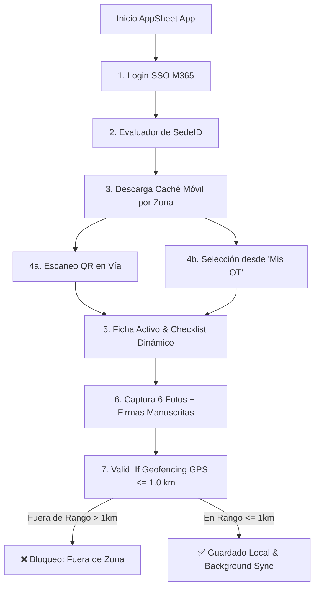

# 📱 MANUAL DE USUARIO ILUSTRADO Y GUÍA DE OPERACIÓN (SGMC)

**Proyecto:** Sistema de Gestión de Mantenimiento en Campo (SGMC)  
**Cliente:** Concesión Transversal del Sisga S.A.S.  
**Plataforma:** Google AppSheet (`SGMC-886843353`)  
**Versión Inicial para Validación Funcional:** Versión 1.0 Ilustrada  
**Enlace a la Aplicación:** [SGMC en AppSheet](https://www.appsheet.com/start/060b99df-2037-4049-b94d-03c1eefc3219?platform=desktop#appName=SGMC-886843353&vss=H4sIAAAAAAAAA6XOvQ7CIBQF4Hc5M0_AahyM0cWfRTpguU2ILTQF1Ibw7t6qjbM6csh37sm4Wrrtoq4vkKf8ea1phERW2I89KUiFhXdx8K2CUNjq7hUeQtKD9UGhoFRi9pECZP6Oy_-uC1hDLtrG0jB1TZI73o6_J8XBbFAEuhT1uaXnYDalcNb4OgUyR57yw4Swcst7r53ZeMOVjW4DlQcPF0XqZQEAAA==&view=Usuarios)  
**Fecha:** Agosto de 2026  

---

## 📌 1. Visión General del Sistema y Diagrama de Navegación

El **SGMC** permite digitalizar las inspecciones viales en campo, soportando la operación sin conexión a Internet (100% Offline) y sincronización con Microsoft 365.



---

## 📱 2. Guía Ilustrada para Técnicos de Campo

### 2.1 Pantalla 1: Inicio de Sesión M365 y Caché por Zona
1. Abra la app AppSheet y seleccione **"Sign in with Microsoft"**.
2. Ingrese su correo corporativo (ej: `santiago.moreno@transversaldelsisga.com`).
3. El sistema descargará únicamente las OTs y activos pertenecientes a su sede (`Sutatenza`, `Peaje Machetá`, `Peaje SLG`, etc.).

```
+-------------------------------------------------------------+
|                     [ APPSHEET LOGIN ]                      |
|                                                             |
|           Concesión Transversal del Sisga S.A.S.             |
|                                                             |
|       [ 🟦 Sign in with Microsoft (M365 Corporativo) ]      |
|                                                             |
| Status: Descargando activos de Sede Sutatenza (Caché Local) |
+-------------------------------------------------------------+
```

---

### 2.2 Pantalla 2: Ficha del Activo y Escáner QR
* En la barra de navegación inferior, presione el botón flotante **`Escanear QR`**.
* Apunte al código QR pegado en el poste SOS, CCTV o Báscula.
* La aplicación desplegará la **Ficha del Activo** con sus 15 atributos e historial.

```
+-------------------------------------------------------------+
|                     [ FICHA DEL ACTIVO ]                    |
|                                                             |
| 📌 Código Activo: SOS-002                                    |
| 📝 Nombre: Poste SOS PR 15+200                              |
| 📍 Ubicación: Sutatenza - Calzada Principal                 |
| 🌐 Coordenadas: Lat 4.8123, Lng -73.6541                    |
| 🏷️ Código QR: QR-SOS-002-SUT (Validado)                     |
|                                                             |
|           [ 🟢 BOTÓN: INICIAR MANTENIMIENTO ]                |
+-------------------------------------------------------------+
```

---

### 2.3 Pantalla 3: Formulario Dinámico y Evidencias Fotográficas
* Al iniciar mantenimiento, la app cargará automáticamente el checklist asignado al tipo de activo (ej. `FRM_SOS` para postes SOS).
* Responda los ítems de inspección (`Conforme`, `No Conforme`, `No Aplica`).
* Adjunte **hasta 6 fotografías** de evidencia (la app aplicará compresión a 600px automáticamente).
* Dibuje su firma manuscrita digital en la pantalla táctil.

```
+-------------------------------------------------------------+
|               [ FORMULARIO DE INSPECCIÓN SOS ]               |
|                                                             |
| ☑️ Gabinete y Chasis:               [ Conforme  |  No Conf ]|
| ☑️ Batería y Panel Solar (12.8V):    [ Conforme  |  No Conf ]|
| ☑️ Botón de Intercomunicador:        [ Conforme  |  No Conf ]|
|                                                             |
| 📷 Evidencias Fotográficas (3 / 6 imágenes adjuntas):       |
|    [ Foto_1.jpg (600px) ]  [ Foto_2.jpg (600px) ]           |
|                                                             |
| ✒️ Firma del Técnico:                                        |
|    [ Lienzo Digital: Firma Manuscrita Registrada ]          |
|                                                             |
|                      [ BOTÓN: GUARDAR ]                     |
+-------------------------------------------------------------+
```

---

### 2.4 Pantalla 4: Validaciones GPS y Protocolo de Bypass en Túneles
* Al presionar Guardar, el sistema tomará la posición GPS y evaluará:
  ```excel
  DISTANCE([Coordenadas_Cierre], LATLONG([ActivoID].[Latitud], [ActivoID].[Longitud])) <= 1.0
  ```

```
+-------------------------------------------------------------+
|                [ VALIDACIÓN GEOFENCING GPS ]                |
|                                                             |
| 🌐 Ubicación Capturada: Lat 4.8124, Lng -73.6542            |
| 🎯 Ubicación del Activo: Lat 4.8123, Lng -73.6541           |
| 📏 Distancia Calculada: 0.02 km (Rango Válido <= 1.0 km)    |
| 📡 Precisión Satelital: USERLOCATIONACCURACY() = 4.2 metros |
|                                                             |
| Status: ✅ Guardado en Cola Local & Background Sync Activo  |
+-------------------------------------------------------------+
```

> **⚠️ PROTOCOLO DE BYPASS EN TÚNELES:**  
> Si se encuentra dentro de un túnel sin cobertura satelital, capture las coordenadas del portal de entrada e ingrese en Observaciones:  
> *"Mantenimiento en túnel - Coordenada de portal registrada por falta de cobertura GPS"*.

---

## 💻 3. Guía Ilustrada para Supervisores CCO (Portal Web)

### 3.1 Portal de Asignación de Órdenes de Trabajo (`OT`)
1. Ingrese desde su navegador web al portal SGMC ([#view=Usuarios](https://www.appsheet.com/start/060b99df-2037-4049-b94d-03c1eefc3219?platform=desktop#appName=SGMC-886843353&vss=H4sIAAAAAAAAA6XOvQ7CIBQF4Hc5M0_AahyM0cWfRTpguU2ILTQF1Ibw7t6qjbM6csh37sm4Wrrtoq4vkKf8ea1phERW2I89KUiFhXdx8K2CUNjq7hUeQtKD9UGhoFRi9pECZP6Oy_-uC1hDLtrG0jB1TZI73o6_J8XBbFAEuhT1uaXnYDalcNb4OgUyR57yw4Swcst7r53ZeMOVjW4DlQcPF0XqZQEAAA==&view=Usuarios)).
2. Programe la OT seleccionando Activo, Técnico y Fecha.
3. El motor de automatización enviará un email inmediato al técnico.

```
+-------------------------------------------------------------+
|                 [ PORTAL WEB SUPERVISOR CCO ]               |
|                                                             |
| OTID     | Activo      | Técnico         | Fecha      | St  |
| ---------|-------------|-----------------|------------|-----|
| OT-0001  | SOS-002     | Santiago Moreno | 06/08/2026 | Fin |
| OT-0002  | CCTV-014    | Carlos Gómez    | 07/08/2026 | Pnd |
|                                                             |
|                [ + CREAR NUEVA OT DE TRABAJO ]              |
+-------------------------------------------------------------+
```

---

## 📄 Documentos Generados para Entrega
* 📝 **`Manual_de_Usuario_SGMC_Con_Diagramas.docx`** (Documento ejecutable en Word listo para enviar al Líder Funcional).
* 📱 **`MANUAL_DE_USUARIO_ILUSTRADO.md`** (Manual en línea con diagramas y maqueta visual de pantallas).

---
*Referencias Cruzadas:* [README.md](../README.md) | [MAP.md](../MAP.md) | [plan_de_trabajo.md](../docs/plan_de_trabajo.md) | [especificaciones.md](../docs/especificaciones.md)
