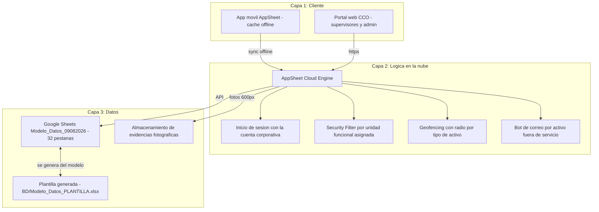
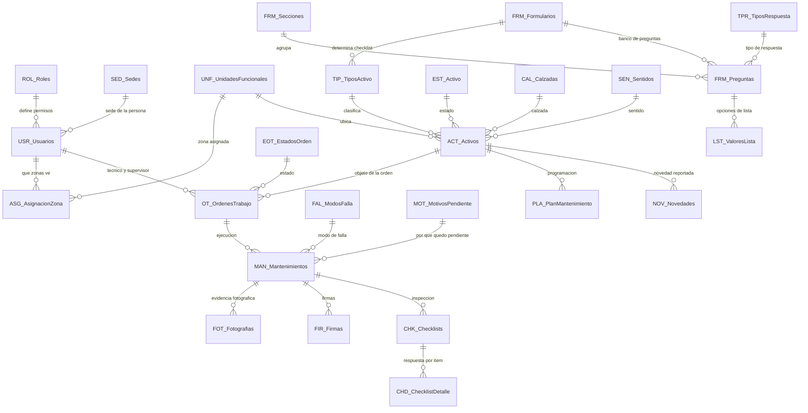

# SGMC — Sistema de Gestión de Mantenimiento en Campo

Aplicación de campo para la inspección y el mantenimiento de la infraestructura tecnológica,
eléctrica y de TI del corredor vial de la **Concesión Transversal del Sisga S.A.S.**

> ## El estado vive en [`ESTADO.md`](ESTADO.md)
>
> **Léalo primero.** Este README explica qué es el sistema y cómo está organizado el repositorio;
> `ESTADO.md` dice en qué punto está hoy, qué falta y quién lo bloquea. Si los dos discrepan, manda
> `ESTADO.md`.
>
> En una frase, a 2026-08-09: **la aplicación está reconstruida y cableada; faltan cuatro ajustes,
> probarla y cargar las coordenadas reales antes de que salga a campo.**

Construida sobre **Google AppSheet** con backend en **Google Sheets**. Sin servidores propios,
sin compilación de APK, sin Play Console: los técnicos instalan la app de AppSheet e inician
sesión con su cuenta corporativa.

**La aplicación vigente es `SISGA`.** La anterior, `SGMC-886843353`, se abandonó el 2026-08-09: su
esquema divergía demasiado y el *Regenerate* de AppSheet fusiona en vez de reemplazar. El porqué
está en [`BASE_CONOCIMIENTO_APPSHEET.md`](docs/BASE_CONOCIMIENTO_APPSHEET.md) §11 y §12.

---

## 1. El problema que resuelve

El mantenimiento del corredor se registraba en papel y hojas sueltas. Eso produce cuatro
problemas que el SGMC ataca directamente:

| Problema | Cómo lo resuelve el SGMC |
|---|---|
| No hay evidencia verificable de que el técnico estuvo en el activo | Geofencing GPS: el cierre solo se permite dentro del radio definido para ese tipo de activo, con registro de precisión satelital y las columnas de captura no editables |
| Buena parte del corredor no tiene señal celular (montaña, túneles) | Operación offline nativa: se diligencia sin red y sincroniza al recuperar conexión |
| Cada tipo de activo requiere una inspección distinta | Checklist dinámico: la app abre el formulario que corresponde al tipo del activo |
| El CCO se entera tarde de una falla | Bot de automatización: correo con informe cuando un activo queda fuera de servicio |

**Para qué existe, en una línea:** garantizar que el mantenimiento se hizo, que quien lo hizo estuvo
físicamente frente al equipo, y que la evidencia que lo respalda es difícil de falsificar.

## 2. Qué gestiona

La plantilla de datos, [`BD/Modelo_Datos_PLANTILLA.xlsx`](BD/Modelo_Datos_PLANTILLA.xlsx), tiene
**389 activos** repartidos así:

- **34 activos de fixture** sobre 18 tipos, tres de cada tipo. Son los que traían las seis órdenes
  de trabajo existentes y se conservan intactos.
- **355 activos sintéticos** con los códigos del Plan Maestro repartidos sobre los 137 km del
  corredor. Cada fila lo dice en `Observaciones`: son de prueba, no son inventario real.

**En la operación real hay 355 activos contables sobre 24 tipos**, confirmados por operación el
2026-08-07 desde el Plan Maestro. La aritmética y el desglose están en
[`CONTEXTO_OPERACION.md`](docs/CONTEXTO_OPERACION.md).
**Tenemos el censo, no el registro**: sabemos cuántos postes SOS hay, no cuál es cada uno ni dónde
está.

Los 18 tipos del archivo, en cuatro categorías:

- **ITS** — Postes SOS, CCTV, paneles de mensaje variable fijo y móvil (PMVF/PMVM), sensores
  meteorológicos y ambientales (SGM/SGE/SSA), básculas de pesaje
- **Eléctrico** — Generadores, UPS, subestaciones
- **Comunicaciones** — Fibra óptica
- **TI** — Servidores, NAS, switches, routers, firewalls, videowall

> **Ninguna coordenada es la real.** Los 34 de fixture comparten un punto en Bogotá y las 355
> sintéticas se generaron sobre el trazado. Cargar las reales es el bloqueante D-01 para salir a
> campo.

## 3. Actores

| Rol | Dónde trabaja | Qué hace |
|---|---|---|
| **Técnico** | App móvil, mayoritariamente offline | Recibe la orden, diligencia el checklist, toma fotos, firma y la deja en revisión |
| **Supervisor** | Portal web | Programa y asigna órdenes, revisa evidencias, aprueba, cierra y consulta el tablero |
| **Administrador** | Portal web | Gestiona usuarios, catálogos, activos y plantillas de inspección |
| **Consulta** | Portal web | Solo lectura y reportes |

El activo **se abre por lista, no por escaneo**: el código QR quedó fuera de alcance por decisión
del 2026-08-07.

## 4. Cómo funciona



**Ciclo del técnico:** iniciar sesión y sincronizar, abrir sus órdenes, elegir la del día, responder
el checklist del tipo de activo, adjuntar fotografías, firmar y cerrar en sitio validando la
posición. La orden queda **En revisión**, no cerrada: quien hace el trabajo no certifica que se
hizo. Si no hay red, todo queda en cola local y sube solo al recuperar señal.

**Ciclo del supervisor:** programar la orden en el portal, asignarla a un técnico, revisar la
evidencia sincronizada, aprobarla y cerrarla.

## 5. Modelo de datos

La fuente única es **[`scripts/modelo_objetivo.py`](scripts/modelo_objetivo.py)**: de ahí se generan
la validación, el diccionario, el manual de despliegue y la plantilla de datos. **Nada se documenta
a mano.**

**28 tablas · 202 columnas · 38 referencias · 20 reglas.**

| Documento | Qué describe |
|---|---|
| [`docs/ARQUITECTURA_OBJETIVO_SGMC.md`](docs/ARQUITECTURA_OBJETIVO_SGMC.md) | El sistema que se construye. Generado del modelo |
| [`docs/bd.md`](docs/bd.md) | Lo que la hoja tiene hoy, columna a columna. Generado del `.xlsx` |



### Las 28 tablas, por grupo

| Grupo | Cuántas | Tablas |
|---|---|---|
| **Catálogos** | 14 | `SED_Sedes`, `UNF_UnidadesFuncionales`, `ROL_Roles`, `USR_Usuarios`, `ASG_AsignacionZona`, `TIP_TiposActivo`, `EST_Activo`, `EOT_EstadosOrden`, `MOT_MotivosPendiente`, `PAR_Parametros`, `FRE_Frecuencias`, `CAL_Calzadas`, `SEN_Sentidos`, `FAL_ModosFalla` |
| **Maestra** | 1 | `ACT_Activos` |
| **Transaccionales** | 4 | `OT_OrdenesTrabajo`, `MAN_Mantenimientos`, `NOV_Novedades`, `PLA_PlanMantenimiento` |
| **Evidencias** | 2 | `FOT_Fotografias`, `FIR_Firmas` |
| **Checklist** | 2 | `CHK_Checklists`, `CHD_ChecklistDetalle` |
| **Motor de formularios** | 5 | `FRM_Formularios`, `FRM_Secciones`, `FRM_Preguntas`, `TPR_TiposRespuesta`, `LST_ValoresLista` |

La tabla `GPS` **se retiró**: la traza de posición vive en las columnas de captura de
`MAN_Mantenimientos`, no en una tabla aparte.

### Regla de geofencing

`ACT_Activos` guarda un único campo `Ubicacion` de tipo LatLong. No hay columnas `Latitud` y
`Longitud` separadas. El radio sale del tipo de activo, porque una subestación y un poste SOS no
admiten la misma tolerancia:

```
DISTANCE([Coordenadas_Cierre], [OTID].[ActivoID].[Ubicacion]) <= [OTID].[ActivoID].[TipoActivoID].[RadioGeofencingKm]
```

**Está cableada y puesta.** `TIP_TiposActivo.RadioGeofencingKm` ya no está vacía: 0,05 km en poste
SOS, cámara, sensores y equipos de TI; 0,1 km en paneles de mensaje variable, báscula, generador y
subestación; 1,5 km en el tramo de fibra, que es lineal. Y las cuatro columnas de captura llevan
`Editable_If = FALSE`, sin lo cual el técnico podría arrastrar el pin del mapa encima del activo.

**Lo que falta es la coordenada del activo**, no la regla.

## 6. Estado, hallazgos y bloqueantes

Todos en [`ESTADO.md`](ESTADO.md), que se actualiza; aquí no, para que no se contradigan.

| Si necesita | Lea |
|---|---|
| Qué está hecho y qué falta hoy | [`ESTADO.md`](ESTADO.md) |
| Qué le toca a usted según su rol | [`docs/INDICACIONES_POR_ROL.md`](docs/INDICACIONES_POR_ROL.md) |
| Qué hace el sistema, para quién y cómo | [`docs/FUNCIONAL_SGMC.md`](docs/FUNCIONAL_SGMC.md) |
| Cómo se construye o configura la app | [`docs/MANUAL_DESPLIEGUE.md`](docs/MANUAL_DESPLIEGUE.md) |
| Qué expresión va en cada sitio | [`docs/sdd/RECONSTRUCCION_EXPRESIONES.md`](docs/sdd/RECONSTRUCCION_EXPRESIONES.md) |
| Cómo se prueba que funciona | [`docs/sdd/PRUEBA-003-despliegue.md`](docs/sdd/PRUEBA-003-despliegue.md) |
| Por qué AppSheet se comporta así | [`docs/BASE_CONOCIMIENTO_APPSHEET.md`](docs/BASE_CONOCIMIENTO_APPSHEET.md) |
| Cómo se mantiene el corredor de verdad | [`docs/CONTEXTO_OPERACION.md`](docs/CONTEXTO_OPERACION.md) |
| Con qué supuestos se construye | [`docs/ALCANCE_Y_SUPUESTOS_SGMC.md`](docs/ALCANCE_Y_SUPUESTOS_SGMC.md) |

## 7. Método: nada se ejecuta contra producción sin las tres firmas

El método vigente es SDD, descrito en [`docs/SDD_PIPELINE_SGMC.md`](docs/SDD_PIPELINE_SGMC.md):
especificar, probar y aprobar antes de tocar producción. Los cinco agentes están en
`.claude/agents/`, y **`python scripts/validar_modelo.py` en 0 errores es el único gate objetivo**.

Los tres verificadores, que no se sustituyen entre sí:

| Script | Mide |
|---|---|
| [`scripts/validar_modelo.py`](scripts/validar_modelo.py) | El modelo consigo mismo |
| [`scripts/verificar_faseA.py`](scripts/verificar_faseA.py) | El modelo contra la hoja descargada |
| [`scripts/verificar_documentos.py`](scripts/verificar_documentos.py) | La prosa contra el modelo |

## 8. Organización del repositorio

```
ESTADO.md      Dónde vamos y qué falta. Se lee primero
README.md      Este archivo
CLAUDE.md      Reglas de trabajo para agentes
MAP.md         Índice maestro y referencias cruzadas

BD/            Hojas de datos. Modelo_Datos_PLANTILLA.xlsx es el entregable de datos
docs/          Documentación técnica y funcional
  historico/   Documentos retirados. No usar como fuente
  images/      Figuras de los documentos
  prompts/     Directivas para agentes
  sdd/         Artefactos del pipeline: ESPEC, PRUEBA, ORDEN y ACTA
Manuales/      Manual de usuario
entregables/   Word y Excel listos para enviar al cliente
scripts/       Fuente del modelo, validadores y generadores
contexto/      Material de contexto operativo. No es la vara
archivo/       Material de origen, no versionado
```

| Documento | Para qué sirve |
|---|---|
| [ESTADO.md](ESTADO.md) | **Empiece aquí.** Qué está hecho, qué falta, qué está bloqueado |
| [docs/INDICACIONES_POR_ROL.md](docs/INDICACIONES_POR_ROL.md) | Quién hace qué para que esto llegue a campo, con sus decisiones exclusivas y su costo |
| [docs/FUNCIONAL_SGMC.md](docs/FUNCIONAL_SGMC.md) | Qué hace el sistema. Su §6 es el registro de una sola forma por propósito |
| [docs/ARQUITECTURA_OBJETIVO_SGMC.md](docs/ARQUITECTURA_OBJETIVO_SGMC.md) | Modelo objetivo, generado desde `scripts/modelo_objetivo.py` y validado |
| [docs/bd.md](docs/bd.md) | Diccionario As-Built, generado del archivo |
| [docs/MANUAL_DESPLIEGUE.md](docs/MANUAL_DESPLIEGUE.md) | De cero a app desplegada, con la ficha de las 28 tablas columna por columna |
| [docs/MIGRACION_HOJA_LIMPIA.md](docs/MIGRACION_HOJA_LIMPIA.md) | El coste de migrar a la hoja limpia, para poder decidirlo |
| [docs/GUIA_IMPLEMENTACION_FUNCIONAL.md](docs/GUIA_IMPLEMENTACION_FUNCIONAL.md) | La implementación vista desde la operación |
| [docs/MODELO_EVOLUCION_FASE_2.md](docs/MODELO_EVOLUCION_FASE_2.md) | Lo que viene después del piloto |
| [docs/BASE_CONOCIMIENTO_APPSHEET.md](docs/BASE_CONOCIMIENTO_APPSHEET.md) | Cómo se comporta AppSheet, con cita textual y URL oficial |
| [docs/SDD_PIPELINE_SGMC.md](docs/SDD_PIPELINE_SGMC.md) | El método: cinco agentes, dos fases y el gate |
| [docs/ALCANCE_Y_SUPUESTOS_SGMC.md](docs/ALCANCE_Y_SUPUESTOS_SGMC.md) | Alcance del sistema y los 14 supuestos adoptados |
| [docs/CONTEXTO_OPERACION.md](docs/CONTEXTO_OPERACION.md) | Cómo se mantiene el corredor, y la procedencia de cada documento de contexto |
| [docs/COMUNICACION_PROPIETARIO_APP.md](docs/COMUNICACION_PROPIETARIO_APP.md) | Qué decirle al dueño de la aplicación anterior |
| [docs/ROADMAP.md](docs/ROADMAP.md) | Fases con criterio de cierre verificable |
| [docs/prompts/PROMPT_CONTINUAR_DESPLIEGUE.md](docs/prompts/PROMPT_CONTINUAR_DESPLIEGUE.md) | Lo que falta para el agente que está en el editor |
| [docs/sdd/](docs/sdd/) | Especificaciones, pruebas y actas del pipeline |
| [docs/historico/](docs/historico/) | **Documentos retirados.** Describen estados superados; seguirlos induce a deshacer trabajo correcto |
| [Manuales/MANUAL_DE_USUARIO.md](Manuales/MANUAL_DE_USUARIO.md) | Guía de operación por rol. **No se entrega todavía**: describe funciones que aún no están montadas, y lo dice en su cabecera |
| [MAP.md](MAP.md) | Índice maestro y referencias cruzadas |
| [CLAUDE.md](CLAUDE.md) | Reglas de trabajo para agentes sobre este repositorio |

**Entregables al cliente**

| Archivo | Estado |
|---|---|
| [`BD/Modelo_Datos_PLANTILLA.xlsx`](BD/Modelo_Datos_PLANTILLA.xlsx) | **El entregable de datos.** Generado del modelo: 28 pestañas, 202 columnas, ninguna de sobra |
| `entregables/Propuesta_Arquitectura_SGMC.docx` | Enviado a Dirección y al funcional. Describe el alcance anterior al QR retirado |
| `entregables/Definicion_Funcional_SGMC_Mesa_de_Trabajo.docx` | Enviado. 14 decisiones con propuesta marcada, hoy adoptadas como supuestos |
| `entregables/CORREO_ENVIO_MESA_DE_TRABAJO.md` | Texto del correo de envío |
| `entregables/Especificaciones_Tecnicas_SGMC_AsBuilt.docx` | v2.0. **Desactualizado**: describe el modelo de 24 tablas anterior a la reconstrucción |
| `entregables/Modelo_Datos_SGMC_AsBuilt.xlsx` | Copia publicada del maestro anterior. Sustituida por la plantilla |

## 9. Enlaces

- Aplicación AppSheet `SISGA`: [abrir](https://www.appsheet.com/template/appdef?appId=9e947fce-c445-4477-af20-a6c6c984bd1e)
- Backend Google Sheets `Modelo_Datos_09082026`, 32 pestañas, propiedad de la Concesión:
  [abrir](https://docs.google.com/spreadsheets/d/1LGabjn1iNDKiJNP7CUD4_LwCH2BGXC8oTBfXmuuAkFs)
- Repositorio: [github.com/dieleoz/SGMC](https://github.com/dieleoz/SGMC)

---
Concesión Transversal del Sisga S.A.S. | Agosto de 2026
