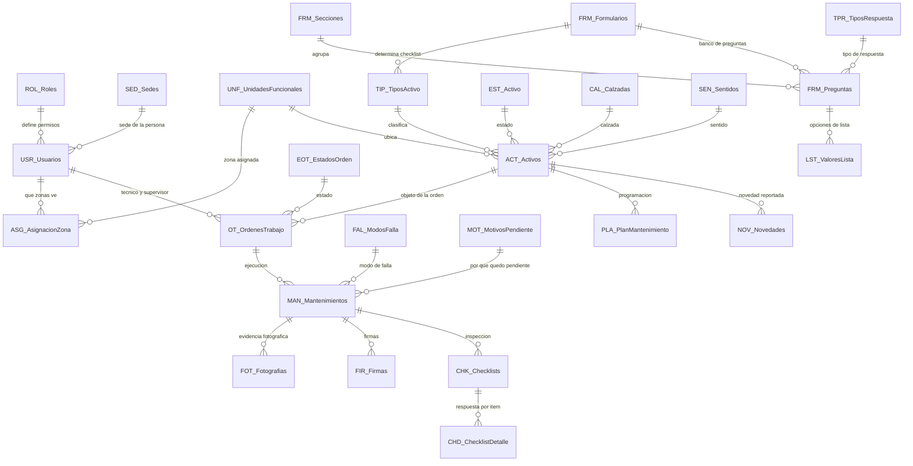

# SGMC — Sistema de Gestión de Mantenimiento en Campo

Aplicación de campo para la inspección y el mantenimiento de la infraestructura tecnológica,
eléctrica y de TI del corredor vial de la **Concesión Transversal del Sisga S.A.S.**

> **Este README dice por dónde se entra: qué resuelve el sistema, cómo está organizado el
> repositorio y dónde está cada cosa. No dice en qué punto va.**
>
> | Para saber | Lea |
> |---|---|
> | Qué está abierto, qué falta y qué lo bloquea | [`ESTADO.md`](ESTADO.md). **Si discrepa de aquí, manda `ESTADO.md`** |
> | Qué es el sistema, en presente: modelo, decisiones de diseño, qué se puede comprobar y qué no, y sus límites | [`docs/SISTEMA.md`](docs/SISTEMA.md) |
> | En qué orden se implementa lo que queda | [`docs/ROADMAP.md`](docs/ROADMAP.md) |
> | Cómo se trabaja sobre este repositorio | [`CLAUDE.md`](CLAUDE.md) |
> | Dónde está cada archivo | [`MAP.md`](MAP.md) |

Construida sobre **Google AppSheet** con backend en **Google Sheets**. Sin servidores propios,
sin compilación de APK, sin Play Console: los técnicos instalan la app de AppSheet e inician
sesión con su cuenta corporativa.

**Cuál es la aplicación vigente y cuál la hoja lo dice `python scripts/sistema.py`, y nada más**,
que también nombra las superadas con el motivo por el que lo son. Por qué se reconstruye una
aplicación en vez de repararla está en
[`BASE_CONOCIMIENTO_APPSHEET.md`](docs/BASE_CONOCIMIENTO_APPSHEET.md) §11 y §12.

---

## 1. El problema que resuelve

El mantenimiento del corredor se registraba en papel y hojas sueltas. Eso produce cuatro
problemas que el SGMC ataca directamente:

| Problema | Cómo lo resuelve el SGMC |
|---|---|
| No hay evidencia verificable de que el técnico estuvo en el activo | Geofencing GPS: el cierre solo se permite dentro del radio definido para ese tipo de activo, con registro de precisión satelital y las columnas de captura no editables |
| Buena parte del corredor no tiene señal celular (montaña, túneles) | Operación offline nativa: se diligencia sin red y sincroniza al recuperar conexión |
| Cada tipo de activo requiere una inspección distinta | Checklist dinámico: la app abre el formulario que corresponde al tipo del activo |
| El CCO se entera tarde de una falla | Bot de automatización: correo con informe cuando un activo queda fuera de servicio |

**Para qué existe, en una línea:** garantizar que el mantenimiento se hizo, que quien lo hizo estuvo
físicamente frente al equipo, y que la evidencia que lo respalda es difícil de falsificar.

## 2. Qué gestiona

La plantilla de datos, [`BD/Modelo_Datos_PLANTILLA.xlsx`](BD/Modelo_Datos_PLANTILLA.xlsx), contiene
**368 activos** repartidos sobre los 137 km del corredor vial de la Concesión.

**En la operación real hay 355 activos contables sobre 18 familias**, según el Plan Maestro. La
aritmética y el desglose están en [`CONTEXTO_OPERACION.md`](docs/CONTEXTO_OPERACION.md).
**Tenemos el censo, no el registro**: sabemos cuántos postes SOS hay, no cuál es cada uno ni dónde
está.

Los **27 tipos** del catálogo, en cuatro categorías. **No son las 18 familias del Plan Maestro**:
aquel dice qué checklist ve el técnico, estas dicen cómo cuenta operación sus equipos, y la
correspondencia entre las dos se comprueba, no se supone —`comprobar()` en
`scripts/catalogo_tipos.py`, que es la fuente única de la lista—:

- **ITS**, 14 — Postes SOS, CCTV, paneles de mensaje variable fijo y móvil (PMVF/PMVM), sensores
  meteorológicos y ambientales (SGM/SGE/SSA), báscula, báscula dinámica, carril de peaje,
  electrónica de peaje, estación de toma de datos, paso seguro, cámara OCR de pesaje
- **Eléctrico**, 3 — Generadores, UPS, subestaciones
- **Comunicaciones**, 1 — Fibra óptica
- **TI**, 9 — Servidores, NAS, switches, switches de capa 3, routers, firewalls, videowall,
  computadores portátiles, impresoras

> **Ninguna coordenada es la real.** `ACT_Activos.Ubicacion_LatLong` está poblada y sus valores son
> todos distintos, pero ninguno se levantó en campo: cada uno se **deriva del `PK`** sobre el
> trazado del corredor, y se vuelve a derivar en **cada pasada** de `generar_plantilla.py`. Un dato
> derivable no se conserva, se vuelve a derivar — por eso la columna no se restaura, se regenera.
> **Cargar las reales es el bloqueante D-01 para salir a campo**, y se comprueba con
> `python scripts/verificar_datos.py`.

## 3. Actores

| Rol | Dónde trabaja | Qué hace |
|---|---|---|
| **Técnico** | App móvil, mayoritariamente offline | Recibe la orden, diligencia el checklist, toma fotos, firma y la deja en revisión |
| **Supervisor** | Portal web | Programa y asigna órdenes, revisa evidencias, aprueba, cierra y consulta el tablero |
| **Administrador** | Portal web | Gestiona usuarios, catálogos, activos y plantillas de inspección |
| **Consulta** | Portal web | Solo lectura y reportes |

El activo **se abre por lista, no por escaneo**: el código QR está fuera de alcance, con sus
consecuencias en [`docs/ALCANCE_Y_SUPUESTOS_SGMC.md`](docs/ALCANCE_Y_SUPUESTOS_SGMC.md).

## 4. Cómo funciona


**Ciclo del técnico:** iniciar sesión y sincronizar, abrir sus órdenes, elegir la del día, responder
el checklist del tipo de activo, adjuntar fotografías, firmar y cerrar en sitio validando la
posición. La orden queda **En revisión**, no cerrada: quien hace el trabajo no certifica que se
hizo. Si no hay red, todo queda en cola local y sube solo al recuperar señal.

**Ciclo del supervisor:** programar la orden en el portal, asignarla a un técnico, revisar la
evidencia sincronizada, aprobarla y cerrarla.

## 5. Modelo de datos

La fuente única es **[`scripts/modelo_objetivo.py`](scripts/modelo_objetivo.py)**: de ahí se generan
la validación, el diccionario, el manual de despliegue y la plantilla de datos. **Nada se documenta
a mano.**

El recuento —tablas, columnas, referencias y reglas— lo imprime `python scripts/validar_modelo.py`
en su primera línea; no se cita de memoria. **Por qué el modelo es así** —qué protege la evidencia,
por qué el radio de geofencing va por tipo, por qué ocho claves se generan con `UNIQUEID()` y por
qué dos etiquetas son columnas virtuales— está en
[`docs/SISTEMA.md`](docs/SISTEMA.md) §4.

> **El volcado local es ciego a las ocho tablas de movimiento.** `generar_plantilla.py` las vacía a
> propósito cada vez que corre, así que **una fila creada en la aplicación nunca aparece en
> `BD/Modelo_Datos_PLANTILLA.xlsx`**. Para mirar datos de movimiento, `python
> scripts/instantanea.py`, que lee por API. Está declarado en `scripts/lectura_de_vuelta.py` como
> `VOLCADO_CIEGO_A`.

| Documento | Qué describe |
|---|---|
| [`docs/ARQUITECTURA_OBJETIVO_SGMC.md`](docs/ARQUITECTURA_OBJETIVO_SGMC.md) | El sistema que se construye. Generado del modelo |
| [`docs/bd.md`](docs/bd.md) | Lo que la hoja tiene hoy, columna a columna. Generado del `.xlsx` |



### Las 28 tablas, por grupo

| Grupo | Cuántas | Tablas |
|---|---|---|
| **Catálogos** | 14 | `SED_Sedes`, `UNF_UnidadesFuncionales`, `ROL_Roles`, `USR_Usuarios`, `ASG_AsignacionZona`, `TIP_TiposActivo`, `EST_Activo`, `EOT_EstadosOrden`, `MOT_MotivosPendiente`, `PAR_Parametros`, `FRE_Frecuencias`, `CAL_Calzadas`, `SEN_Sentidos`, `FAL_ModosFalla` |
| **Maestra** | 1 | `ACT_Activos` |
| **Transaccionales** | 4 | `OT_OrdenesTrabajo`, `MAN_Mantenimientos`, `NOV_Novedades`, `PLA_PlanMantenimiento` |
| **Evidencias** | 2 | `FOT_Fotografias`, `FIR_Firmas` |
| **Checklist** | 2 | `CHK_Checklists`, `CHD_ChecklistDetalle` |
| **Motor de formularios** | 5 | `FRM_Formularios`, `FRM_Secciones`, `FRM_Preguntas`, `TPR_TiposRespuesta`, `LST_ValoresLista` |

La tabla `GPS` **se retiró**: la traza de posición vive en las columnas de captura de
`MAN_Mantenimientos`, no en una tabla aparte.

### Regla de geofencing

`ACT_Activos` guarda un único campo `Ubicacion_LatLong` de tipo LatLong —el sufijo está en el nombre
para que AppSheet acierte el tipo solo—. No hay columnas `Latitud` y `Longitud` separadas. El radio
sale del tipo de activo, porque una subestación y un poste SOS no admiten la misma tolerancia:

```
DISTANCE([Coordenadas_Cierre_LatLong], [OTID].[ActivoID].[Ubicacion_LatLong]) <= [OTID].[ActivoID].[TipoActivoID].[RadioGeofencingKm]
```

El radio vive en `TIP_TiposActivo.RadioGeofencingKm`, con valor en los 27 tipos: 0,05 km en el
equipo puntual, 0,1 km en las instalaciones con recinto y 1,5 km en el tramo de fibra, que es lineal
y no tiene un «delante». La lista completa, tipo por tipo, sale de `scripts/catalogo_tipos.py`.

**Antes de la regla van las referencias que la expresión atraviesa** —orden → activo → tipo—, porque
una referencia mal puesta no hace fallar la regla: la hace **resolver contra lo que no es**, y el
mensaje de error invita a reescribir una expresión correcta para acomodarla a un cableado roto.
**Qué está cableado hoy no lo dice este README ni ningún documento generado del modelo**: lo dice
`python scripts/auditar_cableado.py` leyendo la aplicación en vivo, y qué queda abierto lo dice
[`ESTADO.md`](ESTADO.md).

> **El geofencing no puede ser correcto antes que el dato.** La regla compara contra un punto que
> está sobre la vía pero **no frente al equipo**, así que con radios de 0,05 km rechaza el cierre
> legítimo — y no hay una celda vacía que lo delate. Publicar antes de cargar las coordenadas reales
> (D-01) entrega un sistema donde ningún técnico puede cerrar una orden, y se descubre con el
> técnico delante.

**`RG-08` y `RG-12` eran bots programados, y no corrían en la cuenta gratuita** —verificado con cita
oficial en `docs/BASE_CONOCIMIENTO_APPSHEET.md` §6—, y `RG-08` tenía además un defecto propio: movía
la orden al estado `Vencida`, que es final, así que un técnico que llega tarde no podría cerrarla.
[`ESPEC-006`](docs/sdd/ESPEC-006-reemplazo-bots-programados.md), cerrada con cuatro riesgos aceptados
y **aplicada al modelo por `ORDEN-006` el 2026-08-11**, los retiró: `RG-08` y `RG-12` ya no existen en
`scripts/modelo_objetivo.py`. En su lugar quedan `RG-37`, una columna virtual `EstaVencida` que no
escribe ni bloquea el cierre, y `RG-38`, una vista más una acción que el supervisor pulsa, sin
depender de `Automation > Bots`. **Las dos están cableadas en el editor desde el 2026-08-11**
([`ACTA-009`](docs/sdd/ACTA-009-cableado-editor.md)): `EstaVencida` con `Show?` activo y sin
`Label`, y el slice `Vence en 7 dias` con su acción y el mapeo de seis columnas.

**De los cinco bots que el modelo llegó a declarar, `Automation > Bots` estaba vacío:** ninguno se
había creado nunca. Hoy hay dos —`RG-06` y `RG-10`— y **los dos están incompletos**, no por un fallo
de la sesión sino porque **el modelo no declara lo que AppSheet exige**: `RG-06` dice que envía un
correo *«al CCO y al supervisor»* y no dice quién es el CCO; `RG-10` dice que crea una orden de
seguimiento y no trae el mapeo de columnas. Están en
[`docs/HALLAZGOS_ABIERTOS.md`](docs/HALLAZGOS_ABIERTOS.md).

> **Y una precaución de este proyecto que resultó falsa.** Se trataba a `RG-07` con pinzas porque
> *«manda correos reales a una dirección corporativa»*. El editor avisa literalmente: *«The account is
> free. All emails are therefore being sent to the app creator»*. **En esta cuenta ningún correo de
> bot puede salir a nadie más.** No era una precaución falsa cuando se escribió: era razonable y
> nadie la había medido. Al pagar el plan, el riesgo vuelve entero
> ([`BASE_CONOCIMIENTO_APPSHEET.md`](docs/BASE_CONOCIMIENTO_APPSHEET.md) §19).

> **Lo más grave del 2026-08-11: había un bloqueo vivo en producción, ya corregido.**
> `MAN_Mantenimientos.Coordenadas_Cierre_LatLong` tenía `Initial value` **vacío**, con
> `Editable_If = FALSE` y siendo obligatoria: **ningún técnico podía cerrar un mantenimiento**, la
> función principal del sistema. La causa era un defecto de `generar_prompt_cableado.py`, que dejaba
> de emitir el `Initial value` de una columna en cuanto cualquier regla la tocaba; `ORDEN-008` lo
> corrigió el mismo día
> ([`ACTA-011`](docs/sdd/ACTA-011-bloqueo-vivo-y-here-sin-senal.md)). **Y abre un frente**: 49
> columnas declaran `valor_inicial` en el modelo, ninguna se puede comprobar por comando, y de las
> tres de bloqueo duro que se miraron ese día, las tres estaban mal.
>
> **Y la precisión del cierre por GPS sigue en revisión, no cerrada.** `HERE()` no mide: sondea la
> ubicación **una vez por minuto**, con hasta un minuto de antigüedad, contra radios de geofencing de
> 50 metros. Existe un cuarto modo —la captura manual— que Google recomienda **por encima** de
> `HERE()` cuando importa la precisión, y no está claro si `Editable_If = FALSE` quita también ese
> icono y no solo el arrastre del pin. Sin señal, `HERE()` escribe el literal
> `0.000000, 0.000000` —medido en el formulario real— y `FOT_Fotografias`/`NOV_Novedades` no tienen
> ninguna válvula de excepción como sí la tiene `MAN_Mantenimientos`. Sin resolver, en
> [`BASE_CONOCIMIENTO_APPSHEET.md`](docs/BASE_CONOCIMIENTO_APPSHEET.md) §20 y
> [`docs/HALLAZGOS_ABIERTOS.md`](docs/HALLAZGOS_ABIERTOS.md).
>
> **Y nadie ha comprobado si el modo offline está activado.** Es una configuración que hay que
> encender tabla por tabla; no viene puesta. El GPS **sí** funciona sin cobertura —habla con
> satélites, no con antenas—; lo que no funciona sin activar el modo offline es sincronizar. El
> offline básico es gratis; lo que exige plan Core es la velocidad de sincronización
> ([`BASE_CONOCIMIENTO_APPSHEET.md`](docs/BASE_CONOCIMIENTO_APPSHEET.md) §21).

El guion paso a paso de lo que queda por hacer a mano está en
[`docs/LO_QUE_SE_HACE_A_MANO.md`](docs/LO_QUE_SE_HACE_A_MANO.md).

## 6. Estado, hallazgos y bloqueantes

Todos en [`ESTADO.md`](ESTADO.md), que se actualiza; aquí no, para que no se contradigan.

| Si necesita | Lea |
|---|---|
| Qué está hecho y qué falta hoy | [`ESTADO.md`](ESTADO.md) |
| **Qué está cableado en la aplicación** | `python scripts/auditar_cableado.py`. **No lo sabe ningún documento**; su salida queda en [`docs/CORRECCIONES_CABLEADO.md`](docs/CORRECCIONES_CABLEADO.md) |
| **Qué hay que cerrar antes de que entre la primera fila** | [`docs/ENCARGO_VENTANA.md`](docs/ENCARGO_VENTANA.md), generado. Caduca solo. **Su cotejo está hecho**: las ocho tablas, una por una, en [`ACTA-010`](docs/sdd/ACTA-010-cotejo-ocho-tablas.md) |
| **Lo que sabemos que está mal y no merece especificación** | [`docs/HALLAZGOS_ABIERTOS.md`](docs/HALLAZGOS_ABIERTOS.md), cada entrada con el comando que la verifica |
| **Qué se hace a mano en el editor, paso a paso** | [`docs/LO_QUE_SE_HACE_A_MANO.md`](docs/LO_QUE_SE_HACE_A_MANO.md) — 13 pasos, 11 sin ningún comando que los verifique |
| Qué le toca a usted según su rol | [`docs/INDICACIONES_POR_ROL.md`](docs/INDICACIONES_POR_ROL.md) |
| Qué hace el sistema, para quién y cómo | [`docs/FUNCIONAL_SGMC.md`](docs/FUNCIONAL_SGMC.md) |
| Cómo se construye o configura la app | [`docs/MANUAL_DESPLIEGUE.md`](docs/MANUAL_DESPLIEGUE.md) |
| Qué expresión va en cada sitio | [`docs/sdd/RECONSTRUCCION_EXPRESIONES.md`](docs/sdd/RECONSTRUCCION_EXPRESIONES.md) |
| Cómo se prueba que funciona | [`docs/sdd/PRUEBA-003-despliegue.md`](docs/sdd/PRUEBA-003-despliegue.md) |
| Por qué AppSheet se comporta así | [`docs/BASE_CONOCIMIENTO_APPSHEET.md`](docs/BASE_CONOCIMIENTO_APPSHEET.md) |
| Cómo se mantiene el corredor de verdad | [`docs/CONTEXTO_OPERACION.md`](docs/CONTEXTO_OPERACION.md) |
| Con qué supuestos se construye | [`docs/ALCANCE_Y_SUPUESTOS_SGMC.md`](docs/ALCANCE_Y_SUPUESTOS_SGMC.md) |

## 7. Método: nada se ejecuta contra producción sin las tres firmas

El método vigente es SDD, descrito en [`docs/SDD_PIPELINE_SGMC.md`](docs/SDD_PIPELINE_SGMC.md):
especificar, probar y aprobar antes de tocar producción. `python scripts/validar_modelo.py` en 0 errores es el único gate objetivo.

Los instrumentos del repositorio se reparten en tres grupos, y confundirlos es lo que hace pasar por
comprobado lo que nadie miró. **Qué mide cada uno, uno por uno, está en
[`docs/SISTEMA.md`](docs/SISTEMA.md) §5; cuándo se corre
cada uno, en [`CLAUDE.md`](CLAUDE.md) §7.4.**

| Grupo | Cuáles | Qué leen | ¿Bloquean? |
|---|---|---|---|
| **Los siete verificadores** | `validar_modelo.py`, `verificar_faseA.py`, `verificar_datos.py`, `verificar_documentos.py`, `verificar_enlaces.py`, `verificar_reproducible.py`, `verificar_sistema.py` | **Archivos**: el modelo, el `.xlsx`, la prosa, los enlaces, y que [`docs/SISTEMA.md`](docs/SISTEMA.md) siga siendo verdad | **Sí.** Son el gate, y ninguno sustituye a otro |
| **Los tres que miran producción** | `verificar_app.py`, `auditar_cableado.py`, `instantanea.py` | La **aplicación en vivo**, por API | **No: informan.** Comparten un límite —lo que la API no devuelve no se puede ver— y por eso no son gate |
| **Los tres que no miden, declaran** | `lectura_de_vuelta.py`, `navegacion_editor.py`, `alcance_reglas.py` | Nada. Dicen quién comprueba cada clase de cambio, dónde está cada control en pantalla y qué columnas toca de verdad cada regla | No. Se consultan **antes** de tocar el editor |

**`verificar_app.py` no es un verificador**, aunque se llame igual: pregunta a la aplicación, no a un
archivo. Su propio docstring lo dice, y `probar_auditor.py` es la prueba negativa de
`auditar_cableado.py` —le mete defectos a propósito y comprueba que los caza—, no un instrumento
aparte.

**Ninguno de los seis mira la aplicación, y ninguno de los tres de producción bloquea.** De ahí la
regla `R-04` de [`CLAUDE.md`](CLAUDE.md) §6: *una referencia que resuelve puede apuntar a lo que no
es*, y preguntar «apunta a algo» nunca contesta «apunta a lo correcto».

## 8. Organización del repositorio

```
ESTADO.md      Dónde vamos y qué falta. Se lee primero
README.md      Este archivo
CLAUDE.md      Reglas de trabajo para agentes
MAP.md         Índice maestro y referencias cruzadas

BD/            Hojas de datos. Modelo_Datos_PLANTILLA.xlsx es el entregable de datos
docs/          Documentación técnica y funcional
  images/      Figuras de los documentos
  sdd/         Artefactos del pipeline: ESPEC, PRUEBA y RECONSTRUCCION_EXPRESIONES
Manuales/      Manual de usuario
scripts/       Fuente del modelo, validadores, generadores y el auditor de cableado
contexto/      Material de contexto operativo. No es la vara, y no se versiona
archivo/       Material de origen, no versionado
```

| Documento | Para qué sirve |
|---|---|
| [docs/SISTEMA.md](docs/SISTEMA.md) | El sistema tal como es hoy, en presente, sin historia ni estado. La línea de partida de toda especificación |
| [ESTADO.md](ESTADO.md) | **Empiece aquí.** Qué está hecho, qué falta, qué está bloqueado |
| [docs/INDICACIONES_POR_ROL.md](docs/INDICACIONES_POR_ROL.md) | Quién hace qué para que esto llegue a campo, con sus decisiones exclusivas y su costo |
| [docs/FUNCIONAL_SGMC.md](docs/FUNCIONAL_SGMC.md) | Qué hace el sistema. Su §6 es el registro de una sola forma por propósito |
| [docs/ARQUITECTURA_OBJETIVO_SGMC.md](docs/ARQUITECTURA_OBJETIVO_SGMC.md) | Modelo objetivo, generado desde `scripts/modelo_objetivo.py` y validado |
| [docs/bd.md](docs/bd.md) | Diccionario As-Built, generado del archivo |
| [docs/MANUAL_DESPLIEGUE.md](docs/MANUAL_DESPLIEGUE.md) | De cero a app desplegada, con la ficha de las 28 tablas columna por columna |
| [docs/GUIA_IMPLEMENTACION_FUNCIONAL.md](docs/GUIA_IMPLEMENTACION_FUNCIONAL.md) | La implementación vista desde la operación |
| [docs/MODELO_EVOLUCION_FASE_2.md](docs/MODELO_EVOLUCION_FASE_2.md) | Lo que viene después del piloto |
| [docs/BASE_CONOCIMIENTO_APPSHEET.md](docs/BASE_CONOCIMIENTO_APPSHEET.md) | Cómo se comporta AppSheet, con cita textual y URL oficial |
| [docs/SDD_PIPELINE_SGMC.md](docs/SDD_PIPELINE_SGMC.md) | El método: cinco agentes, dos fases y el gate |
| [docs/ALCANCE_Y_SUPUESTOS_SGMC.md](docs/ALCANCE_Y_SUPUESTOS_SGMC.md) | Alcance del sistema y los 14 supuestos adoptados |
| [docs/CONTEXTO_OPERACION.md](docs/CONTEXTO_OPERACION.md) | Cómo se mantiene el corredor, y la procedencia de cada documento de contexto |
| [docs/COMUNICACION_PROPIETARIO_APP.md](docs/COMUNICACION_PROPIETARIO_APP.md) | Qué decirle al dueño de la aplicación anterior |
| [docs/ROADMAP.md](docs/ROADMAP.md) | Fases con criterio de cierre verificable. Su §2.1 es **la ventana barata**: lo que solo es gratis mientras ocho tablas sigan vacías |
| [docs/ENCARGO_VENTANA.md](docs/ENCARGO_VENTANA.md) | El encargo autocontenido de esa ventana, generado del modelo. **Y lo que deja fuera, con su motivo** |
| [docs/LO_QUE_SE_HACE_A_MANO.md](docs/LO_QUE_SE_HACE_A_MANO.md) | Lo que ningún comando puede hacer ni verificar: el guion paso a paso de quien va al editor de AppSheet, ordenado por cuándo se hace |
| [docs/sdd/](docs/sdd/) | Especificaciones y pruebas del pipeline. El índice vigente, con el estado de cada una, está en [MAP.md](MAP.md) §3 |
| [Manuales/MANUAL_DE_USUARIO.md](Manuales/MANUAL_DE_USUARIO.md) | Guía de operación por rol. **No se entrega todavía**: describe funciones que aún no están montadas, y lo dice en su cabecera |
| [MAP.md](MAP.md) | Índice maestro y referencias cruzadas |
| [CLAUDE.md](CLAUDE.md) | Reglas de trabajo para agentes sobre este repositorio |

**Entregables al cliente**

**Hoy el repositorio tiene un solo entregable, y es de datos:**

| Archivo | Estado |
|---|---|
| [`BD/Modelo_Datos_PLANTILLA.xlsx`](BD/Modelo_Datos_PLANTILLA.xlsx) | **El entregable de datos.** Generado del modelo: 28 pestañas de datos más `_LEEME`, 209 columnas, ninguna de sobra. 27 tipos de activo, 27 formularios y 368 activos |

> **No hay carpeta `entregables/`.** Las catorce decisiones que contenían los documentos enviados a
> Dirección viven hoy como supuestos adoptados en
> [`docs/ALCANCE_Y_SUPUESTOS_SGMC.md`](docs/ALCANCE_Y_SUPUESTOS_SGMC.md); lo retirado se recupera de
> `git`, con `git log --diff-filter=D --name-only -- 'entregables/*'`.

## 9. Enlaces

Los dos primeros salen de `python scripts/sistema.py`, que es lo único que declara cuál es la
aplicación y cuál la hoja. **Confirme el identificador ahí antes de fiarse de un enlace guardado.**

- Aplicación AppSheet `_SISGA_-323965761`: [abrir en AppSheet](https://www.appsheet.com/template/appdef?appId=aca92ac5-a6eb-4c73-be81-471a5b3fe04e)
- Backend Google Sheets `Modelo_Datos_10082026`, propiedad de la Concesión:
  [abrir](https://docs.google.com/spreadsheets/d/1h9kyCYGK6esRL1UiTcPXHlSmDQcPb13fNZ0hBznYOa0)
- Repositorio: [github.com/dieleoz/SGMC](https://github.com/dieleoz/SGMC)

---
Concesión Transversal del Sisga S.A.S.
