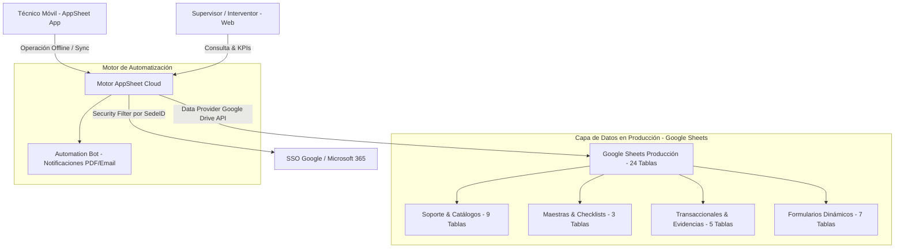

# 🚀 Sistema de Gestión de Mantenimiento en Campo (SGMC) — As-Built & Documentación Técnica

**Cliente:** Concesión Transversal del Sisga S.A.S.  
**Plataforma de Despliegue:** Google AppSheet  
**App Reference Key:** `SGMC-886843353`  
**Base de Datos en Producción (Google Sheets):** [Google Sheets Backend Producción SGMC](https://docs.google.com/spreadsheets/d/1a4MmZ0u9sNgWmyiR2OPJo9YuUEKJFftbJWMW-KbITRc/edit?gid=1353886072#gid=1353886072)  
**Respaldo Maestro Local:** `d:\@Proyect\Sisga\BD\Modelo de Datos (2).xlsx` (24 Hojas)  
**Estado:** 🟢 As-Built & Auditado para Salida a Producción (Agosto 2026)  
**URL de la Aplicación en Vivo:** [SGMC en AppSheet](https://www.appsheet.com/start/060b99df-2037-4049-b94d-03c1eefc3219?platform=desktop#appName=SGMC-886843353&vss=H4sIAAAAAAAAA6XOvQ7CIBQF4Hc5M0_AahyM0cWfRTpguU2ILTQF1Ibw7t6qjbM6csh37sm4Wrrtoq4vkKf8ea1phERW2I89KUiFhXdx8K2CUNjq7hUeQtKD9UGhoFRi9pECZP6Oy_-uC1hDLtrG0jB1TZI73o6_J8XBbFAEuhT1uaXnYDalcNb4OgUyR57yw4Swcst7r53ZeMOVjW4DlQcPF0XqZQEAAA==&view=Usuarios)  

---

## 📌 Visión General del Proyecto

El **SGMC** es la solución tecnológica diseñada para digitalizar la operación, inspección y mantenimiento preventivo/correctivo de la infraestructura vial de la Concesión Transversal del Sisga S.A.S. (Postes SOS, CCTV, PMVF, PMVM, Sensores Ambientales, Básculas, Peajes, Generadores, Fibra Óptica y equipos de TI).

La plataforma opera en tiempo real conectada a **Google Sheets (Producción en la Web)** con **24 Tablas relacionales**, soportando la operación **100% Offline** en corredor vial mediante dispositivos móviles (Android/iOS) con sincronización automática.

---

## 🗺️ Mapa de Navegación y Documentación Cruzada

| Documento | Descripción | Enlace |
|---|---|---|
| 🗺️ **MAP.md** | Mapa completo de archivos, rutas y referencias cruzadas | [MAP.md](./MAP.md) |
| 🗄️ **bd.md** | Diccionario de datos de 24 tablas de producción en Google Sheets | [bd.md](./bd.md) |
| 📖 **MANUAL_DE_USUARIO.md** | Manual de usuario y guía operativa (Técnicos, Supervisores, Admin) | [MANUAL_DE_USUARIO.md](./Manuales/MANUAL_DE_USUARIO.md) |
| 📱 **MANUAL_DE_USUARIO_ILUSTRADO.md** | Manual de usuario ilustrado con diagramas y maquetas visuales | [MANUAL_DE_USUARIO_ILUSTRADO.md](./Manuales/MANUAL_DE_USUARIO_ILUSTRADO.md) |
| 🛠️ **especificaciones.md** | Levantamiento técnico completo de lo construido (Funcional, UI, Reglas y Bots) | [especificaciones.md](./especificaciones.md) |
| 📅 **plan_de_trabajo.md** | Plan de trabajo operativo para despliegue y piloto (Ediciones en Google Sheets) | [plan_de_trabajo.md](./plan_de_trabajo.md) |
| 📋 **DICTAMEN_AUDITORIA_LOCAL_SGMC.md** | Dictamen oficial de auditoría local 100% Conforme | [DICTAMEN_AUDITORIA_LOCAL_SGMC.md](./DICTAMEN_AUDITORIA_LOCAL_SGMC.md) |
| 🗺️ **ROADMAP.md** | Hoja de ruta de avance, estado actual (Fase 1 As-Built) y evolución a Fase 2 | [ROADMAP.md](./ROADMAP.md) |

---

## 🏗️ Arquitectura de la Solución (3 Capas)

---
*SGMC - Concesión Transversal del Sisga S.A.S. | Agosto 2026*
