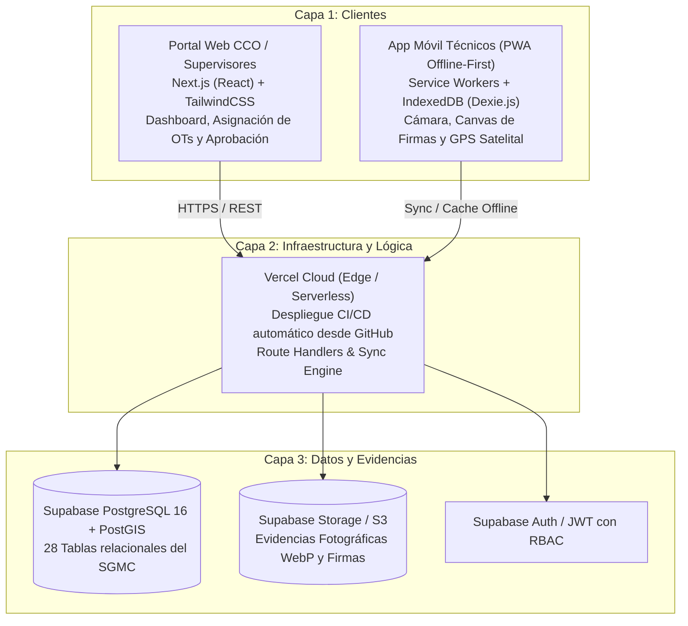
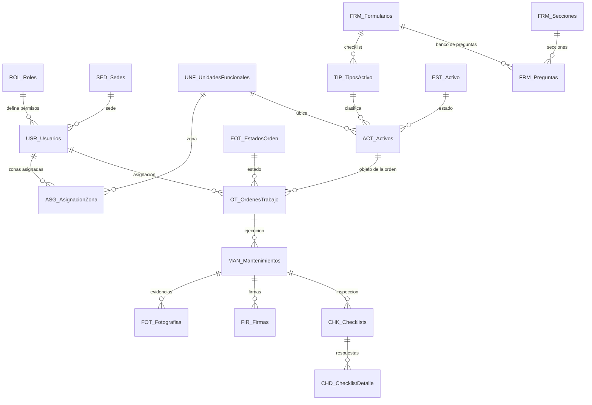

# SGMC v2 — Sistema de Gestión de Mantenimiento en Campo

<!-- verificar_documentos: ignorar ST_DWithin -->
<!-- verificar_documentos: ignorar ST_SetSRID -->
<!-- verificar_documentos: ignorar ST_MakePoint -->

**Concesión Transversal del Sisga S.A.S.** (137 km de corredor vial)  
**Stack Oficial v2:** Next.js 14 (App Router) + PWA Offline-First (Dexie.js) + Supabase (PostgreSQL 16 / PostGIS) + Vercel

---

## 🎯 Estado del Proyecto (2026-08-19)

- **Base de Datos Supabase:** 🟢 **SANEADA Y AUDITADA (0 FALLOS)**. 28 tablas relacionales, 39 Claves Foráneas con integridad referencial estricta, PostGIS y RPC de sincronización outbox atómica.
- **Verificadores del Sistema:** 🟢 **4 de 4 en VERDE** (`validar_modelo.py`, `verificar_documentos.py`, `verificar_enlaces.py`, `verificar_supabase.py`).
- **Despliegue Web / PWA:** 🟢 **ACTIVO** en [https://sisga-2.vercel.app/](https://sisga-2.vercel.app/)
- **Fase 4 en Marcha:** `ESPEC-020` (Corrección de coordenadas e idempotencia) aplicada, órdenes ejecutables en base de datos y georreferenciación en evidencias fotográficas.

---

## 1. El problema que resuelve

El mantenimiento del corredor se registraba en papel y hojas sueltas. El SGMC ataca directamente cuatro problemas:

| Problema | Cómo lo resuelve el SGMC v2 |
|---|---|
| **No hay evidencia verificable de presencia en el activo** | **Geofencing GPS de alta precisión con PostGIS:** Validación espacial nativa (`ST_DWithin`) contra las coordenadas del activo según su radio de tolerancia. |
| **Zonas sin señal celular (montaña, túneles)** | **Operación PWA Offline-First:** Los técnicos diligencian órdenes, checklist, firmas y fotos sin conexión mediante almacenamiento local (IndexedDB / SQLite), sincronizando automáticamente al recuperar red. |
| **Cada activo requiere una inspección distinta** | **Motor de Checklists Dinámicos:** Generación de formularios personalizados para los 27 tipos de activos a partir del catálogo relacional. |
| **Demora en reporte de fallas al CCO** | **Notificaciones y Alertas Automáticas:** Envío inmediato de reportes por correo electrónico/webhook cuando un activo se reporta fuera de servicio. |

---

## 2. Stack Tecnológico v2

* **Frontend Web (Supervisores y CCO):** Next.js (App Router) + TailwindCSS + Lucide Icons + Leaflet/Mapbox para visualización de activos.
* **App Móvil (Técnicos en Campo):** Progressive Web App (PWA) instalable en Android/iOS con funcionamiento 100% offline, geolocalización nativa y compresión de fotos antes de subida.
* **Backend y Base de Datos:** Supabase Cloud con PostgreSQL 16, extensión espacial **PostGIS** para geofencing exacto, autenticación basada en JWT/RBAC y almacenamiento en buckets S3 para evidencias fotográficas.
* **Despliegue & CI/CD:** **Vercel** conectado a la rama `main` de GitHub ([dieleoz/SISGA2](https://github.com/dieleoz/SISGA2)).

---

## 3. Qué gestiona

* **368 activos** distribuidos a lo largo de los 137 km del corredor vial de la Concesión.
* **27 tipos de activos** clasificados en 4 categorías:
  * **ITS (14):** Postes SOS, CCTV, PMVF, PMVM, Sensores meteorológicos (SGM/SGE/SSA), Básculas, Peajes, Radares, etc.
  * **Eléctrico (3):** Generadores, UPS, Subestaciones.
  * **Comunicaciones (1):** Fibra óptica.
  * **TI (9):** Servidores, Switches, Routers, Firewalls, Videowall, Estaciones de trabajo, etc.

---

## 4. Actores del Sistema

| Rol | Plataforma | Responsabilidades |
|---|---|---|
| **Técnico** | App Móvil (PWA Offline) | Recibe la orden de trabajo, responde el checklist dinámico, toma fotografías, firma y cierra en sitio con validación GPS. |
| **Supervisor** | Portal Web | Programa y asigna órdenes de trabajo, audita evidencias fotográficas, aprueba y cierra mantenimientos. |
| **Administrador** | Portal Web | Gestiona usuarios, catálogos, activos y plantillas de inspección. |
| **Consulta / CCO** | Portal Web | Monitoreo en tiempo real del estado de los activos y reportes de interventoría. |

---

## 5. Modelo de Datos (28 Tablas)

El modelo conserva la estructura de 28 tablas relacionales del dominio del SGMC:

---

## 6. Verificación y Auditoría Continua

El proyecto cuenta con cuatro instrumentos de verificación automatizados ejecutables desde la terminal:

| Instrumento | Comando | Función | Estado |
|---|---|---|---|
| **Estructura** | `python scripts/validar_modelo.py` | Valida 28 tablas, 209 columnas, 39 FKs y 23 reglas de negocio | 🟢 **APTO PARA DESPLEGAR** |
| **Documentación** | `python scripts/verificar_documentos.py` | Comprueba que la prosa técnica no contradiga el modelo | 🟢 **DOCUMENTOS CONSISTENTES** |
| **Hipervínculos** | `python scripts/verificar_enlaces.py` | Audita todos los enlaces relativos entre documentos SDD | 🟢 **TODOS RESUELVEN** |
| **Base de Datos Viva** | `python scripts/verificar_supabase.py` | Audita directamente PostgreSQL en Supabase contra el modelo | 🟢 **LA BASE COINCIDE (0 FALLOS)** |

---

## 7. Pipeline de Especificaciones SDD (Fase 2)

| Especificación | Pruebas | Orden | Estado | Propósito / Alcance |
|---|---|---|:---:|---|
| [`ESPEC-010`](docs/sdd/ESPEC-010-arquitectura-web-pwa-supabase.md) | [`PRUEBA-010`](docs/sdd/PRUEBA-010-arquitectura-web-pwa-supabase.md) | [`ORDEN-010`](docs/sdd/ORDEN-010-arquitectura-web-pwa-supabase.md) | 🟢 **RESUELTA** | Arquitectura base Web + PWA + Supabase (Bloqueantes levantados). |
| [`ESPEC-012`](docs/sdd/ESPEC-012-identidad-roles-y-rls.md) | [`PRUEBA-012`](docs/sdd/PRUEBA-012-identidad-roles-y-rls.md) | [`ORDEN-012`](docs/sdd/ORDEN-012-identidad-roles-y-rls.md) | 🟢 **APLICADA** | 59 políticas Row Level Security (RLS) blindadas vinculadas a `auth.jwt()` y `ASG_AsignacionZona` (aislamiento por Unidad Funcional). |
| [`ESPEC-011`](docs/sdd/ESPEC-011-motor-sincronizacion-outbox-offline.md) | [`PRUEBA-011`](docs/sdd/PRUEBA-011-motor-sincronizacion-outbox-offline.md) | [`ORDEN-011`](docs/sdd/ORDEN-011-motor-sincronizacion-outbox-offline.md) | 🟢 **APLICADA** | Motor de Sincronización Outbox Offline con RPC atómica `public.sgmc_sincronizar_mantenimiento`. |
| [`ESPEC-013`](docs/sdd/ESPEC-013-pipeline-evidencias-y-storage.md) | [`PRUEBA-013`](docs/sdd/PRUEBA-013-pipeline-evidencias-y-storage.md) | [`ORDEN-013`](docs/sdd/ORDEN-013-pipeline-evidencias-y-storage.md) | 🟢 **APLICADA** | Bucket S3 `evidencias-sgmc` en Supabase Storage, compresión WebP (<150KB) y canvas de firma digital. |
| [`ESPEC-014`](docs/sdd/ESPEC-014-supervision-auditoria-y-aprobacion.md) | [`PRUEBA-014`](docs/sdd/PRUEBA-014-supervision-auditoria-y-aprobacion.md) | [`ORDEN-014`](docs/sdd/ORDEN-014-supervision-auditoria-y-aprobacion.md) | 🟢 **APLICADA** | Portal de Supervisión (`/supervisor`) con auditoría de fotos WebP, geofencing, checklist y aprobación. |
| [`ESPEC-015`](docs/sdd/ESPEC-015-fichas-interventoria-pdf-y-reportes.md) | [`PRUEBA-015`](docs/sdd/PRUEBA-015-fichas-interventoria-pdf-y-reportes.md) | [`ORDEN-015`](docs/sdd/ORDEN-015-fichas-interventoria-pdf-y-reportes.md) | 🟢 **APLICADA** | Generación de Fichas Técnicas Periciales en PDF con membrete oficial e informes de interventoría. |
| [`ESPEC-016`](docs/sdd/ESPEC-016-novedades-de-ruta-en-campo.md) | [`PRUEBA-016`](docs/sdd/PRUEBA-016-novedades-de-ruta-en-campo.md) | [`ORDEN-016`](docs/sdd/ORDEN-016-novedades-de-ruta-en-campo.md) | 🟢 **APLICADA** | Gestión de Novedades de Ruta (`NOV_Novedades`) y conversión a OTs Correctivas. |
| [`ESPEC-017`](docs/sdd/ESPEC-017-generador-planes-mantenimiento.md) | [`PRUEBA-017`](docs/sdd/PRUEBA-017-generador-planes-mantenimiento.md) | [`ORDEN-017`](docs/sdd/ORDEN-017-generador-planes-mantenimiento.md) | 🟢 **APLICADA** | Programador y Generador Automático de Planes Preventivos (`PLA_PlanMantenimiento`). |
| [`ESPEC-018`](docs/sdd/ESPEC-018-protocolo-piloto-en-via-y-acta-cierre.md) | [`PRUEBA-018`](docs/sdd/PRUEBA-018-protocolo-piloto-en-via-y-acta-cierre.md) | [`ORDEN-018`](docs/sdd/ORDEN-018-protocolo-piloto-en-via-y-acta-cierre.md) | 🟢 **APLICADA** | Protocolo de Prueba Piloto en Vía (10 activos UF1/UF2) y Acta de Cierre Operativo. |
| [`ESPEC-020`](docs/ROADMAP.md) | `scripts/aplicar_espec020_coordenadas.py` | `BD/supabase_sync_rpc.sql` | 🟢 **APLICADA** | Corrección atómica de coordenadas de cierre (relajación NOT NULL, retiro de COALESCE inventado e idempotencia RPC). |

---

## 8. Gestión de Históricos y Reportes Contractuales

La base de datos en PostgreSQL cuenta con integridad referencial estricta (`ON DELETE RESTRICT`) e inmutabilidad temporal para respaldar cuatro niveles de reportería:

* 📅 **Parte Diario de Operaciones:** Cuadro de mando diario de mantenimientos ejecutados en campo, técnicos en vía y cierres con excepción satelital.
* 📆 **Avance Semanal de Cronograma:** Porcentaje de cumplimiento del plan preventivo agrupado por Unidad Funcional (`UF1` a `UF4`).
* 🗓️ **Fichas e Informe Mensual de Interventoría:** Cálculo de **Disponibilidad Contractual ($D_i$)** de los 368 activos y exportación de Fichas Periciales en PDF con fotos WebP, geofencing y firmas.
* 📈 **Confiabilidad Anual (MTBF / MTTR):** Análisis de modos de falla (`FAL_ModosFalla`), Tiempo Medio Entre Fallas y Tiempo Medio de Reparación para planes de reposición.

---

## 9. Enlaces del Proyecto

* **Repositorio GitHub:** [https://github.com/dieleoz/SISGA2](https://github.com/dieleoz/SISGA2)
* **Despliegue en Vivo:** [https://sisga-2.vercel.app/](https://sisga-2.vercel.app/)
* **Base de Datos:** Supabase PostgreSQL 16 con PostGIS (`dcrvobzicjxckeofqsjf.supabase.co`)

---
Concesión Transversal del Sisga S.A.S. — SGMC v2
