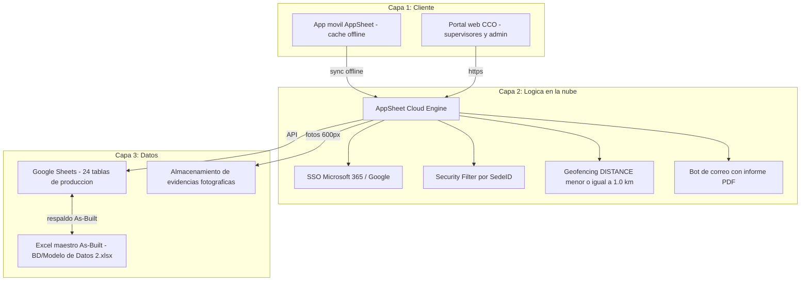
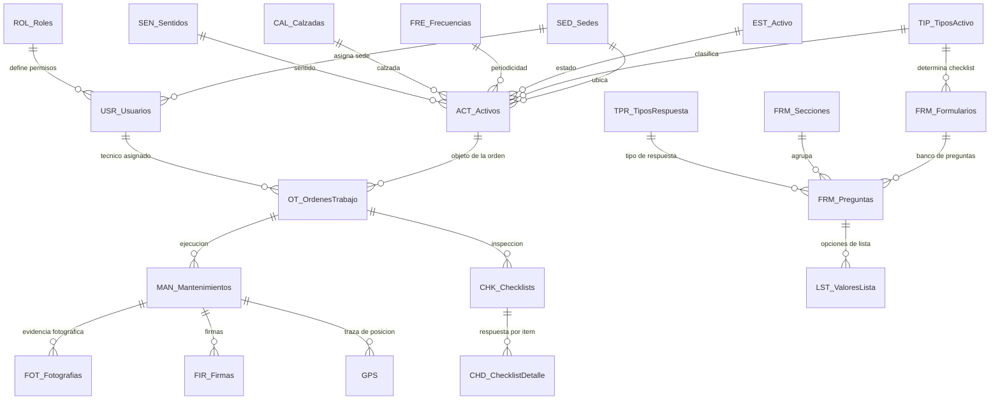

# SGMC — Sistema de Gestión de Mantenimiento en Campo

Aplicación de campo para la inspección y el mantenimiento de la infraestructura tecnológica,
eléctrica y de TI del corredor vial de la **Concesión Transversal del Sisga S.A.S.**

Construida sobre **Google AppSheet** con backend en **Google Sheets**. Sin servidores propios,
sin compilación de APK, sin Play Console: los técnicos instalan la app de AppSheet e inician
sesión con su cuenta corporativa.

> **Estado del proyecto: Sprint 0 — definición funcional en validación.**
> El modelo de datos y la app existen y están operativos como prototipo, pero la Fase 0 no está
> cerrada: hay 8 bloqueantes verificados y la definición funcional aún no ha sido validada con el
> líder funcional. Ver [Estado real](#estado-real-verificado) y
> [AUDITORIA_PLAN_Y_ROADMAP.md](docs/AUDITORIA_PLAN_Y_ROADMAP.md).
> No desplegar a campo hasta cerrar la mesa de trabajo de
> [DEFINICION_FUNCIONAL_MESA_DE_TRABAJO.md](docs/DEFINICION_FUNCIONAL_MESA_DE_TRABAJO.md).

---

## 1. El problema que resuelve

El mantenimiento del corredor se registraba en papel y hojas sueltas. Eso produce cuatro
problemas que el SGMC ataca directamente:

| Problema | Cómo lo resuelve el SGMC |
|---|---|
| No hay evidencia verificable de que el técnico estuvo en el activo | Geofencing GPS: el cierre solo se permite a menos de 1 km del activo, con registro de precisión satelital |
| Buena parte del corredor no tiene señal celular (montaña, túneles) | Operación offline nativa: se diligencia sin red y sincroniza al recuperar conexión |
| Cada tipo de activo requiere una inspección distinta | Checklist dinámico: la app abre el formulario que corresponde al tipo de activo escaneado |
| El CCO se entera tarde de una falla | Bot de automatización: correo con informe PDF cuando un activo queda fuera de servicio |

## 2. Qué gestiona

34 activos catalogados sobre 18 tipos, en cuatro categorías:

- **ITS** — Postes SOS, CCTV, paneles de mensaje variable fijo y móvil (PMVF/PMVM), sensores
  meteorológicos y ambientales (SGM/SGE/SSA), básculas de pesaje
- **Eléctrico** — Generadores, UPS, subestaciones
- **Comunicaciones** — Fibra óptica
- **TI** — Servidores, NAS, switches, routers, firewalls, videowall

## 3. Actores

| Rol | Dónde trabaja | Qué hace |
|---|---|---|
| **Técnico** | App móvil, mayoritariamente offline | Recibe OT, escanea QR, diligencia checklist, toma fotos, firma, cierra con GPS |
| **Supervisor** | Portal web | Programa y asigna OT, revisa evidencias, aprueba, consulta el tablero |
| **Administrador** | Portal web | Gestiona usuarios, catálogos, activos y formularios de inspección |
| **Consulta** | Portal web | Solo lectura y reportes |

## 4. Cómo funciona



**Ciclo del técnico:** iniciar sesión y sincronizar, descargar las OT de su sede, seleccionar la
OT o escanear el QR del activo, abrir el checklist que corresponde al tipo, responder, adjuntar
fotografías, firmar, cerrar validando la posición GPS. Si no hay red, todo queda en cola local y
sube solo al recuperar señal.

**Ciclo del supervisor:** programar la OT en el portal, asignarla a un técnico (el bot le avisa
por correo), revisar la evidencia sincronizada y aprobar, con el tablero de indicadores al lado.

## 5. Modelo de datos

Fuente de verdad: **`BD/Modelo de Datos (2).xlsx`**, 24 hojas. `entregables/Modelo_Datos_SGMC_AsBuilt.xlsx`
es una copia idéntica publicada, para enviar; no se edita. Diccionario completo en [bd.md](docs/bd.md).



### Las 24 tablas

| Grupo | Tablas | Función |
|---|---|---|
| **Catálogos (9)** | `USR_Usuarios`, `ROL_Roles`, `SED_Sedes`, `TIP_TiposActivo`, `EST_Activo`, `FRE_Frecuencias`, `CAL_Calzadas`, `SEN_Sentidos`, `FRM_Formularios` | Usuarios y roles RBAC, sedes, taxonomía de activos y catálogos viales |
| **Maestras (3)** | `ACT_Activos`, `CHK_Checklists`, `CHD_ChecklistDetalle` | Inventario de activos con PR, QR y `Ubicacion` (LatLong); inspecciones ejecutadas y su detalle |
| **Transaccionales (5)** | `OT_OrdenesTrabajo`, `MAN_Mantenimientos`, `FOT_Fotografias`, `FIR_Firmas`, `GPS` | Orden programada, ejecución con `Coordenadas_Cierre` y `Precision_GPS`, y evidencias |
| **Motor de formularios (7)** | `FRM_Preguntas`, `FRM_Secciones`, `TPR_TiposRespuesta`, `LST_ValoresLista`, `FRM_SOS`, `FRM_CCTV`, `FRM_PMVF` | Checklists dinámicos por tipo de activo |

### Regla de geofencing

`ACT_Activos` guarda un único campo `Ubicacion` de tipo LatLong. No hay columnas `Latitud` y
`Longitud` separadas. La expresión válida contra este modelo es:

```
DISTANCE([Coordenadas_Cierre], [ActivoID].[Ubicacion]) <= 1.0
```

## 6. Estado real (verificado)

Verificado el 6 de agosto de 2026 leyendo el Excel maestro directamente en disco.

**Construido y funcionando**
- Modelo de 24 tablas, con `Coordenadas_Cierre` y `Precision_GPS` en `MAN_Mantenimientos`
- Catálogos poblados: 34 activos con QR, 18 tipos, 10 sedes, 4 roles, 11 usuarios
- 6 órdenes de trabajo registradas y 1 checklist de inspección SOS con su detalle
- Banco de preguntas del formulario de postes SOS (15 preguntas)
- App AppSheet publicada, con vistas móviles y web

**Abierto y bloqueante**

| # | Hallazgo |
|---|---|
| B-01 | Los 34 activos comparten una sola coordenada, situada en Bogotá y no en el corredor. El geofencing es inoperante hasta levantar las coordenadas reales |
| B-02 | `TIP_TiposActivo.FormularioID` está vacío en los 18 tipos: la asignación automática de checklist no tiene mapeo |
| B-03 | Todos los usuarios están en la sede 1 y todos los activos en las sedes 7 a 10. El Security Filter dejaría a cada técnico sin activos |
| B-04 | Solo 1 de 18 formularios tiene banco de preguntas |
| B-05 | El único checklist existente referencia una OT que no existe |
| B-06 | Fotografías, firmas y GPS están modelados dos veces: campos en `MAN_Mantenimientos` y tablas hijas vacías |
| B-07 | `MAN_Mantenimientos` está vacía: ningún mantenimiento se ha ejecutado nunca de extremo a extremo |
| B-08 | El detalle de checklist guarda las preguntas como texto libre, sin trazabilidad al banco de preguntas |

Detalle, evidencia y plan de remediación en [AUDITORIA_PLAN_Y_ROADMAP.md](docs/AUDITORIA_PLAN_Y_ROADMAP.md).

## 7. Por qué el proyecto vuelve a la definición funcional

El SGMC nació como un MVP de 8 días sobre una ERS v1.0 y un formulario de levantamiento
diligenciado el 25 de julio de 2026 (ver `legacy/Plan_Implementacion_SGMC_AppSheet.docx`). Desde
entonces mutó: el modelo pasó de 17 a 24 tablas, aparecieron dos arquitecturas de formularios en
paralelo y las evidencias quedaron modeladas por duplicado.

Esa mutación ocurrió sin una validación funcional intermedia. Varios bloqueantes de la lista
anterior no son errores de implementación sino **decisiones de negocio que nadie tomó**: qué
gobierna la sede de un activo, cuántas fotos exige realmente una inspección, qué reportes debe
entregar el sistema.

Por eso el paso siguiente no es configurar sino definir. El documento
[DEFINICION_FUNCIONAL_MESA_DE_TRABAJO.md](docs/DEFINICION_FUNCIONAL_MESA_DE_TRABAJO.md) presenta los
flujos funcionales por actor y las decisiones pendientes al líder funcional. Sus respuestas
producen el roadmap de implementación.

## 8. Organización del repositorio

```
BD/            Fuente de verdad: Modelo de Datos (2).xlsx, 24 hojas
docs/          Documentación técnica y funcional
docs/images/   Figuras de los documentos
docs/prompts/  Directivas para agentes de auditoría
Manuales/      Manuales de usuario y sus imágenes
entregables/   Documentos Word y Excel listos para enviar al cliente
scripts/       Generadores de figuras y documentos
archivo/       Material de origen, no versionado
```

| Documento | Para qué sirve |
|---|---|
| [DEFINICION_FUNCIONAL_MESA_DE_TRABAJO.md](docs/DEFINICION_FUNCIONAL_MESA_DE_TRABAJO.md) | Flujos funcionales por actor y 14 decisiones a validar con el líder funcional |
| [AUDITORIA_PLAN_Y_ROADMAP.md](docs/AUDITORIA_PLAN_Y_ROADMAP.md) | Dictamen vigente: hallazgos, evidencia y Fase 0 corregida |
| [bd.md](docs/bd.md) | Diccionario de datos de las 24 tablas |
| [especificaciones.md](docs/especificaciones.md) | Requerimientos funcionales RF-001 a RF-016 |
| [especificaciones_visuales.md](docs/especificaciones_visuales.md) | Pantallas, vistas y elementos de interfaz |
| [plan_de_trabajo.md](docs/plan_de_trabajo.md) | Plan operativo, supeditado a la mesa de trabajo |
| [ROADMAP.md](docs/ROADMAP.md) | Fases y criterios de cierre |
| [GUIA_SVG_BOTONES_DINAMICOS_APPSHEET.md](docs/GUIA_SVG_BOTONES_DINAMICOS_APPSHEET.md) | Diseño de botones e iconos dinámicos en AppSheet |
| [MAP.md](MAP.md) | Índice maestro y referencias cruzadas |
| [CLAUDE.md](CLAUDE.md) | Reglas de trabajo para agentes sobre este repositorio |
| [Manuales/](Manuales/) | Manual de usuario, versión ilustrada y documento Word |
| [entregables/](entregables/) | Mesa de trabajo, especificaciones técnicas y modelo de datos publicado |

**Entregables al cliente**

| Archivo | Estado |
|---|---|
| `entregables/Definicion_Funcional_SGMC_Mesa_de_Trabajo.docx` | Para enviar. 14 decisiones con propuesta marcada y 5 esquemas |
| `entregables/CORREO_ENVIO_MESA_DE_TRABAJO.md` | Texto del correo de envío, listo para copiar |
| `entregables/Especificaciones_Tecnicas_SGMC_AsBuilt.docx` | v2.0. Qué hace, qué ofrece y cómo funciona, con el modelo real de 24 tablas y el estado verificado de los 16 requerimientos |
| `entregables/Modelo_Datos_SGMC_AsBuilt.xlsx` | Copia publicada del maestro. No editar: se edita `BD/` y se replica |
| `Manuales/Manual_de_Usuario_SGMC_Con_Diagramas.docx` | No es entregable ahora: el manual sirve cuando la app esté lista para usarse. Además sus imágenes tienen las tildes corruptas |

## 9. Enlaces

- Aplicación AppSheet: `SGMC-886843353` — [abrir](https://www.appsheet.com/start/060b99df-2037-4049-b94d-03c1eefc3219?platform=desktop#appName=SGMC-886843353&view=Usuarios)
- Backend Google Sheets: [abrir](https://docs.google.com/spreadsheets/d/1a4MmZ0u9sNgWmyiR2OPJo9YuUEKJFftbJWMW-KbITRc/edit)
- Repositorio: [github.com/dieleoz/SGMC](https://github.com/dieleoz/SGMC)

---
Concesión Transversal del Sisga S.A.S. | Agosto de 2026
