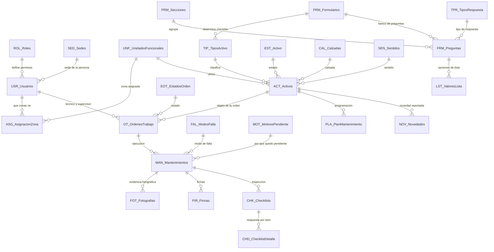

# SGMC — Sistema de Gestión de Mantenimiento en Campo

Aplicación de campo para la inspección y el mantenimiento de la infraestructura tecnológica,
eléctrica y de TI del corredor vial de la **Concesión Transversal del Sisga S.A.S.**

> ## El estado vive en [`ESTADO.md`](ESTADO.md)
>
> **Léalo primero.** Este README explica qué es el sistema y cómo está organizado el repositorio;
> `ESTADO.md` dice en qué punto está hoy, qué falta y quién lo bloquea. Si los dos discrepan, manda
> `ESTADO.md`.
>
> En una frase, a 2026-08-11: **la hoja de datos está terminada y verificada; la aplicación está a
> medio cablear.** Las 28 tablas están dadas de alta, las 39 referencias auditadas en 0 correcciones
> y en el editor están puestas las 6 claves con `UNIQUEID()` más los tipos y las etiquetas de 22 de
> las 28 tablas. Faltan las 2 columnas virtuales `Etiqueta`, los 5 bots y los 2 filtros de
> seguridad.
>
> **`ESPEC-005` es el primer dictamen del pipeline que pasa el gate**, y ya está aplicada al modelo:
> `OTID` y `PlanID` se generan con `UNIQUEID()`. `ESPEC-004` sigue bloqueada.
>
> **Dónde está el Excel:** [`BD/Modelo_Datos_PLANTILLA.xlsx`](BD/Modelo_Datos_PLANTILLA.xlsx). La
> plantilla sale entera de `python scripts/generar_plantilla.py` y es el mismo archivo publicado como
> `Modelo_Datos_10082026`, que es la hoja que la aplicación lee. **No se edita a mano.**
>
> **Con qué comando se pregunta el estado real del cableado:**
>
> ```bash
> python scripts/auditar_cableado.py
> ```
>
> Lee la aplicación en vivo y reemite [`docs/CORRECCIONES_CABLEADO.md`](docs/CORRECCIONES_CABLEADO.md)
> con lo que quede pendiente. **Ningún documento generado desde el modelo sabe qué está cableado**: el
> modelo declara lo que tiene que existir, no lo que existe.

Construida sobre **Google AppSheet** con backend en **Google Sheets**. Sin servidores propios,
sin compilación de APK, sin Play Console: los técnicos instalan la app de AppSheet e inician
sesión con su cuenta corporativa.

**La aplicación vigente es `_SISGA_-323965761`.** Las versiones anteriores se abandonaron
el 2026-08-10 al limpiar el repositorio e iniciar la reconstrucción limpia sobre `Modelo_Datos_10082026`.
El porqué está en [`BASE_CONOCIMIENTO_APPSHEET.md`](docs/BASE_CONOCIMIENTO_APPSHEET.md) §11 y §12.

---

## 1. El problema que resuelve

El mantenimiento del corredor se registraba en papel y hojas sueltas. Eso produce cuatro
problemas que el SGMC ataca directamente:

| Problema | Cómo lo resuelve el SGMC |
|---|---|
| No hay evidencia verificable de que el técnico estuvo en el activo | Geofencing GPS: el cierre solo se permite dentro del radio definido para ese tipo de activo, con registro de precisión satelital y las columnas de captura no editables |
| Buena parte del corredor no tiene señal celular (montaña, túneles) | Operación offline nativa: se diligencia sin red y sincroniza al recuperar conexión |
| Cada tipo de activo requiere una inspección distinta | Checklist dinámico: la app abre el formulario que corresponde al tipo del activo |
| El CCO se entera tarde de una falla | Bot de automatización: correo con informe cuando un activo queda fuera de servicio |

**Para qué existe, en una línea:** garantizar que el mantenimiento se hizo, que quien lo hizo estuvo
físicamente frente al equipo, y que la evidencia que lo respalda es difícil de falsificar.

## 2. Qué gestiona

La plantilla de datos, [`BD/Modelo_Datos_PLANTILLA.xlsx`](BD/Modelo_Datos_PLANTILLA.xlsx), contiene
**368 activos** repartidos sobre los 137 km del corredor vial de la Concesión.

**En la operación real hay 355 activos contables sobre 18 familias**, confirmados por operación el
2026-08-07 desde el Plan Maestro. La aritmética y el desglose están en
[`CONTEXTO_OPERACION.md`](docs/CONTEXTO_OPERACION.md).
**Tenemos el censo, no el registro**: sabemos cuántos postes SOS hay, no cuál es cada uno ni dónde
está.

Los **27 tipos** de la plantilla, en cuatro categorías. Eran 18 hasta el 2026-08-09, cuando se
añadieron los nueve que faltaban: nueve familias del Plan Maestro colgaban del tipo de otra cosa y
veían el checklist equivocado. La lista sale de `scripts/catalogo_tipos.py`, que es su fuente única:

- **ITS**, 14 — Postes SOS, CCTV, paneles de mensaje variable fijo y móvil (PMVF/PMVM), sensores
  meteorológicos y ambientales (SGM/SGE/SSA), báscula, báscula dinámica, carril de peaje,
  electrónica de peaje, estación de toma de datos, paso seguro, cámara OCR de pesaje
- **Eléctrico**, 3 — Generadores, UPS, subestaciones
- **Comunicaciones**, 1 — Fibra óptica
- **TI**, 9 — Servidores, NAS, switches, switches de capa 3, routers, firewalls, videowall,
  computadores portátiles, impresoras

> **Ninguna coordenada es la real.** `ACT_Activos.Ubicacion_LatLong` está poblada en las **368 de
> 368** filas y sus **368 valores son distintos**, pero ninguno se levantó en campo: cada uno se
> **deriva del `PK`** sobre el trazado del corredor, y se vuelve a derivar en **cada pasada** de
> `generar_plantilla.py`. Esa es la razón de que el renombrado de `Ubicacion` a `Ubicacion_LatLong`,
> que el 2026-08-10 dejó la columna vacía en las 368, no costara más que volver a generar: **un dato
> derivable no se conserva, se vuelve a derivar.** Cargar las reales es el bloqueante D-01 para salir
> a campo, y se comprueba con `python scripts/verificar_datos.py`.

## 3. Actores

| Rol | Dónde trabaja | Qué hace |
|---|---|---|
| **Técnico** | App móvil, mayoritariamente offline | Recibe la orden, diligencia el checklist, toma fotos, firma y la deja en revisión |
| **Supervisor** | Portal web | Programa y asigna órdenes, revisa evidencias, aprueba, cierra y consulta el tablero |
| **Administrador** | Portal web | Gestiona usuarios, catálogos, activos y plantillas de inspección |
| **Consulta** | Portal web | Solo lectura y reportes |

El activo **se abre por lista, no por escaneo**: el código QR quedó fuera de alcance por decisión
del 2026-08-07.

## 4. Cómo funciona


**Ciclo del técnico:** iniciar sesión y sincronizar, abrir sus órdenes, elegir la del día, responder
el checklist del tipo de activo, adjuntar fotografías, firmar y cerrar en sitio validando la
posición. La orden queda **En revisión**, no cerrada: quien hace el trabajo no certifica que se
hizo. Si no hay red, todo queda en cola local y sube solo al recuperar señal.

**Ciclo del supervisor:** programar la orden en el portal, asignarla a un técnico, revisar la
evidencia sincronizada, aprobarla y cerrarla.

## 5. Modelo de datos

La fuente única es **[`scripts/modelo_objetivo.py`](scripts/modelo_objetivo.py)**: de ahí se generan
la validación, el diccionario, el manual de despliegue y la plantilla de datos. **Nada se documenta
a mano.**

**28 tablas · 211 columnas · 39 referencias · 23 reglas.** La cifra sale de
`python scripts/validar_modelo.py`, que la imprime en su primera línea; no se cita de memoria.
Eran 21 reglas hasta que `ESPEC-005` añadió `RG-35` y `RG-36`.

> **Dos de esas 23 no son columnas de la hoja.** `RG-35` y `RG-36` son **columnas virtuales**
> llamadas `Etiqueta` que AppSheet calcula y no guarda en el Sheets, así que **no están en
> `MODELO`**: viven en `REGLAS` y en `inferencia.ETIQUETA_VIRTUAL`. Buscarlas en la hoja no las
> encuentra, y eso es correcto.

> **Y el volcado local es ciego a ocho tablas.** `generar_plantilla.py` vacía a propósito las ocho
> tablas de movimiento cada vez que corre, así que **una fila creada en la aplicación nunca aparece
> en `BD/Modelo_Datos_PLANTILLA.xlsx`**. Para mirar datos de movimiento, `python
> scripts/instantanea.py`, que lee por API. Está declarado en `scripts/lectura_de_vuelta.py` como
> `VOLCADO_CIEGO_A`.

| Documento | Qué describe |
|---|---|
| [`docs/ARQUITECTURA_OBJETIVO_SGMC.md`](docs/ARQUITECTURA_OBJETIVO_SGMC.md) | El sistema que se construye. Generado del modelo |
| [`docs/bd.md`](docs/bd.md) | Lo que la hoja tiene hoy, columna a columna. Generado del `.xlsx` |



### Las 28 tablas, por grupo

| Grupo | Cuántas | Tablas |
|---|---|---|
| **Catálogos** | 14 | `SED_Sedes`, `UNF_UnidadesFuncionales`, `ROL_Roles`, `USR_Usuarios`, `ASG_AsignacionZona`, `TIP_TiposActivo`, `EST_Activo`, `EOT_EstadosOrden`, `MOT_MotivosPendiente`, `PAR_Parametros`, `FRE_Frecuencias`, `CAL_Calzadas`, `SEN_Sentidos`, `FAL_ModosFalla` |
| **Maestra** | 1 | `ACT_Activos` |
| **Transaccionales** | 4 | `OT_OrdenesTrabajo`, `MAN_Mantenimientos`, `NOV_Novedades`, `PLA_PlanMantenimiento` |
| **Evidencias** | 2 | `FOT_Fotografias`, `FIR_Firmas` |
| **Checklist** | 2 | `CHK_Checklists`, `CHD_ChecklistDetalle` |
| **Motor de formularios** | 5 | `FRM_Formularios`, `FRM_Secciones`, `FRM_Preguntas`, `TPR_TiposRespuesta`, `LST_ValoresLista` |

La tabla `GPS` **se retiró**: la traza de posición vive en las columnas de captura de
`MAN_Mantenimientos`, no en una tabla aparte.

### Regla de geofencing

`ACT_Activos` guarda un único campo `Ubicacion_LatLong` de tipo LatLong —el sufijo está en el nombre
para que AppSheet acierte el tipo solo—. No hay columnas `Latitud` y `Longitud` separadas. El radio
sale del tipo de activo, porque una subestación y un poste SOS no admiten la misma tolerancia:

```
DISTANCE([Coordenadas_Cierre_LatLong], [OTID].[ActivoID].[Ubicacion_LatLong]) <= [OTID].[ActivoID].[TipoActivoID].[RadioGeofencingKm]
```

**No está cableada en la aplicación, y de las 23 reglas solo 9 lo están** —puestas y cotejadas a
ojo, que es la única evidencia posible: las expresiones no viajan por la API—. Todas están escritas y
listas para reponer en
[`docs/sdd/RECONSTRUCCION_EXPRESIONES.md`](docs/sdd/RECONSTRUCCION_EXPRESIONES.md), junto con el
`Editable_If = FALSE` de las cuatro columnas de captura. **Pero antes van las referencias que la
expresión atraviesa** —orden → activo → tipo—, porque una referencia mal puesta no hace fallar la
regla: la hace resolver contra lo que no es. El 2026-08-10 `ACT_Activos.TipoActivoID` apuntaba a
`SED_Sedes`, y esta misma expresión fallaba con
`Can't find column "RadioGeofencingKm" in table "SED_Sedes"` — un mensaje que invita a reescribir
una expresión correcta para acomodarla a un cableado roto. **Cuáles faltan hoy no lo dice este README
ni ningún documento generado del modelo**: lo dice `python scripts/auditar_cableado.py` leyendo la
aplicación.

**Lo que sí está resuelto es el dato.** En
[`BD/Modelo_Datos_PLANTILLA.xlsx`](BD/Modelo_Datos_PLANTILLA.xlsx) —el mismo archivo publicado
como `Modelo_Datos_10082026`— `TIP_TiposActivo.RadioGeofencingKm` trae valor en los **27 tipos**:
0,05 km en 18 —poste SOS, cámara, sensores, paso seguro y equipos de TI—, 0,1 km en 8 —paneles de
mensaje variable, básculas, peajes, generador y subestación— y 1,5 km en el tramo de fibra, que es
lineal.

**Y aunque se cablee, falta la coordenada real del activo** (bloqueante D-01). La columna ya no está
vacía —las 368 traen su punto derivado del `PK`—, y **eso se lee peor, no mejor**: la regla compara
contra un punto que está sobre la vía pero no frente al equipo, así que con radios de 0,05 km en 18
de los 27 tipos **rechaza el cierre legítimo, igual que cuando estaba vacía, pero ya no hay una celda
en blanco que lo delate**. Publicar antes de cargar las coordenadas reales entrega un sistema donde
ningún técnico puede cerrar una orden, y se descubre con el técnico delante.

**Y el cierre con excepción por GPS deficiente, tal como estaba declarado, no podía dispararse
nunca**: dependía de `USERLOCATIONACCURACY()`, que no existe en AppSheet. La corrección —que el
técnico marque la excepción en vez de que la calcule una fórmula inexistente— está especificada en
[`docs/sdd/ESPEC-004-cierre-excepcion-manual.md`](docs/sdd/ESPEC-004-cierre-excepcion-manual.md),
**bloqueada por el arquitecto en segunda pasada con quince hallazgos**. No se aplica.

**`OTID` y `PlanID` eran claves legibles sin generador declarado, y ya no lo son.** Las otras seis
tablas transaccionales vacías resolvían su clave con `UNIQUEID()`; estas dos no, y los bots `RG-10`
y `RG-12` creaban órdenes sin asignarla, así que la fila nacía sin clave y AppSheet la descartaba
sin avisar. **[`ESPEC-005`](docs/sdd/ESPEC-005-clave-otid-planid.md) lo resolvió y está aplicada al
modelo**: las dos pasan a `UNIQUEID()` —`CLAVE_LEGIBLE` de 22 a 20 tablas, `CLAVE_GENERADA` de 6 a
8— y la identificación ante el técnico la dan dos columnas virtuales `Etiqueta` (`RG-35`, `RG-36`).
**Con eso queda desbloqueado crear órdenes desde la aplicación**, que hasta hoy se hacen en el
Sheets saltándose todas las validaciones. **Lo que falta es la mitad que vive en el editor**: crear
las dos virtuales, marcarles `Show?` y marcarles `Label`, según
[`docs/PROMPT_CABLEADO.md`](docs/PROMPT_CABLEADO.md).

## 6. Estado, hallazgos y bloqueantes

Todos en [`ESTADO.md`](ESTADO.md), que se actualiza; aquí no, para que no se contradigan.

| Si necesita | Lea |
|---|---|
| Qué está hecho y qué falta hoy | [`ESTADO.md`](ESTADO.md) |
| **Qué está cableado en la aplicación** | `python scripts/auditar_cableado.py`. **No lo sabe ningún documento**; su salida queda en [`docs/CORRECCIONES_CABLEADO.md`](docs/CORRECCIONES_CABLEADO.md) |
| Qué le toca a usted según su rol | [`docs/INDICACIONES_POR_ROL.md`](docs/INDICACIONES_POR_ROL.md) |
| Qué hace el sistema, para quién y cómo | [`docs/FUNCIONAL_SGMC.md`](docs/FUNCIONAL_SGMC.md) |
| Cómo se construye o configura la app | [`docs/MANUAL_DESPLIEGUE.md`](docs/MANUAL_DESPLIEGUE.md) |
| Qué expresión va en cada sitio | [`docs/sdd/RECONSTRUCCION_EXPRESIONES.md`](docs/sdd/RECONSTRUCCION_EXPRESIONES.md) |
| Cómo se prueba que funciona | [`docs/sdd/PRUEBA-003-despliegue.md`](docs/sdd/PRUEBA-003-despliegue.md) |
| Por qué AppSheet se comporta así | [`docs/BASE_CONOCIMIENTO_APPSHEET.md`](docs/BASE_CONOCIMIENTO_APPSHEET.md) |
| Cómo se mantiene el corredor de verdad | [`docs/CONTEXTO_OPERACION.md`](docs/CONTEXTO_OPERACION.md) |
| Con qué supuestos se construye | [`docs/ALCANCE_Y_SUPUESTOS_SGMC.md`](docs/ALCANCE_Y_SUPUESTOS_SGMC.md) |

## 7. Método: nada se ejecuta contra producción sin las tres firmas

El método vigente es SDD, descrito en [`docs/SDD_PIPELINE_SGMC.md`](docs/SDD_PIPELINE_SGMC.md):
especificar, probar y aprobar antes de tocar producción. `python scripts/validar_modelo.py` en 0 errores es el único gate objetivo.

Los **seis** verificadores, que no se sustituyen entre sí:

| Script | Mide |
|---|---|
| [`scripts/validar_modelo.py`](scripts/validar_modelo.py) | El modelo consigo mismo |
| [`scripts/verificar_faseA.py`](scripts/verificar_faseA.py) | El modelo contra la hoja descargada |
| [`scripts/verificar_documentos.py`](scripts/verificar_documentos.py) | La prosa contra el modelo |
| [`scripts/verificar_enlaces.py`](scripts/verificar_enlaces.py) | Que todo enlace relativo entre documentos resuelve |
| [`scripts/verificar_reproducible.py`](scripts/verificar_reproducible.py) | Que generar la plantilla dos veces dé el mismo archivo |
| [`scripts/verificar_datos.py`](scripts/verificar_datos.py) | Que **los datos** sostienen lo que el modelo declara |

**El sexto se añadió el 2026-08-10, y tapa el hueco que los otros cinco compartían: ninguno abría el
archivo de datos.** `verificar_datos.py` mira si las columnas obligatorias están pobladas en las
tablas que tienen filas, y si las 39 referencias resuelven **contra los valores reales**. Por ese
hueco se colaron tres defectos el mismo día, en verde: `Ubicacion_LatLong` vacía en las 368,
`SED_Sedes.UnidadFuncionalID` vacía en 5 de 6 y `ACT_Activos.SedeID` vacía en las 368.

**Ninguno de los seis mira la aplicación.** Para eso hay un séptimo script, que no es un verificador
del modelo sino un **auditor del cableado real**:

| Script | Mide |
|---|---|
| [`scripts/auditar_cableado.py`](scripts/auditar_cableado.py) | El cableado **real** de la aplicación contra el modelo. Emite [`docs/CORRECCIONES_CABLEADO.md`](docs/CORRECCIONES_CABLEADO.md) |
| [`scripts/probar_auditor.py`](scripts/probar_auditor.py) | Que el auditor **caza lo que dice cazar**: le mete seis defectos a propósito, incluido el real del 2026-08-10 |

Existe porque el 2026-08-10 el cableado se reportó como «39/39 asignadas» y no lo estaba: dos
referencias apuntaban a `SED_Sedes` en vez de a `CAL_Calzadas` y a `TIP_TiposActivo`, y tres columnas
de texto se habían convertido en `Ref`. **Nada lo detectó**: `validar_modelo.py` daba `APTO`, la API
respondía 28/28 y las 368 filas seguían ahí. Es la regla `R-04` —*una referencia que resuelve puede
apuntar a lo que no es*—, y preguntar «apunta a algo» nunca contesta «apunta a lo correcto».

**Y tres módulos que no verifican nada: declaran lo que nadie declaraba.** Se consultan antes de
tocar el editor, no después:

| Script | Declara |
|---|---|
| [`scripts/lectura_de_vuelta.py`](scripts/lectura_de_vuelta.py) | **Quién comprueba cada clase de cambio**: tres tienen comando, **cuatro no tiene nadie**. Y `VOLCADO_CIEGO_A`, las ocho tablas que el volcado local vacía por diseño |
| [`scripts/navegacion_editor.py`](scripts/navegacion_editor.py) | **Dónde está cada control en pantalla.** El nombre de la regla no es el del control: `Required_If` se llama `Require?` y **no es una casilla** |
| [`scripts/alcance_reglas.py`](scripts/alcance_reglas.py) | **Qué columnas toca de verdad cada regla, con su tabla**: 39 de las 211. Por nombre suelto salían 94 |

## 8. Organización del repositorio

```
ESTADO.md      Dónde vamos y qué falta. Se lee primero
README.md      Este archivo
CLAUDE.md      Reglas de trabajo para agentes
MAP.md         Índice maestro y referencias cruzadas

BD/            Hojas de datos. Modelo_Datos_PLANTILLA.xlsx es el entregable de datos
docs/          Documentación técnica y funcional
  images/      Figuras de los documentos
  sdd/         Artefactos del pipeline: ESPEC, PRUEBA y RECONSTRUCCION_EXPRESIONES
Manuales/      Manual de usuario
scripts/       Fuente del modelo, validadores, generadores y el auditor de cableado
contexto/      Material de contexto operativo. No es la vara, y no se versiona
archivo/       Material de origen, no versionado
```

| Documento | Para qué sirve |
|---|---|
| [ESTADO.md](ESTADO.md) | **Empiece aquí.** Qué está hecho, qué falta, qué está bloqueado |
| [docs/INDICACIONES_POR_ROL.md](docs/INDICACIONES_POR_ROL.md) | Quién hace qué para que esto llegue a campo, con sus decisiones exclusivas y su costo |
| [docs/FUNCIONAL_SGMC.md](docs/FUNCIONAL_SGMC.md) | Qué hace el sistema. Su §6 es el registro de una sola forma por propósito |
| [docs/ARQUITECTURA_OBJETIVO_SGMC.md](docs/ARQUITECTURA_OBJETIVO_SGMC.md) | Modelo objetivo, generado desde `scripts/modelo_objetivo.py` y validado |
| [docs/bd.md](docs/bd.md) | Diccionario As-Built, generado del archivo |
| [docs/MANUAL_DESPLIEGUE.md](docs/MANUAL_DESPLIEGUE.md) | De cero a app desplegada, con la ficha de las 28 tablas columna por columna |
| [docs/GUIA_IMPLEMENTACION_FUNCIONAL.md](docs/GUIA_IMPLEMENTACION_FUNCIONAL.md) | La implementación vista desde la operación |
| [docs/MODELO_EVOLUCION_FASE_2.md](docs/MODELO_EVOLUCION_FASE_2.md) | Lo que viene después del piloto |
| [docs/BASE_CONOCIMIENTO_APPSHEET.md](docs/BASE_CONOCIMIENTO_APPSHEET.md) | Cómo se comporta AppSheet, con cita textual y URL oficial |
| [docs/SDD_PIPELINE_SGMC.md](docs/SDD_PIPELINE_SGMC.md) | El método: cinco agentes, dos fases y el gate |
| [docs/ALCANCE_Y_SUPUESTOS_SGMC.md](docs/ALCANCE_Y_SUPUESTOS_SGMC.md) | Alcance del sistema y los 14 supuestos adoptados |
| [docs/CONTEXTO_OPERACION.md](docs/CONTEXTO_OPERACION.md) | Cómo se mantiene el corredor, y la procedencia de cada documento de contexto |
| [docs/COMUNICACION_PROPIETARIO_APP.md](docs/COMUNICACION_PROPIETARIO_APP.md) | Qué decirle al dueño de la aplicación anterior |
| [docs/ROADMAP.md](docs/ROADMAP.md) | Fases con criterio de cierre verificable |
| [docs/sdd/](docs/sdd/) | Especificaciones y pruebas del pipeline (`ESPEC-003`, `PRUEBA-003`, `RECONSTRUCCION_EXPRESIONES`, `ESPEC-004`, `ESPEC-005`) |
| [Manuales/MANUAL_DE_USUARIO.md](Manuales/MANUAL_DE_USUARIO.md) | Guía de operación por rol. **No se entrega todavía**: describe funciones que aún no están montadas, y lo dice en su cabecera |
| [MAP.md](MAP.md) | Índice maestro y referencias cruzadas |
| [CLAUDE.md](CLAUDE.md) | Reglas de trabajo para agentes sobre este repositorio |

**Entregables al cliente**

**Hoy el repositorio tiene un solo entregable, y es de datos:**

| Archivo | Estado |
|---|---|
| [`BD/Modelo_Datos_PLANTILLA.xlsx`](BD/Modelo_Datos_PLANTILLA.xlsx) | **El entregable de datos.** Generado del modelo: 28 pestañas de datos más `_LEEME`, 211 columnas, ninguna de sobra. 27 tipos de activo, 27 formularios y 368 activos |

> **La carpeta `entregables/` ya no existe en el repositorio.** Sus cinco archivos —la propuesta de
> arquitectura, la definición funcional de la mesa de trabajo, el correo de envío, las
> especificaciones As-Built v2.0 y el modelo de datos As-Built— **se retiraron en la limpieza del
> 2026-08-10**, con el resto del material que describía aplicaciones y hojas superadas. Los dos Word
> ya se habían enviado y no se reenvían; sus catorce decisiones viven hoy como supuestos adoptados en
> [`docs/ALCANCE_Y_SUPUESTOS_SGMC.md`](docs/ALCANCE_Y_SUPUESTOS_SGMC.md). Se comprueba con
> `git log --diff-filter=D --name-only -- 'entregables/*'`.

## 9. Enlaces

- Aplicación AppSheet `_SISGA_-323965761`: [abrir en AppSheet](https://www.appsheet.com/template/appdef?appId=aca92ac5-a6eb-4c73-be81-471a5b3fe04e)
- Backend Google Sheets `Modelo_Datos_10082026`, 29 pestañas, propiedad de la Concesión:
  [abrir](https://docs.google.com/spreadsheets/d/1h9kyCYGK6esRL1UiTcPXHlSmDQcPb13fNZ0hBznYOa0)
- Repositorio: [github.com/dieleoz/SGMC](https://github.com/dieleoz/SGMC)

---
Concesión Transversal del Sisga S.A.S. | Agosto de 2026
