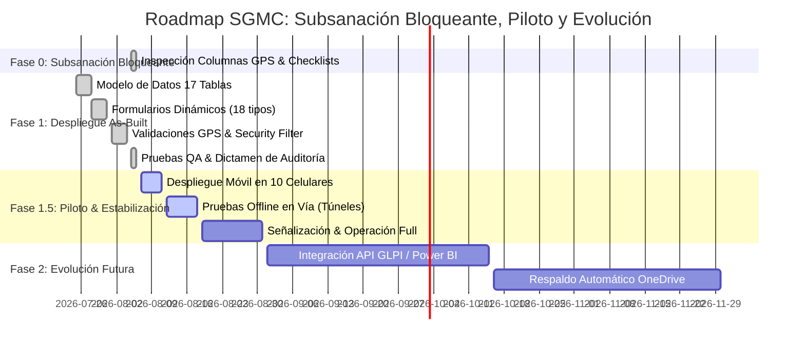

# 🗺️ ROADMAP DE IMPLEMENTACIÓN Y EVOLUCIÓN — SGMC AppSheet

**Proyecto:** Sistema de Gestión de Mantenimiento en Campo (SGMC)  
**Cliente:** Concesión Transversal del Sisga S.A.S.  
**Estado Actual:** 🟢 **Fase 1.5: Grupo Piloto y Estabilización de Campo (Agosto 2026)**  
**URL de la Aplicación:** [SGMC en AppSheet](https://www.appsheet.com/start/060b99df-2037-4049-b94d-03c1eefc3219?platform=desktop#appName=SGMC-886843353&vss=H4sIAAAAAAAAA6XOvQ7CIBQF4Hc5M0_AahyM0cWfRTpguU2ILTQF1Ibw7t6qjbM6csh37sm4Wrrtoq4vkKf8ea1phERW2I89KUiFhXdx8K2CUNjq7hUeQtKD9UGhoFRi9pECZP6Oy_-uC1hDLtrG0jB1TZI73o6_J8XBbFAEuhT1uaXnYDalcNb4OgUyR57yw4Swcst7r53ZeMOVjW4DlQcPF0XqZQEAAA==&view=Usuarios)  

---

## 📌 Estado de Avance por Fases

---

## 🚦 Detalle de Fases y Punto de Inicio

### 🟢 Fase 0 y 1: As-Built & Subsanaciones (COMPLETADO 100%)
- [x] **Subsanaciones Físicas de Excel:** Columnas `Coordenadas_Cierre` y `Precision_GPS` en `MAN_Mantenimientos`, esquemas de `CHK_Checklists` y `CHD_ChecklistDetalle`, unificación de `FRM_Formularios`.
- [x] **Modelo Relacional de 17 Tablas:** Estructura jerárquica en Microsoft 365 / Excel.
- [x] **18 Formularios Dinámicos:** Asignación automática de checklists por tipo de activo.
- [x] **Geofencing GPS (RF-012):** Bloqueo de cierre a > 1.0 km (`DISTANCE() <= 1.0`).
- [x] **Seguridad por Zona (RF-004):** Security Filter por `SedeID`.
- [x] **Dictamen de Auditoría:** `DICTAMEN_AUDITORIA_LOCAL_SGMC.md` 100% Conforme.

---

### 🟡 Fase 1.5: Grupo Piloto y Estabilización (PUNTO DE INICIO ACTUAL DE OPERACIÓN)
- [ ] **1. Despliegue Móvil (Tarea T-01 / Q-01):** Instalación de AppSheet App en los 10 móviles del equipo piloto y autenticación SSO M365 (`USEREMAIL()`).
- [ ] **2. Verificación de Security Filter (Tarea T-02 / Q-02):** Confirmar que cada técnico descargue únicamente los activos de su sede asignada.
- [ ] **3. Pruebas de Carga Offline en Vía (Tarea Q-05):** Ejecución de mantenimientos en zonas de sombra celular (túneles y montaña) validando la compresión de 6 fotos a 600px y sincronización en segundo plano.
- [ ] **4. Validación de Alertas CCO (Tarea T-05 / S-03):** Envío automático de emails con PDF adjunto en estado *Fuera de Servicio*.

---

### 🔵 Fase 2: Evolución Futura (Plan de Escalabilidad)
- [ ] **Integración con Power BI:** Conexión directa del repositorio M365 para tableros ejecutivos avanzados.
- [ ] **Integración con GLPI / Mesas de Ayuda:** Sincronización API para tickets de mantenimiento de TI.
- [ ] **Respaldo Automático:** Script mensual de backup de evidencias fotográficas y base de datos a OneDrive corporativo.

---
*Referencias Cruzadas:* [README.md](./README.md) | [plan_de_trabajo.md](./plan_de_trabajo.md) | [especificaciones.md](./especificaciones.md) | [MAP.md](./MAP.md)
