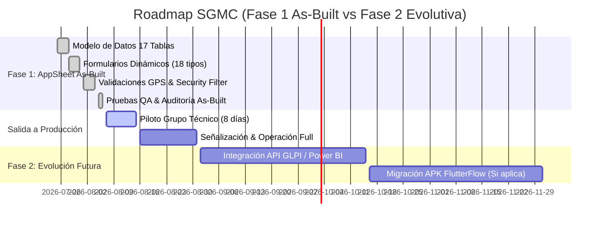

# 🗺️ ROADMAP DE IMPLEMENTACIÓN Y EVOLUCIÓN — SGMC AppSheet

**Proyecto:** Sistema de Gestión de Mantenimiento en Campo (SGMC)  
**Cliente:** Concesión Transversal del Sisga S.A.S.  
**Estado Actual:** 🟢 **Fase 1: As-Built & Salida a Producción (Agosto 2026)**  
**URL de la Aplicación:** [SGMC en AppSheet](https://www.appsheet.com/start/060b99df-2037-4049-b94d-03c1eefc3219?platform=desktop#appName=SGMC-886843353&vss=H4sIAAAAAAAAA6XOvQ7CIBQF4Hc5M0_AahyM0cWfRTpguU2ILTQF1Ibw7t6qjbM6csh37sm4Wrrtoq4vkKf8ea1phERW2I89KUiFhXdx8K2CUNjq7hUeQtKD9UGhoFRi9pECZP6Oy_-uC1hDLtrG0jB1TZI73o6_J8XBbFAEuhT1uaXnYDalcNb4OgUyR57yw4Swcst7r53ZeMOVjW4DlQcPF0XqZQEAAA==&view=Usuarios)  

---

## 📌 Estado de Avance por Fases

---

## 🚦 Detalle de Fases

### 🟢 Fase 1: Despliegue As-Built (ACTUAL - COMPLETADO 100%)
- [x] **Modelo Relacional de 17 Tablas:** Estructura jerárquica en Microsoft 365 / Excel.
- [x] **18 Formularios Dinámicos:** Asignación automática de checklists por tipo de activo.
- [x] **Geofencing GPS (RF-012):** Bloqueo de cierre a > 1.0 km (`DISTANCE() <= 1.0`).
- [x] **Seguridad por Zona (RF-004):** Security Filter por `SedeID`.
- [x] **Notificaciones por Email (RF-016):** Automation Bot en estado *Fuera de servicio*.
- [x] **Auditoría & Pruebas QA:** Batería `TC-SEC-01` a `TC-BOT-01` verificada.

### 🟡 Fase 1.5: Grupo Piloto y Estabilización (En Curso)
- [ ] **Despliegue Móvil:** Instalación de AppSheet App desde Google Play / App Store en los dispositivos móviles de los técnicos.
- [ ] **Sincronización Piloto:** Medición de latencia de carga inicial en zonas de baja señal (Sutatenza, Machetá, San Luis de Gaceno).
- [ ] **Ajuste de Caché:** Monitoreo de compresión de imágenes a 600px en `FOT_Fotografias`.

### 🔵 Fase 2: Evolutiva (Plan de Escalabilidad Futura)
- [ ] **Integración con Power BI:** Conexión directa del repositorio M365 para tableros ejecutivos avanzados.
- [ ] **Integración con GLPI / Mesas de Ayuda:** Sincronización API para tickets de mantenimiento de infraestructura de TI.
- [ ] **Respaldo Automático:** Script mensual de backup de imágenes y base de datos a OneDrive corporativo.

---
*Referencias Cruzadas:* [README.md](./README.md) | [especificaciones.md](./especificaciones.md) | [bd.md](./bd.md) | [MAP.md](./MAP.md)
