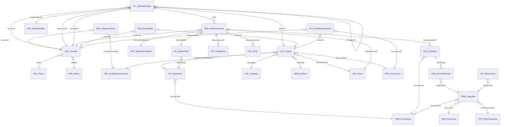

# Arquitectura objetivo del SGMC

**Generado automáticamente** por `scripts/generar_doc_arquitectura.py` desde
`scripts/modelo_objetivo.py`. No editar a mano: los cambios se hacen en el modelo y se
regenera. Validado con `scripts/validar_modelo.py`.

Este documento define el sistema que se va a construir, no el que existe. El actual está
descrito en `AUDITORIA_PLAN_Y_ROADMAP.md` y no sirve como base: sus referencias no están
cableadas, cuatro tablas están vacías y la cadena relacional existe solo en el papel.

**27 tablas · 192 columnas · 38 referencias · 13 reglas**

---

## 1. Convenciones

Cinco reglas que el modelo anterior no tenía, y cuya ausencia explica sus fallos:

1. **Toda tabla tiene una clave primaria única, de tipo texto, llamada `<Prefijo>ID`.**
2. **Toda referencia se llama igual que la clave a la que apunta.** La mezcla de `OTID` con
   `Numero_OT` fue causa directa de registros huérfanos. Cuando el mismo destino se referencia
   con dos roles distintos, como técnico y supervisor, el alias se declara y se justifica.
3. **Un dato se guarda en un solo lugar.** Nada de evidencia repetida entre campos embebidos y
   tablas hijas.
4. **Las tablas hijas llevan `IsPartOf`:** se crean, editan y borran con su padre.
5. **Los catálogos llevan `Activo`,** para retirar un valor sin romper el histórico.

## 2. Qué cambia respecto del modelo actual

### 2.1 Tablas nuevas

| Tabla | Por qué |
|---|---|
| `UNF_UnidadesFuncionales` | Tramos del corredor donde estan los activos. Se separa de SED_Sedes porque son dos conceptos distintos que el modelo anterior mezclaba en una sola columna, dejando usuarios y activos en conjuntos disjuntos. |
| `ASG_AsignacionZona` | Que unidades funcionales atiende cada tecnico. Resuelve el supuesto D-03: un tecnico puede tener varias, de modo que la relacion es de muchos a muchos y no cabe como columna en USR_Usuarios. |
| `EOT_EstadosOrden` | Ciclo de vida de la orden segun el supuesto D-06. Declararlo como catalogo, y no como texto libre, es lo que permite medir cumplimiento. |
| `MOT_MotivosPendiente` | Motivos tipificados de trabajo incompleto, supuesto D-07. Si el tecnico no tiene donde declarar por que no pudo terminar, fuerza un cierre falso. |
| `NOV_Novedades` | Hallazgos del tecnico en ruta: activos no inventariados o fallas fuera de programacion. Supuesto D-08. Sin esta via los hallazgos se pierden o acaban en WhatsApp, que es lo que el sistema viene a reemplazar. |
| `PLA_PlanMantenimiento` | Que tarea preventiva toca a cada activo y cada cuanto. Es lo que convierte al sistema en gestion de mantenimiento y no en un registro de formularios: de aqui salen las ordenes, en lugar de crearlas a mano una por una. |
| `FAL_ModosFalla` | Taxonomia de fallas por tipo de activo. Sin clasificar la falla no hay ingenieria de mantenimiento posible: no se puede calcular tiempo medio entre fallas, ni saber que componente falla mas, ni pasar de correctivo a predictivo. |

### 2.2 Tablas que se retiran

| Tabla | Motivo |
|---|---|
| `GPS` | Duplica Coordenadas_Cierre y Precision_GPS de MAN_Mantenimientos. Nunca recibio un registro. |
| `FRM_SOS` | Hoja plana en paralelo al motor FRM_Preguntas. Se migra y se retira. |
| `FRM_CCTV` | Hoja plana en paralelo al motor FRM_Preguntas. Se migra y se retira. |
| `FRM_PMVF` | Hoja plana en paralelo al motor FRM_Preguntas. Se migra y se retira. |
| `SEC_Secciones` | Duplicada con FRM_Secciones. Se consolida en una sola. |

### 2.3 Campos que se retiran

`MAN_Mantenimientos` pasa de 24 columnas heterogéneas a un registro de ejecución limpio. El
resto son campos que guardaban por segunda vez un dato alcanzable por referencia.

**`MAN_Mantenimientos`**

| Campo | Motivo |
|---|---|
| `ActivoID` | El activo se alcanza por [OTID].[ActivoID]. Guardarlo tambien aqui permite que la ejecucion diga un activo y su orden diga otro, y no hay forma de saber cual miente. Existe en el Excel local; AppSheet confirmo que en produccion no esta. |
| `Imagen_Inicio` | Sustituido por FOT_Fotografias con Tipo=Antes. |
| `Imagen_Final` | Sustituido por FOT_Fotografias con Tipo=Despues. |
| `Firma_Tecnico` | Sustituido por FIR_Firmas. |
| `Firma_Supervisor` | El supervisor aprueba en el portal, no firma. Supuesto D-10. |
| `Localizacion` | Ambiguo y redundante con Coordenadas_Cierre. |
| `Diagnostico` | Se responde en el checklist, no en campo libre. |
| `Trabajo_Realizado` | Se responde en el checklist. |
| `Repuestos_Utilizados` | Gestion de repuestos esta fuera de alcance. |
| `Requiere_Repuesto` | Se cubre con MotivoPendienteID = Falta de repuesto. |
| `Duracion_Minutos` | Se calcula de FechaHoraInicio y FechaHoraFin. |
| `Tipo` | El tipo es de la orden, no de la ejecucion. |
| `Fecha` | Redundante con FechaHoraInicio. |
| `Estado_Intervencion` | Redundante con el estado de la orden. |

**`OT_OrdenesTrabajo`**

| Campo | Motivo |
|---|---|
| `FormularioID` | El formulario lo determina el tipo del activo, no la orden. |
| `Motivo_Cierre` | Se tipifica en MOT_MotivosPendiente desde la ejecucion. |
| `Informe_Final` | Se genera del mantenimiento y su checklist, no se transcribe. |

**`ACT_Activos`**

| Campo | Motivo |
|---|---|
| `SedeID` | Se sustituye por UnidadFuncionalID. Mezclar donde trabaja la persona con donde esta el activo es lo que dejo a los usuarios en la sede 1 y a los activos en las sedes 7 a 10, es decir en conjuntos disjuntos. |

**`CHK_Checklists`**

| Campo | Motivo |
|---|---|
| `ActivoID` | Se alcanza por [MantenimientoID].[OTID].[ActivoID]. |
| `TecnicoID` | Se alcanza por [MantenimientoID].[TecnicoID]. Es el campo donde el dato de prueba dejo 'Santiago Moreno' en lugar de un identificador. |
| `Observaciones` | La observacion es de la ejecucion o de la respuesta, no del encabezado. |

**`CHD_ChecklistDetalle`**

| Campo | Motivo |
|---|---|
| `Seccion` | Se alcanza por [PreguntaID].[SeccionID]. |

### 2.4 Cableado de referencias

El defecto raíz del sistema actual no es que falten columnas: es que las que existen son
texto. AppSheet responde `Invalid dereference. Column OTID is not a Ref`, y con eso caen el
geofencing, la navegación padre-hijo y todo reporte por activo.

Una referencia de AppSheet **guarda el valor de la clave de la tabla destino**. Por eso
renombrar y retipar no son dos tareas sino una: si la clave se llama `Numero_OT` y quien la
apunta se llama `OTID`, la conversión no tiene contra qué resolver.

Los nombres actuales se verificaron el 2026-08-07 leyendo `BD/Modelo de Datos (2).xlsx` con
`openpyxl`, encabezado por encabezado, sobre las cinco tablas implicadas.

#### Conservan el nombre, cambian de tipo

| Tabla | Columna | Tipo actual | Tipo objetivo | Apunta a | Nota |
|---|---|---|---|---|---|
| `MAN_Mantenimientos` | `OTID` | Text | **Ref** | `OT_OrdenesTrabajo` | Verificado: AppSheet rechaza la desreferencia porque es Text. La tabla tiene 0 filas, asi que hoy la conversion no arrastra ningun dato. Es el momento mas barato en que se podra hacer. |
| `ACT_Activos` | `TipoActivoID` | Number | **Ref** | `TIP_TiposActivo` | Guarda enteros 1 a 18. Por confirmar en produccion. |
| `ACT_Activos` | `CalzadaID` | Number | **Ref** | `CAL_Calzadas` | Por confirmar en produccion. |
| `ACT_Activos` | `SentidoID` | Number | **Ref** | `SEN_Sentidos` | Por confirmar en produccion. |
| `ACT_Activos` | `FrecuenciaID` | Number | **Ref** | `FRE_Frecuencias` | Por confirmar en produccion. |
| `CHK_Checklists` | `FormularioID` | Text | **Ref** | `FRM_Formularios` | Por confirmar en produccion. |
| `CHD_ChecklistDetalle` | `ChecklistID` | Text | **Ref** | `CHK_Checklists` | Ademas IsPartOf: el detalle vive y muere con su encabezado. |

#### Cambian de nombre

| Tabla | Nombre actual | Nombre objetivo | Por qué |
|---|---|---|---|
| `OT_OrdenesTrabajo` | `Numero_OT` | **`OTID`** | La clave se llamaba distinto de la referencia que la apunta. Ese solo desajuste produjo el checklist huerfano d02d8a3d. |
| `OT_OrdenesTrabajo` | `Activo` | **`ActivoID`** | Guarda enteros que son ActivoID (2, 26, 5, 9, 27, 3). Es la referencia al activo, con nombre que parece una bandera. |
| `OT_OrdenesTrabajo` | `Tecnico` | **`TecnicoID`** | Guarda enteros que son UsuarioID. |
| `OT_OrdenesTrabajo` | `SupervidorID` | **`SupervisorID`** | Error de escritura en el encabezado de produccion. |
| `OT_OrdenesTrabajo` | `Fecha Programada` | **`FechaProgramada`** | Los espacios en el nombre obligan a citarlo. |
| `OT_OrdenesTrabajo` | `Estado` | **`EstadoOrdenID`** | Pasa de texto libre a referencia contra EOT_EstadosOrden. |
| `OT_OrdenesTrabajo` | `Fecha_Cierre` | **`FechaCierre`** | Convencion de nombres. |
| `OT_OrdenesTrabajo` | `Cerrada_Por` | **`CerradaPor`** | Convencion de nombres. |
| `ACT_Activos` | `EstadoID` | **`EstadoActivoID`** | La referencia se llama como la clave destino. |
| `MAN_Mantenimientos` | `T�cnicoID` | **`TecnicoID`** | Encabezado con la tilde corrupta por codificacion. |
| `MAN_Mantenimientos` | `Hora Inicio` | **`FechaHoraInicio`** | Fecha y hora en una sola columna DateTime. |
| `MAN_Mantenimientos` | `Hora Fin` | **`FechaHoraFin`** | Fecha y hora en una sola columna DateTime. |
| `MAN_Mantenimientos` | `Estado Final` | **`EstadoActivoID`** | Pasa a referencia contra EST_Activo. |
| `MAN_Mantenimientos` | `Requiere_Segunda_Visita` | **`RequiereSegundaVisita`** | Convencion de nombres. |
| `MAN_Mantenimientos` | `Motivo_Pendiente` | **`MotivoPendienteID`** | Pasa a referencia contra MOT_MotivosPendiente. |
| `MAN_Mantenimientos` | `Aprobado_Supervisor` | **`AprobadoSupervisor`** | Convencion de nombres. |
| `MAN_Mantenimientos` | `Usuario_Registro` | **`UsuarioRegistro`** | Convencion de nombres. |
| `MAN_Mantenimientos` | `Fecha_Hora_Registro` | **`FechaHoraRegistro`** | Convencion de nombres. |
| `CHK_Checklists` | `OTID` | **`MantenimientoID`** | Cambia de padre: el checklist cuelga de la ejecucion, no de la orden. La inspeccion es parte de ejecutar. |
| `CHK_Checklists` | `T�cnicoID` | **`TecnicoID`** | Encabezado con la tilde corrupta. Se retira despues. |
| `CHK_Checklists` | `Estado` | **`Finalizado`** | Un booleano en lugar de texto libre. |
| `CHD_ChecklistDetalle` | `Secci�n` | **`Seccion`** | Encabezado con la tilde corrupta. Se retira despues. |
| `CHD_ChecklistDetalle` | `PreguntaItem` | **`PreguntaID`** | Guardaba el TEXTO de la pregunta. Sin la clave no hay comparacion historica posible. |
| `CHD_ChecklistDetalle` | `EstadoRespuesta` | **`RespuestaLista`** | El tipo de respuesta lo fija la pregunta. |
| `CHD_ChecklistDetalle` | `Observaci�n` | **`Observacion`** | Encabezado con la tilde corrupta. |

#### La trampa del nombre reutilizado

`OT_OrdenesTrabajo.Activo` guarda hoy el identificador del activo, pero en el modelo objetivo
`Activo` es la bandera `Yes/No` que llevan todas las tablas. **Son dos columnas distintas que
se llaman igual en momentos distintos.** Al migrar hay que renombrar la vieja antes de crear la
nueva; en el orden inverso el Sheets queda con dos columnas `Activo` y AppSheet resuelve una de
las dos sin avisar cuál. `validar_modelo.py` lo señala como aviso V-14.

## 3. Diagrama de relaciones



## 4. Definición de las tablas

### 4.1 Catalogos (13)

#### `SED_Sedes`

Sedes fisicas donde trabaja el personal: CCO, peajes y basculas.

| Columna | Tipo | Clave | Referencia | Obligatoria | Nota |
|---|---|---|---|---|---|
| `SedeID` | Text | PK |  |  |  |
| `Nombre` | Text |  |  | Sí |  |
| `Ciudad` | Text |  |  |  |  |
| `Activo` | Yes/No |  |  |  | Valor inicial: `TRUE` |

#### `UNF_UnidadesFuncionales` · **NUEVA**

Tramos del corredor donde estan los activos. Se separa de SED_Sedes porque son dos conceptos distintos que el modelo anterior mezclaba en una sola columna, dejando usuarios y activos en conjuntos disjuntos.

| Columna | Tipo | Clave | Referencia | Obligatoria | Nota |
|---|---|---|---|---|---|
| `UnidadFuncionalID` | Text | PK |  |  |  |
| `Nombre` | Text |  |  | Sí |  |
| `PRInicial` | Text |  |  |  |  |
| `PRFinal` | Text |  |  |  |  |
| `Activo` | Yes/No |  |  |  | Valor inicial: `TRUE` |

#### `ROL_Roles`

Perfiles de acceso: Administrador, Supervisor, Tecnico y Consulta.

| Columna | Tipo | Clave | Referencia | Obligatoria | Nota |
|---|---|---|---|---|---|
| `RolID` | Text | PK |  |  |  |
| `Nombre` | Text |  |  | Sí |  |
| `Descripcion` | Text |  |  |  |  |
| `Activo` | Yes/No |  |  |  | Valor inicial: `TRUE` |

#### `USR_Usuarios`

Personas del sistema. El correo resuelve la sesion contra USEREMAIL().

| Columna | Tipo | Clave | Referencia | Obligatoria | Nota |
|---|---|---|---|---|---|
| `UsuarioID` | Text | PK |  |  |  |
| `Nombres` | Text |  |  | Sí |  |
| `Correo` | Email |  |  | Sí | Clave de resolucion de sesion |
| `Cargo` | Text |  |  |  |  |
| `Iniciales` | Text |  |  |  |  |
| `RolID` | Ref |  | `ROL_Roles` | Sí |  |
| `SedeID` | Ref |  | `SED_Sedes` | Sí |  |
| `Telefono` | Phone |  |  |  |  |
| `FechaIngreso` | Date |  |  |  |  |
| `Activo` | Yes/No |  |  |  | Valor inicial: `TRUE` |

#### `ASG_AsignacionZona` · **NUEVA**

Que unidades funcionales atiende cada tecnico. Resuelve el supuesto D-03: un tecnico puede tener varias, de modo que la relacion es de muchos a muchos y no cabe como columna en USR_Usuarios.

| Columna | Tipo | Clave | Referencia | Obligatoria | Nota |
|---|---|---|---|---|---|
| `AsignacionID` | Text | PK |  |  |  |
| `UsuarioID` | Ref |  | `USR_Usuarios` | Sí |  |
| `UnidadFuncionalID` | Ref |  | `UNF_UnidadesFuncionales` | Sí |  |
| `Activo` | Yes/No |  |  |  | Valor inicial: `TRUE` |

#### `TIP_TiposActivo`

Taxonomia de activos. Determina que checklist abre la aplicacion.

| Columna | Tipo | Clave | Referencia | Obligatoria | Nota |
|---|---|---|---|---|---|
| `TipoActivoID` | Text | PK |  |  |  |
| `Nombre` | Text |  |  | Sí |  |
| `Categoria` | Enum |  |  |  | ITS, Electrico, Comunicaciones, TI |
| `FormularioID` | Ref |  | `FRM_Formularios` | Sí | Sin este mapeo no hay checklist dinamico. Estaba vacio en los 18 tipos |
| `TieneQR` | Yes/No |  |  |  | Valor inicial: `TRUE` |
| `RequiereGPS` | Yes/No |  |  |  | Valor inicial: `TRUE` |
| `RadioGeofencingKm` | Decimal |  |  |  | Supuesto D-02: radio por tipo, no unico para los 18. Valor inicial: `0.2` |
| `Activo` | Yes/No |  |  |  | Valor inicial: `TRUE` |

#### `EST_Activo`

Estados del activo: Operativo, En mantenimiento, Fuera de servicio, Retirado.

| Columna | Tipo | Clave | Referencia | Obligatoria | Nota |
|---|---|---|---|---|---|
| `EstadoActivoID` | Text | PK |  |  |  |
| `Nombre` | Text |  |  | Sí |  |
| `GeneraAlerta` | Yes/No |  |  |  | Fuera de servicio dispara el bot de alerta. Valor inicial: `FALSE` |
| `Activo` | Yes/No |  |  |  | Valor inicial: `TRUE` |

#### `EOT_EstadosOrden` · **NUEVA**

Ciclo de vida de la orden segun el supuesto D-06. Declararlo como catalogo, y no como texto libre, es lo que permite medir cumplimiento.

| Columna | Tipo | Clave | Referencia | Obligatoria | Nota |
|---|---|---|---|---|---|
| `EstadoOrdenID` | Text | PK |  |  |  |
| `Nombre` | Text |  |  | Sí | Programada, Asignada, En ejecucion, En revision, Cerrada, Suspendida, Vencida |
| `Orden` | Number |  |  |  |  |
| `QuienCambia` | Enum |  |  |  | Sistema, Tecnico, Supervisor |
| `EsFinal` | Yes/No |  |  |  | Valor inicial: `FALSE` |
| `Activo` | Yes/No |  |  |  | Valor inicial: `TRUE` |

#### `MOT_MotivosPendiente` · **NUEVA**

Motivos tipificados de trabajo incompleto, supuesto D-07. Si el tecnico no tiene donde declarar por que no pudo terminar, fuerza un cierre falso.

| Columna | Tipo | Clave | Referencia | Obligatoria | Nota |
|---|---|---|---|---|---|
| `MotivoPendienteID` | Text | PK |  |  |  |
| `Nombre` | Text |  |  | Sí | Falta de repuesto, Clima, Acceso restringido, Riesgo, Requiere especialista |
| `GeneraSeguimiento` | Yes/No |  |  |  | Valor inicial: `TRUE` |
| `Activo` | Yes/No |  |  |  | Valor inicial: `TRUE` |

#### `FRE_Frecuencias`

Periodicidad del mantenimiento preventivo.

| Columna | Tipo | Clave | Referencia | Obligatoria | Nota |
|---|---|---|---|---|---|
| `FrecuenciaID` | Text | PK |  |  |  |
| `Nombre` | Text |  |  | Sí |  |
| `Dias` | Number |  |  | Sí |  |
| `Activo` | Yes/No |  |  |  | Valor inicial: `TRUE` |

#### `CAL_Calzadas`

Calzadas del corredor.

| Columna | Tipo | Clave | Referencia | Obligatoria | Nota |
|---|---|---|---|---|---|
| `CalzadaID` | Text | PK |  |  |  |
| `Nombre` | Text |  |  | Sí |  |
| `Activo` | Yes/No |  |  |  | Valor inicial: `TRUE` |

#### `SEN_Sentidos`

Sentidos de circulacion.

| Columna | Tipo | Clave | Referencia | Obligatoria | Nota |
|---|---|---|---|---|---|
| `SentidoID` | Text | PK |  |  |  |
| `Nombre` | Text |  |  | Sí |  |
| `Activo` | Yes/No |  |  |  | Valor inicial: `TRUE` |

#### `FAL_ModosFalla` · **NUEVA**

Taxonomia de fallas por tipo de activo. Sin clasificar la falla no hay ingenieria de mantenimiento posible: no se puede calcular tiempo medio entre fallas, ni saber que componente falla mas, ni pasar de correctivo a predictivo.

| Columna | Tipo | Clave | Referencia | Obligatoria | Nota |
|---|---|---|---|---|---|
| `ModoFallaID` | Text | PK |  |  |  |
| `TipoActivoID` | Ref |  | `TIP_TiposActivo` | Sí |  |
| `Nombre` | Text |  |  | Sí |  |
| `Componente` | Text |  |  |  |  |
| `Criticidad` | Enum |  |  |  | Alta, Media, Baja |
| `Activo` | Yes/No |  |  |  | Valor inicial: `TRUE` |

### 4.2 Maestras (1)

#### `ACT_Activos`

Inventario de los activos del corredor. Es el eje del sistema.

| Columna | Tipo | Clave | Referencia | Obligatoria | Nota |
|---|---|---|---|---|---|
| `ActivoID` | Text | PK |  |  |  |
| `CodigoActivo` | Text |  |  | Sí | Codigo visible, tipo SOS-001 |
| `Nombre` | Text |  |  | Sí |  |
| `TipoActivoID` | Ref |  | `TIP_TiposActivo` | Sí |  |
| `UnidadFuncionalID` | Ref |  | `UNF_UnidadesFuncionales` | Sí | Antes SedeID. El cambio resuelve el filtro de seguridad |
| `PR` | Text |  |  |  | Punto de referencia vial |
| `CalzadaID` | Ref |  | `CAL_Calzadas` |  |  |
| `SentidoID` | Ref |  | `SEN_Sentidos` |  |  |
| `Ubicacion` | LatLong |  |  | Sí | Coordenada real. Hoy los 34 activos comparten un punto en Bogota |
| `EstadoActivoID` | Ref |  | `EST_Activo` | Sí |  |
| `CodigoQR` | Text |  |  |  | Configurada como Searchable y Scan |
| `FrecuenciaID` | Ref |  | `FRE_Frecuencias` |  |  |
| `Criticidad` | Enum |  |  |  | Alta, Media, Baja. Pondera la disponibilidad de D-13 |
| `Activo` | Yes/No |  |  |  | Valor inicial: `TRUE` |
| `Observaciones` | LongText |  |  |  |  |

### 4.3 Transaccionales (4)

#### `OT_OrdenesTrabajo`

Trabajo programado o levantado sobre un activo.

| Columna | Tipo | Clave | Referencia | Obligatoria | Nota |
|---|---|---|---|---|---|
| `OTID` | Text | PK |  |  | Antes Numero_OT. Se renombra para que coincida con la referencia |
| `ActivoID` | Ref |  | `ACT_Activos` | Sí |  |
| `TecnicoID` | Ref |  | `USR_Usuarios` | Sí | Rol en la orden: quien ejecuta |
| `SupervisorID` | Ref |  | `USR_Usuarios` | Sí | Rol en la orden: quien supervisa |
| `Tipo` | Enum |  |  | Sí | Preventivo, Correctivo |
| `FechaProgramada` | DateTime |  |  | Sí |  |
| `EstadoOrdenID` | Ref |  | `EOT_EstadosOrden` | Sí |  |
| `OTOrigenID` | Ref |  | `OT_OrdenesTrabajo` |  | Orden que la origino, cuando es seguimiento de una segunda visita. Autorreferencia: la orden que origino esta |
| `Observaciones` | LongText |  |  |  |  |
| `FechaCierre` | DateTime |  |  |  |  |
| `CerradaPor` | Ref |  | `USR_Usuarios` |  | Rol en el cierre |
| `Activo` | Yes/No |  |  |  | Valor inicial: `TRUE` |

#### `MAN_Mantenimientos`

Ejecucion real en campo. Cuelga de la orden y es padre de la evidencia.

| Columna | Tipo | Clave | Referencia | Obligatoria | Nota |
|---|---|---|---|---|---|
| `MantenimientoID` | Text | PK |  |  |  |
| `OTID` | Ref |  | `OT_OrdenesTrabajo` · IsPartOf | Sí | Era Text. Ese solo hecho impedia todo el geofencing |
| `TecnicoID` | Ref |  | `USR_Usuarios` | Sí | Valor inicial: `LOOKUP(USEREMAIL(), "USR_Usuarios", "Correo", "UsuarioID")`. Rol: quien ejecuta |
| `FechaHoraInicio` | DateTime |  |  | Sí | Valor inicial: `NOW()` |
| `FechaHoraFin` | DateTime |  |  |  |  |
| `OrigenApertura` | Enum |  |  | Sí | QR o Lista. Abrir por lista no prueba presencia; se marca para poder exigir QR donde importe y para medir cuantos cierres carecen de escaneo. Valor inicial: `QR` |
| `UbicacionEscaneo` | LatLong |  |  |  | Donde estaba el tecnico al escanear. Junto con Coordenadas_Cierre permite comprobar que llego y se quedo, no que paso cerca |
| `FechaHoraEscaneo` | DateTime |  |  |  | Con FechaHoraFin da la duracion real de la intervencion |
| `EstadoActivoID` | Ref |  | `EST_Activo` | Sí | Estado en que queda el activo tras la intervencion |
| `Coordenadas_Cierre` | LatLong |  |  | Sí | Valor inicial: `HERE()` |
| `Precision_GPS` | Number |  |  |  | Valor inicial: `USERLOCATIONACCURACY()` |
| `CierreConExcepcion` | Yes/No |  |  |  | Supuesto D-04: se activa cuando la precision supera el umbral. Valor inicial: `FALSE` |
| `MotivoExcepcion` | LongText |  |  |  | Obligatorio si CierreConExcepcion es verdadero |
| `RequiereSegundaVisita` | Yes/No |  |  |  | Valor inicial: `FALSE` |
| `MotivoPendienteID` | Ref |  | `MOT_MotivosPendiente` |  |  |
| `ModoFallaID` | Ref |  | `FAL_ModosFalla` |  | Solo en correctivos. Alimenta el tiempo medio entre fallas y el analisis de que componente falla mas |
| `Observaciones` | LongText |  |  |  |  |
| `AprobadoSupervisor` | Yes/No |  |  |  | Valor inicial: `FALSE` |
| `FechaAprobacion` | DateTime |  |  |  |  |
| `ObservacionRechazo` | LongText |  |  |  | Traza de la devolucion, supuesto D-07 |
| `UsuarioRegistro` | Text |  |  |  | Valor inicial: `USEREMAIL()` |
| `FechaHoraRegistro` | ChangeTimestamp |  |  |  |  |
| `Activo` | Yes/No |  |  |  | Valor inicial: `TRUE` |

#### `NOV_Novedades` · **NUEVA**

Hallazgos del tecnico en ruta: activos no inventariados o fallas fuera de programacion. Supuesto D-08. Sin esta via los hallazgos se pierden o acaban en WhatsApp, que es lo que el sistema viene a reemplazar.

| Columna | Tipo | Clave | Referencia | Obligatoria | Nota |
|---|---|---|---|---|---|
| `NovedadID` | Text | PK |  |  |  |
| `UsuarioID` | Ref |  | `USR_Usuarios` | Sí | Valor inicial: `LOOKUP(USEREMAIL(), "USR_Usuarios", "Correo", "UsuarioID")` |
| `Tipo` | Enum |  |  | Sí | Activo no inventariado, Falla detectada |
| `Descripcion` | LongText |  |  | Sí |  |
| `Ubicacion` | LatLong |  |  | Sí | Valor inicial: `HERE()` |
| `Fotografia` | Image |  |  | Sí |  |
| `ActivoID` | Ref |  | `ACT_Activos` |  | Solo si la novedad es sobre uno existente |
| `Estado` | Enum |  |  |  | Reportada, Aceptada, Descartada. Valor inicial: `Reportada` |
| `FechaHora` | ChangeTimestamp |  |  |  |  |

#### `PLA_PlanMantenimiento` · **NUEVA**

Que tarea preventiva toca a cada activo y cada cuanto. Es lo que convierte al sistema en gestion de mantenimiento y no en un registro de formularios: de aqui salen las ordenes, en lugar de crearlas a mano una por una.

| Columna | Tipo | Clave | Referencia | Obligatoria | Nota |
|---|---|---|---|---|---|
| `PlanID` | Text | PK |  |  |  |
| `ActivoID` | Ref |  | `ACT_Activos` | Sí |  |
| `FrecuenciaID` | Ref |  | `FRE_Frecuencias` | Sí |  |
| `UltimaEjecucion` | Date |  |  |  |  |
| `ProximaFecha` | Date |  |  | Sí | Formula: [UltimaEjecucion] + [FrecuenciaID].[Dias] |
| `ResponsableID` | Ref |  | `USR_Usuarios` |  | Rol: tecnico habitual |
| `Activo` | Yes/No |  |  |  | Valor inicial: `TRUE` |

### 4.4 Evidencias (2)

#### `FOT_Fotografias`

Fotografias del mantenimiento. Supuesto D-10: minimo 3, maximo 6, tipificadas. Se elige tabla hija y se retiran los campos de imagen embebidos en MAN.

| Columna | Tipo | Clave | Referencia | Obligatoria | Nota |
|---|---|---|---|---|---|
| `FotoID` | Text | PK |  |  |  |
| `MantenimientoID` | Ref |  | `MAN_Mantenimientos` · IsPartOf | Sí |  |
| `Tipo` | Enum |  |  | Sí | Antes, Despues, Novedad |
| `Archivo` | Image |  |  | Sí | Calidad baja, 600 px. La camara debe forzarse en la app: si permite elegir de la galeria, toda la cadena de evidencia pierde valor |
| `Ubicacion` | LatLong |  |  | Sí | Coordenada de CADA fotografia. La compresion a 600 px descarta el EXIF, asi que la geolocalizacion debe guardarse como dato, no confiarse a la imagen. Valor inicial: `HERE()` |
| `PrecisionGPS` | Number |  |  |  | Valor inicial: `USERLOCATIONACCURACY()` |
| `FechaHora` | ChangeTimestamp |  |  |  | Marca del servidor, no del reloj del telefono, que el usuario puede alterar |
| `Usuario` | Text |  |  |  | Valor inicial: `USEREMAIL()` |

#### `FIR_Firmas`

Firma manuscrita. Supuesto D-10: firma el tecnico en campo; el supervisor valida aprobando en el portal, no firmando.

| Columna | Tipo | Clave | Referencia | Obligatoria | Nota |
|---|---|---|---|---|---|
| `FirmaID` | Text | PK |  |  |  |
| `MantenimientoID` | Ref |  | `MAN_Mantenimientos` · IsPartOf | Sí |  |
| `TipoFirma` | Enum |  |  | Sí | Tecnico |
| `Imagen` | Signature |  |  | Sí |  |
| `FechaHora` | ChangeTimestamp |  |  |  |  |

### 4.5 Checklist (2)

#### `CHK_Checklists`

Encabezado de la inspeccion. Cuelga del mantenimiento, no de la orden: la inspeccion es parte de la ejecucion.

| Columna | Tipo | Clave | Referencia | Obligatoria | Nota |
|---|---|---|---|---|---|
| `ChecklistID` | Text | PK |  |  |  |
| `MantenimientoID` | Ref |  | `MAN_Mantenimientos` · IsPartOf | Sí |  |
| `FormularioID` | Ref |  | `FRM_Formularios` | Sí |  |
| `VersionFormulario` | Number |  |  | Sí | Supuesto D-11: congela la version con que se respondio |
| `FechaInicio` | DateTime |  |  |  | Valor inicial: `NOW()` |
| `FechaFin` | DateTime |  |  |  |  |
| `Finalizado` | Yes/No |  |  |  | Valor inicial: `FALSE` |

#### `CHD_ChecklistDetalle`

Respuesta a cada pregunta. Referencia la pregunta por su clave, no por su texto: sin eso no hay comparacion historica posible.

| Columna | Tipo | Clave | Referencia | Obligatoria | Nota |
|---|---|---|---|---|---|
| `DetalleID` | Text | PK |  |  |  |
| `ChecklistID` | Ref |  | `CHK_Checklists` · IsPartOf | Sí |  |
| `PreguntaID` | Ref |  | `FRM_Preguntas` | Sí | Antes se guardaba el texto de la pregunta. Supuesto D-11 |
| `RespuestaTexto` | LongText |  |  |  |  |
| `RespuestaNumero` | Decimal |  |  |  |  |
| `RespuestaBoolean` | Yes/No |  |  |  |  |
| `RespuestaLista` | Enum |  |  |  |  |
| `Contestada` | Yes/No |  |  |  | Valor inicial: `FALSE` |
| `Observacion` | LongText |  |  |  |  |

### 4.6 Formularios (5)

#### `FRM_Formularios`

Registro maestro de los 18 checklists, uno por tipo de activo.

| Columna | Tipo | Clave | Referencia | Obligatoria | Nota |
|---|---|---|---|---|---|
| `FormularioID` | Text | PK |  |  |  |
| `Nombre` | Text |  |  | Sí |  |
| `Descripcion` | Text |  |  |  |  |
| `Version` | Number |  |  | Sí | Valor inicial: `1` |
| `Activo` | Yes/No |  |  |  | Valor inicial: `TRUE` |

#### `FRM_Secciones`

Agrupacion de preguntas dentro del formulario.

| Columna | Tipo | Clave | Referencia | Obligatoria | Nota |
|---|---|---|---|---|---|
| `SeccionID` | Text | PK |  |  |  |
| `Nombre` | Text |  |  | Sí |  |
| `Orden` | Number |  |  | Sí |  |
| `Activo` | Yes/No |  |  |  | Valor inicial: `TRUE` |

#### `FRM_Preguntas`

Banco unico de preguntas. Es el motor: se retiran las hojas planas FRM_SOS, FRM_CCTV y FRM_PMVF, que eran una arquitectura paralela con otro esquema.

| Columna | Tipo | Clave | Referencia | Obligatoria | Nota |
|---|---|---|---|---|---|
| `PreguntaID` | Text | PK |  |  |  |
| `FormularioID` | Ref |  | `FRM_Formularios` | Sí |  |
| `SeccionID` | Ref |  | `FRM_Secciones` | Sí |  |
| `Orden` | Number |  |  | Sí |  |
| `Pregunta` | Text |  |  | Sí |  |
| `TipoRespuestaID` | Ref |  | `TPR_TiposRespuesta` | Sí |  |
| `Obligatoria` | Yes/No |  |  |  | Valor inicial: `TRUE` |
| `ValorMinimo` | Decimal |  |  |  |  |
| `ValorMaximo` | Decimal |  |  |  |  |
| `Unidad` | Text |  |  |  |  |
| `Ayuda` | Text |  |  |  |  |
| `VisibleSi` | Text |  |  |  | Expresion de visibilidad condicional |
| `RequiereFoto` | Yes/No |  |  |  | Valor inicial: `FALSE` |
| `Version` | Number |  |  |  | Valor inicial: `1` |
| `Activo` | Yes/No |  |  |  | Valor inicial: `TRUE` |

#### `TPR_TiposRespuesta`

Tipo de dato esperado en cada respuesta.

| Columna | Tipo | Clave | Referencia | Obligatoria | Nota |
|---|---|---|---|---|---|
| `TipoRespuestaID` | Text | PK |  |  |  |
| `Nombre` | Text |  |  | Sí |  |
| `Activo` | Yes/No |  |  |  | Valor inicial: `TRUE` |

#### `LST_ValoresLista`

Opciones de las preguntas de tipo lista.

| Columna | Tipo | Clave | Referencia | Obligatoria | Nota |
|---|---|---|---|---|---|
| `ValorListaID` | Text | PK |  |  |  |
| `PreguntaID` | Ref |  | `FRM_Preguntas` | Sí | Antes referenciaba la pregunta por su texto |
| `Valor` | Text |  |  | Sí |  |
| `Orden` | Number |  |  |  |  |
| `Activo` | Yes/No |  |  |  | Valor inicial: `TRUE` |

## 5. Reglas y automatizaciones

### RG-01 · Valid_If sobre `MAN_Mantenimientos`.`Coordenadas_Cierre`

Impide cerrar lejos del activo, con radio por tipo. La ruta atraviesa dos referencias, de ahi que cablearlas sea el primer paso de todo.

```
DISTANCE([Coordenadas_Cierre], [OTID].[ActivoID].[Ubicacion]) <= [OTID].[ActivoID].[TipoActivoID].[RadioGeofencingKm]
```

Cubre: RF-012

### RG-02 · Initial value sobre `MAN_Mantenimientos`.`Precision_GPS`

Registra el error del satelite en metros, para distinguir un cierre legitimo de uno dudoso.

```
USERLOCATIONACCURACY()
```

Cubre: RF-011

### RG-03 · Required_If sobre `MAN_Mantenimientos`.`MotivoExcepcion`

Si el tecnico cierra con excepcion por GPS deficiente, debe justificarlo por escrito.

```
[CierreConExcepcion] = TRUE
```

Cubre: D-04

### RG-04 · Security Filter sobre `ACT_Activos`

Cada tecnico descarga solo los activos de las unidades funcionales que tiene asignadas. Controla el volumen de sincronizacion, no solo la visibilidad.

```
IN([UnidadFuncionalID], SELECT(ASG_AsignacionZona[UnidadFuncionalID], AND([UsuarioID].[Correo] = USEREMAIL(), [Activo] = TRUE)))
```

Cubre: RF-004

### RG-05 · Security Filter sobre `OT_OrdenesTrabajo`

El tecnico ve sus ordenes; el supervisor, las que supervisa.

```
OR([TecnicoID].[Correo] = USEREMAIL(), [SupervisorID].[Correo] = USEREMAIL())
```

Cubre: RF-004

### RG-06 · Bot sobre `MAN_Mantenimientos`

Envia correo con informe PDF al CCO y al supervisor cuando el activo queda fuera de servicio.

```
[EstadoActivoID].[GeneraAlerta] = TRUE
```

Cubre: RF-016

### RG-07 · Bot sobre `OT_OrdenesTrabajo`

Notifica por correo al tecnico cuando se le asigna una orden.

```
Adds
```

Cubre: RF-003

### RG-08 · Bot programado sobre `OT_OrdenesTrabajo`.`EstadoOrdenID`

Marca como Vencida la orden cuya fecha programada paso sin cerrarse.

```
AND([EstadoOrdenID].[EsFinal] = FALSE, [FechaProgramada] < TODAY())
```

Cubre: D-06

### RG-09 · Initial value sobre `CHK_Checklists`.`VersionFormulario`

Congela la version del formulario con que se respondio, para comparar historico.

```
[FormularioID].[Version]
```

Cubre: D-11

### RG-11 · App formula sobre `PLA_PlanMantenimiento`.`ProximaFecha`

Calcula cuando vuelve a tocar el preventivo de ese activo.

```
[UltimaEjecucion] + [FrecuenciaID].[Dias]
```

Cubre: Plan de mantenimiento

### RG-12 · Bot programado sobre `PLA_PlanMantenimiento`

Genera las ordenes de la semana a partir del plan y notifica al tecnico responsable. REQUIERE PLAN PAGADO: en el gratuito los bots programados no se ejecutan.

```
[ProximaFecha] <= TODAY() + 7
```

Cubre: Plan de mantenimiento

### RG-13 · Verificacion de evidencia sobre `MAN_Mantenimientos`

Contrasta donde escaneo con donde cerro. Una diferencia grande indica que escaneo en un sitio y cerro en otro. No bloquea: se reporta.

```
DISTANCE([UbicacionEscaneo], [Coordenadas_Cierre]) <= 0.5
```

Cubre: Prueba de presencia

### RG-10 · Bot sobre `MAN_Mantenimientos`

Genera una orden de seguimiento enlazada a la original mediante OTOrigenID.

```
[RequiereSegundaVisita] = TRUE
```

Cubre: D-07

## 6. Validación automática

El modelo se comprueba con `python scripts/validar_modelo.py`, que aplica dieciséis reglas:

| Regla | Comprueba |
|---|---|
| V-01 | Cada tabla tiene una clave primaria única, de tipo texto y terminada en `ID` |
| V-02 | Todos los tipos declarados existen en AppSheet |
| V-03 | Ninguna columna está declarada dos veces en la misma tabla |
| V-04 | Toda referencia apunta a una tabla que existe |
| V-05 | La referencia se llama como la clave destino, o declara un alias justificado |
| V-06 | Ninguna tabla queda huérfana: o referencia, o es referenciada, o es hoja con IsPartOf |
| V-07 | La evidencia se almacena solo en las tablas hijas, nunca embebida |
| V-08 | `IsPartOf` solo se declara sobre columnas de tipo `Ref` |
| V-09 | Toda tabla declara grupo y propósito |
| V-10 | Las reglas apuntan a tablas y columnas que existen |
| V-11 | Las rutas de desreferencia son navegables, incluido el cambio de contexto en `SELECT()` |
| V-12 | Lo declarado como retirado no sigue vivo en el modelo |
| V-13 | Cada flujo funcional tiene la columna que lo soporta |
| V-14 | Todo renombrado aterriza en una columna que existe, y avisa si reutiliza el nombre viejo |
| V-15 | Toda referencia declara de dónde sale: renombrado, retipado o columna nueva |
| V-16 | Lo retipado coincide en tipo y destino con lo que declara el modelo |

**V-11 es la regla que habría evitado el defecto raíz del modelo actual:** comprueba que
`DISTANCE([Coordenadas_Cierre], [OTID].[ActivoID].[Ubicacion])` sea navegable. Contra el modelo
en producción falla, porque `OTID` es texto y no referencia. Esa comprobación, hecha en su
momento, habría ahorrado meses.

## 7. Orden de despliegue

1. **Copia de respaldo manual** de la aplicación y del Sheets. No se toca nada sin ella.
2. Crear las tablas nuevas y sus columnas en el Sheets.
3. *Regenerate Structure* de cada tabla afectada en AppSheet.
4. Tipar las columnas y cablear las referencias. **Este es el paso crítico.**
5. Migrar los datos existentes al modelo nuevo.
6. Retirar tablas y campos obsoletos, ya sin datos vivos.
7. Configurar las reglas RG-01 a RG-10.
8. Poblar con datos de prueba y ejercitar la aplicación.
9. Construir los reportes.

El detalle está en `prompts/PROMPT_CONSTRUCCION_SGMC.md`.

---
*Documento generado. Para modificarlo, edita `scripts/modelo_objetivo.py` y ejecuta
`python scripts/generar_doc_arquitectura.py`.*
