# Arquitectura objetivo del SGMC

**Generado automáticamente** por `scripts/generar_doc_arquitectura.py` desde
`scripts/modelo_objetivo.py`. No editar a mano: los cambios se hacen en el modelo y se
regenera. Validado con `scripts/validar_modelo.py`.

Este documento define **el diseño de datos que se construye**: tablas, columnas, claves,
referencias y reglas. Lo que la hoja tiene hoy, columna a columna, está en `bd.md`, también
generado; para qué sirve cada pieza y quién la usa, en `FUNCIONAL_SGMC.md`. Los tres se
complementan y ninguno sustituye a los otros dos.

**El modelo describe datos, no interfaz.** No hay aquí vistas, acciones ni slices: `VISTAS`,
`ACCIONES` y `SLICES` no existen en `modelo_objetivo.py`. Lo único que AppSheet construye solo son
las columnas virtuales `Related`, que salen de las referencias. Las pantallas no, y por eso el
paso de vistas de los manuales generados **declara que no está especificado y pide anotar lo que
se haga**, en vez de decir «se construye sola» — que es la clase de instrucción que este proyecto
tiene prohibida.

**28 tablas · 209 columnas · 39 referencias · 21 reglas**

---

## 1. Convenciones

Cinco reglas que el modelo anterior no tenía, y cuya ausencia explica sus fallos:

1. **Toda tabla tiene una clave primaria única, de tipo texto, llamada `<Prefijo>ID`.**
2. **Toda referencia se llama igual que la clave a la que apunta.** La mezcla de `OTID` con
   `Numero_OT` fue causa directa de registros huérfanos. Cuando el mismo destino se referencia
   con dos roles distintos, como técnico y supervisor, el alias se declara y se justifica.
3. **Un dato se guarda en un solo lugar.** Nada de evidencia repetida entre campos embebidos y
   tablas hijas.
4. **Las tablas hijas llevan `IsPartOf`:** se crean, editan y borran con su padre.
5. **Los catálogos llevan `Activo`,** para retirar un valor sin romper el histórico.

## 2. Qué cambia respecto del modelo actual

### 2.1 Tablas nuevas

| Tabla | Por qué |
|---|---|
| `UNF_UnidadesFuncionales` | Tramos del corredor donde estan los activos. Se separa de SED_Sedes porque son dos conceptos distintos que el modelo anterior mezclaba en una sola columna, dejando usuarios y activos en conjuntos disjuntos. |
| `ASG_AsignacionZona` | Que unidades funcionales atiende cada tecnico. Resuelve el supuesto D-03: un tecnico puede tener varias, de modo que la relacion es de muchos a muchos y no cabe como columna en USR_Usuarios. |
| `EOT_EstadosOrden` | Ciclo de vida de la orden segun el supuesto D-06. Declararlo como catalogo, y no como texto libre, es lo que permite medir cumplimiento. |
| `MOT_MotivosPendiente` | Motivos tipificados de trabajo incompleto, supuesto D-07. Si el tecnico no tiene donde declarar por que no pudo terminar, fuerza un cierre falso. |
| `PAR_Parametros` | Umbrales que el administrador ajusta con las pruebas de campo, sin tocar la configuracion de la aplicacion. Existe porque un numero magico escondido en una expresion no se puede calibrar: hay que abrir el editor, encontrarlo y arriesgarse a romper la regla. Aqui es una celda. |
| `NOV_Novedades` | Hallazgos del tecnico en ruta: activos no inventariados o fallas fuera de programacion. Supuesto D-08. Sin esta via los hallazgos se pierden o acaban en WhatsApp, que es lo que el sistema viene a reemplazar. |
| `PLA_PlanMantenimiento` | Que tarea preventiva toca a cada activo y cada cuanto. Es lo que convierte al sistema en gestion de mantenimiento y no en un registro de formularios: de aqui salen las ordenes, en lugar de crearlas a mano una por una. |
| `FAL_ModosFalla` | Taxonomia de fallas por tipo de activo. Sin clasificar la falla no hay ingenieria de mantenimiento posible: no se puede calcular tiempo medio entre fallas, ni saber que componente falla mas, ni pasar de correctivo a predictivo. |

### 2.2 Tablas que se retiran

| Tabla | Motivo |
|---|---|
| `GPS` | Duplica Coordenadas_Cierre y Precision_GPS de MAN_Mantenimientos. Nunca recibio un registro. |
| `FRM_SOS` | Hoja plana en paralelo al motor FRM_Preguntas. Se migra y se retira. |
| `FRM_CCTV` | Hoja plana en paralelo al motor FRM_Preguntas. Se migra y se retira. |
| `FRM_PMVF` | Hoja plana en paralelo al motor FRM_Preguntas. Se migra y se retira. |
| `SEC_Secciones` | Duplicada con FRM_Secciones. Se consolida en una sola. |

### 2.3 Campos que se retiran

`MAN_Mantenimientos` pasa de 24 columnas heterogéneas a un registro de ejecución limpio. El
resto son campos que guardaban por segunda vez un dato alcanzable por referencia.

**`USR_Usuarios`**

| Campo | Motivo |
|---|---|
| `SedeID` | Retirada el 2026-08-10 para que el modelo diga lo que dice la especificacion. FUNCIONAL_SGMC 6.3 la declara descartada frente a ASG_AsignacionZona: la sede es un edificio y la asignacion es un tramo, y un tecnico puede atender varias unidades funcionales, asi que la relacion es de muchos a muchos y no cabe como columna. RG-04, el filtro de seguridad que decide que activos ve cada tecnico, lee la asignacion y no menciona la sede. El modelo la declaraba Ref obligatoria mientras la spec la daba por descartada: se contradecian, y cablearla habria dejado dos formas de decir donde trabaja alguien. |
| `UltimaSincronizacion` | Venia de una version anterior y el modelo nunca la uso. La regeneracion del 2026-08-10 la dejo fuera y no se echo en falta. Retirada el 2026-08-10. |

**`MAN_Mantenimientos`**

| Campo | Motivo |
|---|---|
| `Imagen_Inicio` | Sustituido por FOT_Fotografias con Tipo=Antes. |
| `Imagen_Final` | Sustituido por FOT_Fotografias con Tipo=Despues. |
| `Firma_Tecnico` | Sustituido por FIR_Firmas. |
| `Firma_Supervisor` | El supervisor aprueba en el portal, no firma. Supuesto D-10. |
| `Localizacion` | Ambiguo y redundante con Coordenadas_Cierre. |
| `Diagnostico` | Se responde en el checklist, no en campo libre. |
| `Trabajo_Realizado` | Se responde en el checklist. |
| `Repuestos_Utilizados` | Gestion de repuestos esta fuera de alcance. |
| `Requiere_Repuesto` | Se cubre con MotivoPendienteID = Falta de repuesto. |
| `Duracion_Minutos` | Se calcula de FechaHoraInicio y FechaHoraFin. |
| `Tipo` | El tipo es de la orden, no de la ejecucion. |
| `Fecha` | Redundante con FechaHoraInicio. |
| `Estado_Intervencion` | Redundante con el estado de la orden. |
| `Precision_GPS` | USERLOCATIONACCURACY() no existe en AppSheet (ESPEC-004 2.1): la columna nunca se poblaba, RG-19 comparaba siempre numero > blanco y RG-03 no pedia MotivoExcepcion nunca. Retirada por ESPEC-004/ORDEN-004. Si MAN_Mantenimientos ya estaba dada de alta en el editor con esta columna sin usar (Rama A, ESPEC-004 2.10), retirarla del modelo no la borra de la hoja: queda huerfana, sin Initial value y sin uso, y eso no es un fallo (ACTA-004; PRUEBA-004 P-45). Si ya estaba cableada con Initial value puesto (Rama B), hace falta Delete and re-add de la tabla completa (ESPEC-004 2.10). |

**`OT_OrdenesTrabajo`**

| Campo | Motivo |
|---|---|
| `FormularioID` | El formulario lo determina el tipo del activo, no la orden. |
| `Motivo_Cierre` | Se tipifica en MOT_MotivosPendiente desde la ejecucion. |
| `Informe_Final` | Se genera del mantenimiento y su checklist, no se transcribe. |

**`ACT_Activos`**

| Campo | Motivo |
|---|---|

**`FOT_Fotografias`**

| Campo | Motivo |
|---|---|
| `PrecisionGPS` | USERLOCATIONACCURACY() no existe en AppSheet (ESPEC-004 2.1, mismo hallazgo que Precision_GPS de MAN_Mantenimientos). Ninguna regla la leia (ESPEC-007 2.2): a diferencia de MAN, no habia cadena que romper. Retirada por ESPEC-007. Si FOT_Fotografias ya tenia esta columna con Initial value puesto en el editor, hace falta Delete and re-add de la tabla completa (mismo procedimiento de ESPEC-004 2.10); si quedo huerfana sin usar, no hace falta nada (ESPEC-007 2.7, sin confirmar cual rama aplica). |
| `Fecha` | Duplicaba a FechaHora, que es la que vale como evidencia porque la escribe el servidor. Dos fechas para el mismo hecho invitan a discutir cual manda justo cuando hay que probar algo. Retirada el 2026-08-10. |

**`CHK_Checklists`**

| Campo | Motivo |
|---|---|
| `ActivoID` | Se alcanza por [MantenimientoID].[OTID].[ActivoID]. |
| `TecnicoID` | Se alcanza por [MantenimientoID].[TecnicoID]. Es el campo donde el dato de prueba dejo 'Santiago Moreno' en lugar de un identificador. |
| `Observaciones` | La observacion es de la ejecucion o de la respuesta, no del encabezado. |
| `FechaCreacion` | Redundante con FechaInicio. |
| `Estado` | Sustituido por Finalizado, que produccion ya tiene. |
| `GPSInicio` | La coordenada es del mantenimiento y de cada fotografia, no del checklist. |
| `GPSFin` | Idem. |
| `FirmaTecnico` | Sustituido por FIR_Firmas. |
| `FirmaSupervisor` | El supervisor aprueba en el portal, no firma. Supuesto D-10. |
| `PDF` | El informe se genera al enviarlo, no se almacena en la fila. |
| `FechaEnvioCorreo` | Es traza del bot, no del checklist. |
| `Activo` | El checklist es parte de su mantenimiento: no se desactiva por separado. |
| `PreguntaActual` | Estado de la interfaz, no dato. Se deriva de las respuestas. |
| `TotalPreguntas` | Se cuenta de FRM_Preguntas. |
| `Porcentaje` | Se calcula. Guardarlo permite que contradiga al detalle. |

**`CHD_ChecklistDetalle`**

| Campo | Motivo |
|---|---|
| `Orden` | Se alcanza por [PreguntaID].[Orden]. |
| `TipoRespuestaID` | Se alcanza por [PreguntaID].[TipoRespuestaID]. |
| `PreguntaActual` | Estado de la interfaz, no dato. |
| `EstadoPregunta` | Redundante con Contestada. |
| `TotalPreguntas` | No es del detalle sino del encabezado, y ademas se cuenta. |
| `RespuestaFecha` | Fuera de alcance: ninguna pregunta usa tipo fecha. |
| `RespuestaHora` | Fuera de alcance: ninguna pregunta usa tipo hora. |
| `RespuestaFoto` | Sustituido por FOT_Fotografias. |
| `RespuestaFirma` | Sustituido por FIR_Firmas. |
| `RespuestaGPS` | La coordenada es del mantenimiento y de cada fotografia. |
| `FechaRespuesta` | Se deriva del ChangeTimestamp del mantenimiento. |
| `Activo` | El detalle es parte de su checklist: no se desactiva por separado. |

**`FRM_Formularios`**

| Campo | Motivo |
|---|---|
| `Orden` | Ordenaria los formularios en una lista y ninguna vista los ordena. Estaba vacia. Si algun dia se ordenan, se declara entonces con su proposito escrito. Retirada el 2026-08-10. |

**`FRM_Preguntas`**

| Campo | Motivo |
|---|---|
| `ValorDefecto` | Precargaria la respuesta antes de que el tecnico conteste. En una evidencia eso es peligroso: una respuesta por defecto que nadie toca parece contestada. Retirada el 2026-08-10. |

### 2.4 Cableado de referencias

El defecto raíz del sistema actual no es que falten columnas: es que las que existen son
texto. AppSheet responde `Invalid dereference. Column OTID is not a Ref`, y con eso caen el
geofencing, la navegación padre-hijo y todo reporte por activo.

Una referencia de AppSheet **guarda el valor de la clave de la tabla destino**. Por eso
renombrar y retipar no son dos tareas sino una: si la clave se llama `Numero_OT` y quien la
apunta se llama `OTID`, la conversión no tiene contra qué resolver.

Los nombres actuales se verificaron el 2026-08-07 leyendo `BD/Modelo de Datos (2).xlsx` con
`openpyxl`, encabezado por encabezado, sobre las cinco tablas implicadas.

#### Conservan el nombre, cambian de tipo

| Tabla | Columna | Tipo actual | Tipo objetivo | Apunta a | Nota |
|---|---|---|---|---|---|
| `MAN_Mantenimientos` | `OTID` | Text | **Ref** | `OT_OrdenesTrabajo` | Verificado: AppSheet rechaza la desreferencia porque es Text. La tabla tiene 0 filas, asi que hoy la conversion no arrastra ningun dato. Es el momento mas barato en que se podra hacer. |
| `ACT_Activos` | `TipoActivoID` | Number | **Ref** | `TIP_TiposActivo` | Guarda enteros 1 a 18 en la hoja de produccion y 1 a 27 en la plantilla, que trae los nueve tipos anadidos. Por confirmar en produccion. |
| `ACT_Activos` | `CalzadaID` | Number | **Ref** | `CAL_Calzadas` | Por confirmar en produccion. |
| `ACT_Activos` | `SentidoID` | Number | **Ref** | `SEN_Sentidos` | Por confirmar en produccion. |
| `ACT_Activos` | `FrecuenciaID` | Number | **Ref** | `FRE_Frecuencias` | Por confirmar en produccion. |
| `CHK_Checklists` | `FormularioID` | Text | **Ref** | `FRM_Formularios` | Por confirmar en produccion. |
| `CHD_ChecklistDetalle` | `ChecklistID` | Text | **Ref** | `CHK_Checklists` | Ademas IsPartOf: el detalle vive y muere con su encabezado. |
| `CHD_ChecklistDetalle` | `PreguntaID` | Text | **Ref** | `FRM_Preguntas` | Produccion ya la llama PreguntaID, pero LST_ValoresLista guarda ahi el TEXTO 'Estado encontrado' en vez de la clave. Confirmar antes de convertir. |
| `USR_Usuarios` | `RolID` | Number | **Ref** | `ROL_Roles` | Guarda enteros 2 a 5. Por confirmar el tipo. |
| `TIP_TiposActivo` | `FormularioID` | Text | **Ref** | `FRM_Formularios` | Poblado en las dos hojas vivas: 18 de 18 en la de produccion, con valores FRM_SOS a FRM_SUBE, y 27 de 27 en la plantilla. Estuvo vacio en la hoja de la aplicacion abandonada, que es de donde viene ese aviso en documentos antiguos. Todos los valores existen en FRM_Formularios: la conversion no produce huerfanos en ninguna de las dos. |
| `LST_ValoresLista` | `PreguntaID` | Text | **Ref** | `FRM_Preguntas` | PELIGRO: sus 4 filas guardan el TEXTO 'Estado encontrado', no una clave. Convertir a Ref las deja huerfanas a las cuatro. Corregir los valores antes, o dejarla como Text y anotarlo como deuda. |
| `FRM_Preguntas` | `FormularioID` | Text | **Ref** | `FRM_Formularios` | Por confirmar el tipo. |
| `FRM_Preguntas` | `SeccionID` | Number | **Ref** | `FRM_Secciones` | Por confirmar el tipo. |
| `FRM_Preguntas` | `TipoRespuestaID` | Number | **Ref** | `TPR_TiposRespuesta` | Por confirmar el tipo. |

#### Cambian de nombre

| Tabla | Nombre actual | Nombre objetivo | Por qué |
|---|---|---|---|
| `OT_OrdenesTrabajo` | `Numero_OT` | **`OTID`** | La clave se llamaba distinto de la referencia que la apunta. Ese solo desajuste produjo el checklist huerfano d02d8a3d. |
| `OT_OrdenesTrabajo` | `Activo` | **`ActivoID`** | Guarda enteros que son ActivoID (2, 26, 5, 9, 27, 3). Es la referencia al activo, con nombre que parece una bandera. |
| `OT_OrdenesTrabajo` | `Tecnico` | **`TecnicoID`** | Guarda enteros que son UsuarioID. |
| `OT_OrdenesTrabajo` | `SupervidorID` | **`SupervisorID`** | Error de escritura en el encabezado de produccion. |
| `OT_OrdenesTrabajo` | `Fecha Programada` | **`FechaProgramada`** | Los espacios en el nombre obligan a citarlo. |
| `OT_OrdenesTrabajo` | `Estado` | **`EstadoOrdenID`** | Pasa de texto libre a referencia contra EOT_EstadosOrden. |
| `OT_OrdenesTrabajo` | `Fecha_Cierre` | **`FechaCierre`** | Convencion de nombres. |
| `OT_OrdenesTrabajo` | `Cerrada_Por` | **`CerradaPor`** | Convencion de nombres. |
| `ACT_Activos` | `EstadoID` | **`EstadoActivoID`** | La referencia se llama como la clave destino. |
| `USR_Usuarios` | `usuarioID` | **`UsuarioID`** | Produccion la escribe en minuscula inicial. AppSheet resuelve por nombre literal. |
| `USR_Usuarios` | `Estado` | **`Activo`** | Convencion: todas las tablas usan Activo como bandera. |
| `MAN_Mantenimientos` | `MttoID` | **`MantenimientoID`** | La clave no seguia la convencion <Prefijo>ID legible. |
| `MAN_Mantenimientos` | `Tecnico_Asignado` | **`TecnicoID`** | Pasa a referencia contra USR_Usuarios. |
| `MAN_Mantenimientos` | `Fecha_Hora_Inicio` | **`FechaHoraInicio`** | Convencion de nombres. |
| `MAN_Mantenimientos` | `Fecha_Hora_Fin` | **`FechaHoraFin`** | Convencion de nombres. |
| `MAN_Mantenimientos` | `Requiere_Segunda_Visita` | **`RequiereSegundaVisita`** | Convencion de nombres. |
| `MAN_Mantenimientos` | `Motivo_Pendiente` | **`MotivoPendienteID`** | Pasa a referencia contra MOT_MotivosPendiente. |
| `MAN_Mantenimientos` | `Aprobado_Supervisor` | **`AprobadoSupervisor`** | Convencion de nombres. |
| `MAN_Mantenimientos` | `Usuario_Registro` | **`UsuarioRegistro`** | Convencion de nombres. |
| `MAN_Mantenimientos` | `Fecha_Hora_Registro` | **`FechaHoraRegistro`** | Convencion de nombres. |
| `CHK_Checklists` | `OTID` | **`MantenimientoID`** | Cambia de padre: el checklist cuelga de la ejecucion, no de la orden. La inspeccion es parte de ejecutar. |
| `CHD_ChecklistDetalle` | `Observaciones` | **`Observacion`** | Singular: es la observacion de una respuesta, no de la tabla. |
| `LST_ValoresLista` | `ListaID` | **`ValorListaID`** | La clave se llamaba distinto de la convencion. Detectado el 2026-08-07 al verificar la Fase A, no antes. |
| `ROL_Roles` | `Descripción` | **`Descripcion`** | AppSheet resuelve por nombre literal: la tilde obliga a escribirla en cada expresion. |
| `FRM_Formularios` | `Descripción` | **`Descripcion`** | Idem. |
| `FRM_Formularios` | `Versión` | **`Version`** | Idem. |

#### La trampa del nombre reutilizado

`OT_OrdenesTrabajo.Activo` guarda hoy el identificador del activo, pero en el modelo objetivo
`Activo` es la bandera `Yes/No` que llevan todas las tablas. **Son dos columnas distintas que
se llaman igual en momentos distintos.** Al migrar hay que renombrar la vieja antes de crear la
nueva; en el orden inverso el Sheets queda con dos columnas `Activo` y AppSheet resuelve una de
las dos sin avisar cuál. `validar_modelo.py` lo señala como aviso V-14.

## 3. Diagrama de relaciones

```mermaid
erDiagram
    SED_Sedes }o--|| UNF_UnidadesFuncionales : "UnidadFuncionalID"
    USR_Usuarios }o--|| ROL_Roles : "RolID"
    ASG_AsignacionZona }o--|| USR_Usuarios : "UsuarioID"
    ASG_AsignacionZona }o--|| UNF_UnidadesFuncionales : "UnidadFuncionalID"
    TIP_TiposActivo }o--|| FRM_Formularios : "FormularioID"
    ACT_Activos }o--|| TIP_TiposActivo : "TipoActivoID"
    ACT_Activos }o--|| UNF_UnidadesFuncionales : "UnidadFuncionalID"
    ACT_Activos }o--|| CAL_Calzadas : "CalzadaID"
    ACT_Activos }o--|| SEN_Sentidos : "SentidoID"
    ACT_Activos }o--|| SED_Sedes : "SedeID"
    ACT_Activos }o--|| EST_Activo : "EstadoActivoID"
    ACT_Activos }o--|| FRE_Frecuencias : "FrecuenciaID"
    OT_OrdenesTrabajo }o--|| ACT_Activos : "ActivoID"
    OT_OrdenesTrabajo }o--|| USR_Usuarios : "TecnicoID"
    OT_OrdenesTrabajo }o--|| USR_Usuarios : "SupervisorID"
    OT_OrdenesTrabajo }o--|| EOT_EstadosOrden : "EstadoOrdenID"
    OT_OrdenesTrabajo }o--|| OT_OrdenesTrabajo : "OTOrigenID"
    OT_OrdenesTrabajo }o--|| USR_Usuarios : "CerradaPor"
    MAN_Mantenimientos }o--|| OT_OrdenesTrabajo : "OTID"
    MAN_Mantenimientos }o--|| USR_Usuarios : "TecnicoID"
    MAN_Mantenimientos }o--|| EST_Activo : "EstadoActivoID"
    MAN_Mantenimientos }o--|| MOT_MotivosPendiente : "MotivoPendienteID"
    MAN_Mantenimientos }o--|| FAL_ModosFalla : "ModoFallaID"
    NOV_Novedades }o--|| USR_Usuarios : "UsuarioID"
    NOV_Novedades }o--|| ACT_Activos : "ActivoID"
    PLA_PlanMantenimiento }o--|| ACT_Activos : "ActivoID"
    PLA_PlanMantenimiento }o--|| FRE_Frecuencias : "FrecuenciaID"
    PLA_PlanMantenimiento }o--|| USR_Usuarios : "ResponsableID"
    FAL_ModosFalla }o--|| TIP_TiposActivo : "TipoActivoID"
    MAN_Mantenimientos ||--o{ FOT_Fotografias : "MantenimientoID"
    MAN_Mantenimientos ||--o{ FIR_Firmas : "MantenimientoID"
    MAN_Mantenimientos ||--o{ CHK_Checklists : "MantenimientoID"
    CHK_Checklists }o--|| FRM_Formularios : "FormularioID"
    CHK_Checklists ||--o{ CHD_ChecklistDetalle : "ChecklistID"
    CHD_ChecklistDetalle }o--|| FRM_Preguntas : "PreguntaID"
    FRM_Preguntas }o--|| FRM_Formularios : "FormularioID"
    FRM_Preguntas }o--|| FRM_Secciones : "SeccionID"
    FRM_Preguntas }o--|| TPR_TiposRespuesta : "TipoRespuestaID"
    LST_ValoresLista }o--|| FRM_Preguntas : "PreguntaID"
```



## 4. Definición de las tablas

### 4.1 Catalogos (14)

#### `SED_Sedes`

Edificaciones del corredor: CCO, peajes y basculas. Cada una esta al lado de la via, en un PR concreto, y por tanto dentro de una unidad funcional. Es el PADRE DE UBICACION del equipo bajo techo: un servidor, un NAS o una impresora no estan en un punto de la via, estan DENTRO de un edificio, y de el heredan donde estan.

| Columna | Tipo | Clave | Referencia | Obligatoria | Nota |
|---|---|---|---|---|---|
| `SedeID` | Text | PK |  |  |  |
| `Nombre` | Text |  |  | Sí |  |
| `Ciudad` | Text |  |  |  |  |
| `UnidadFuncionalID` | Ref |  | `UNF_UnidadesFuncionales` | Sí | La UF en la que cae el PR del edificio. Sin esto la sede no sabe donde esta, que es justo por lo que el requisito de que el equipo de un peaje heredara su unidad funcional estuvo registrado como no cubierto |
| `PR` | Text |  |  |  | Punto de referencia de INVIAS del edificio |
| `TramoINVIAS` | Text |  |  |  | La ruta a la que pertenece ese PR. El peaje de Macheta esta en la 5607 |
| `PK` | Text |  |  |  | Punto kilometrico del proyecto, lineal. El que no es ambiguo |
| `Ubicacion_LatLong` | LatLong |  |  |  | Coordenada de la edificacion |
| `Activo` | Yes/No |  |  |  | Valor inicial: `TRUE` |

#### `UNF_UnidadesFuncionales` · **NUEVA**

Tramos del corredor donde estan los activos. Se separa de SED_Sedes porque son dos conceptos distintos que el modelo anterior mezclaba en una sola columna, dejando usuarios y activos en conjuntos disjuntos.

| Columna | Tipo | Clave | Referencia | Obligatoria | Nota |
|---|---|---|---|---|---|
| `UnidadFuncionalID` | Text | PK |  |  |  |
| `Nombre` | Text |  |  | Sí |  |
| `PKInicial` | Text |  |  |  | Kilometro lineal del proyecto donde empieza la unidad funcional |
| `PKFinal` | Text |  |  |  | Kilometro lineal del proyecto donde termina |
| `PRInicial` | Text |  |  |  | PR de INVIAS del contrato, CON SU RUTA porque cada ruta reinicia la numeracion. Apendice Tecnico 1, Tabla 3 |
| `PRFinal` | Text |  |  |  | Idem. La UF1 empieza en una ruta y termina en otra, de ahi que la ruta viaje dentro del valor y no en una columna aparte |
| `Activo` | Yes/No |  |  |  | Valor inicial: `TRUE` |

#### `ROL_Roles`

Perfiles de acceso: Administrador, Supervisor, Tecnico y Consulta.

| Columna | Tipo | Clave | Referencia | Obligatoria | Nota |
|---|---|---|---|---|---|
| `RolID` | Text | PK |  |  |  |
| `Nombre` | Text |  |  | Sí |  |
| `Descripcion` | Text |  |  |  |  |
| `Activo` | Yes/No |  |  |  | Valor inicial: `TRUE` |

#### `USR_Usuarios`

Personas del sistema. El correo resuelve la sesion contra USEREMAIL().

| Columna | Tipo | Clave | Referencia | Obligatoria | Nota |
|---|---|---|---|---|---|
| `UsuarioID` | Text | PK |  |  |  |
| `Nombres` | Text |  |  | Sí |  |
| `Correo` | Email |  |  | Sí | Clave de resolucion de sesion |
| `Cargo` | Text |  |  |  |  |
| `Iniciales` | Text |  |  |  |  |
| `RolID` | Ref |  | `ROL_Roles` | Sí |  |
| `Telefono` | Phone |  |  |  |  |
| `FechaIngreso` | Date |  |  |  |  |
| `Activo` | Yes/No |  |  |  | Valor inicial: `TRUE` |

#### `ASG_AsignacionZona` · **NUEVA**

Que unidades funcionales atiende cada tecnico. Resuelve el supuesto D-03: un tecnico puede tener varias, de modo que la relacion es de muchos a muchos y no cabe como columna en USR_Usuarios.

| Columna | Tipo | Clave | Referencia | Obligatoria | Nota |
|---|---|---|---|---|---|
| `AsignacionID` | Text | PK |  |  |  |
| `UsuarioID` | Ref |  | `USR_Usuarios` | Sí |  |
| `UnidadFuncionalID` | Ref |  | `UNF_UnidadesFuncionales` | Sí |  |
| `Activo` | Yes/No |  |  |  | Valor inicial: `TRUE` |

#### `TIP_TiposActivo`

Taxonomia de activos. Determina que checklist abre la aplicacion.

| Columna | Tipo | Clave | Referencia | Obligatoria | Nota |
|---|---|---|---|---|---|
| `TipoActivoID` | Text | PK |  |  |  |
| `Nombre` | Text |  |  | Sí |  |
| `Categoria` | Enum |  |  |  |  |
| `FormularioID` | Ref |  | `FRM_Formularios` | Sí | Sin este mapeo no hay checklist dinamico. Estuvo vacio en la hoja de la aplicacion anterior, y de ahi viene el aviso. HOY ESTA POBLADO EN LAS DOS HOJAS VIVAS: 18 de 18 en la de produccion y 27 de 27 en la plantilla |
| `TieneQR` | Yes/No |  |  |  | Valor inicial: `TRUE` |
| `RequiereGPS` | Yes/No |  |  |  | Valor inicial: `TRUE` |
| `RadioGeofencingKm` | Decimal |  |  |  | Supuesto D-02: radio por tipo, no un numero unico. El catalogo (scripts/catalogo_tipos.py) lo fija por tipo y la plantilla lo trae poblado en los 27; el valor inicial solo aplica a un tipo nuevo. Valor inicial: `0.2` |
| `Activo` | Yes/No |  |  |  | Valor inicial: `TRUE` |

#### `EST_Activo`

Estados del activo: Operativo, En mantenimiento, Fuera de servicio, Retirado.

| Columna | Tipo | Clave | Referencia | Obligatoria | Nota |
|---|---|---|---|---|---|
| `EstadoActivoID` | Text | PK |  |  |  |
| `Nombre` | Text |  |  | Sí |  |
| `GeneraAlerta` | Yes/No |  |  |  | Fuera de servicio dispara el bot de alerta. Valor inicial: `FALSE` |
| `Activo` | Yes/No |  |  |  | Valor inicial: `TRUE` |

#### `EOT_EstadosOrden` · **NUEVA**

Ciclo de vida de la orden segun el supuesto D-06. Declararlo como catalogo, y no como texto libre, es lo que permite medir cumplimiento.

| Columna | Tipo | Clave | Referencia | Obligatoria | Nota |
|---|---|---|---|---|---|
| `EstadoOrdenID` | Text | PK |  |  |  |
| `Nombre` | Text |  |  | Sí | Programada, Asignada, En ejecucion, En revision, Cerrada, Suspendida, Vencida |
| `Orden` | Number |  |  |  |  |
| `QuienCambia` | Enum |  |  |  |  |
| `EsFinal` | Yes/No |  |  |  | Valor inicial: `FALSE` |
| `Activo` | Yes/No |  |  |  | Valor inicial: `TRUE` |

#### `MOT_MotivosPendiente` · **NUEVA**

Motivos tipificados de trabajo incompleto, supuesto D-07. Si el tecnico no tiene donde declarar por que no pudo terminar, fuerza un cierre falso.

| Columna | Tipo | Clave | Referencia | Obligatoria | Nota |
|---|---|---|---|---|---|
| `MotivoPendienteID` | Text | PK |  |  |  |
| `Nombre` | Text |  |  | Sí | Falta de repuesto, Clima, Acceso restringido, Riesgo, Requiere especialista |
| `GeneraSeguimiento` | Yes/No |  |  |  | Valor inicial: `TRUE` |
| `Activo` | Yes/No |  |  |  | Valor inicial: `TRUE` |

#### `PAR_Parametros` · **NUEVA**

Umbrales que el administrador ajusta con las pruebas de campo, sin tocar la configuracion de la aplicacion. Existe porque un numero magico escondido en una expresion no se puede calibrar: hay que abrir el editor, encontrarlo y arriesgarse a romper la regla. Aqui es una celda.

| Columna | Tipo | Clave | Referencia | Obligatoria | Nota |
|---|---|---|---|---|---|
| `ParametroID` | Text | PK |  |  |  |
| `Nombre` | Text |  |  | Sí |  |
| `Valor` | Decimal |  |  | Sí |  |
| `Unidad` | Text |  |  |  |  |
| `Descripcion` | LongText |  |  |  |  |
| `Activo` | Yes/No |  |  |  | DECORATIVA: LOOKUP() no filtra por esta columna, asi que desactivar un parametro no lo desactiva. Se conserva por coherencia con los demas catalogos, pero no es un interruptor: para dejar de aplicar un umbral se cambia su valor, no su bandera. Valor inicial: `TRUE` |

#### `FRE_Frecuencias`

Periodicidad del mantenimiento preventivo.

| Columna | Tipo | Clave | Referencia | Obligatoria | Nota |
|---|---|---|---|---|---|
| `FrecuenciaID` | Text | PK |  |  |  |
| `Nombre` | Text |  |  | Sí |  |
| `Dias` | Number |  |  | Sí |  |
| `Activo` | Yes/No |  |  |  | Valor inicial: `TRUE` |

#### `CAL_Calzadas`

Calzadas del corredor.

| Columna | Tipo | Clave | Referencia | Obligatoria | Nota |
|---|---|---|---|---|---|
| `CalzadaID` | Text | PK |  |  |  |
| `Nombre` | Text |  |  | Sí |  |
| `Activo` | Yes/No |  |  |  | Valor inicial: `TRUE` |

#### `SEN_Sentidos`

Sentidos de circulacion.

| Columna | Tipo | Clave | Referencia | Obligatoria | Nota |
|---|---|---|---|---|---|
| `SentidoID` | Text | PK |  |  |  |
| `Nombre` | Text |  |  | Sí |  |
| `Activo` | Yes/No |  |  |  | Valor inicial: `TRUE` |

#### `FAL_ModosFalla` · **NUEVA**

Taxonomia de fallas por tipo de activo. Sin clasificar la falla no hay ingenieria de mantenimiento posible: no se puede calcular tiempo medio entre fallas, ni saber que componente falla mas, ni pasar de correctivo a predictivo.

| Columna | Tipo | Clave | Referencia | Obligatoria | Nota |
|---|---|---|---|---|---|
| `ModoFallaID` | Text | PK |  |  |  |
| `TipoActivoID` | Ref |  | `TIP_TiposActivo` | Sí |  |
| `Nombre` | Text |  |  | Sí |  |
| `Componente` | Text |  |  |  |  |
| `Criticidad` | Enum |  |  |  |  |
| `Activo` | Yes/No |  |  |  | Valor inicial: `TRUE` |

### 4.2 Maestras (1)

#### `ACT_Activos`

Inventario de los activos del corredor. Es el eje del sistema.

| Columna | Tipo | Clave | Referencia | Obligatoria | Nota |
|---|---|---|---|---|---|
| `ActivoID` | Text | PK |  |  |  |
| `CodigoActivo` | Text |  |  | Sí | Codigo visible, tipo SOS-001 |
| `Nombre` | Text |  |  | Sí |  |
| `TipoActivoID` | Ref |  | `TIP_TiposActivo` | Sí |  |
| `UnidadFuncionalID` | Ref |  | `UNF_UnidadesFuncionales` | Sí | Antes SedeID. El cambio resuelve el filtro de seguridad |
| `PR` | Text |  |  |  | Punto de referencia vial |
| `CalzadaID` | Ref |  | `CAL_Calzadas` |  |  |
| `SentidoID` | Ref |  | `SEN_Sentidos` |  |  |
| `Ubicacion_LatLong` | LatLong |  |  | Sí | Coordenada real. Se deriva del PK sobre el trazado en cada pasada del generador, asi que un renombrado no puede volver a vaciarla. Ninguna esta levantada en campo |
| `PK` | Text |  |  |  | Punto kilometrico DEL PROYECTO: lineal y continuo desde 0+000 hasta el final. Es el unico que identifica un punto sin ambiguedad en todo el corredor |
| `TramoINVIAS` | Text |  |  |  | La ruta de INVIAS a la que pertenece el PR: 55CN03, 5607 o 5608. SIN ELLA EL PR NO IDENTIFICA UN PUNTO, y no es teoria: el corredor tiene dos sitios distintos llamados PR 0+000 -el arranque en El Sisga sobre la 55CN03 y Guateque sobre la 5608-, separados por unos 50 km |
| `SedeID` | Ref |  | `SED_Sedes` |  | Solo para el equipo bajo techo -servidores, NAS, impresoras, video wall-, que vive DENTRO de una edificacion y no en un punto de la via. Vacia en el equipo de corredor, que tiene su propio PR y su propia coordenada. Cuando esta puesta, RG-34 obliga a que la unidad funcional del activo sea la de su edificacion: la UF se guarda en un solo sitio y no en dos |
| `EstadoActivoID` | Ref |  | `EST_Activo` | Sí |  |
| `CodigoQR` | Text |  |  |  | Configurada como Searchable y Scan |
| `FrecuenciaID` | Ref |  | `FRE_Frecuencias` |  |  |
| `Criticidad` | Enum |  |  |  | Pondera la disponibilidad de D-13 |
| `FechaBaja` | Date |  |  |  | Cuando se dio de baja. Sin ella el historico no puede explicar por que el activo dejo de recibir mantenimiento, y esa pregunta la hace la interventoria |
| `MotivoBaja` | Enum |  |  |  |  |
| `Activo` | Yes/No |  |  |  | NO se edita a mano: se deriva del estado. Tener dos formas de decir 'dado de baja' garantiza que algun dia se contradigan |
| `Observaciones` | LongText |  |  |  |  |

### 4.3 Transaccionales (4)

#### `OT_OrdenesTrabajo`

Trabajo programado o levantado sobre un activo.

| Columna | Tipo | Clave | Referencia | Obligatoria | Nota |
|---|---|---|---|---|---|
| `OTID` | Text | PK |  |  | Antes Numero_OT. Se renombra para que coincida con la referencia |
| `ActivoID` | Ref |  | `ACT_Activos` | Sí |  |
| `TecnicoID` | Ref |  | `USR_Usuarios` | Sí | Rol en la orden: quien ejecuta |
| `SupervisorID` | Ref |  | `USR_Usuarios` | Sí | Rol en la orden: quien supervisa |
| `Tipo` | Enum |  |  | Sí |  |
| `FechaProgramada` | DateTime |  |  | Sí |  |
| `EstadoOrdenID` | Ref |  | `EOT_EstadosOrden` | Sí |  |
| `OTOrigenID` | Ref |  | `OT_OrdenesTrabajo` |  | Orden que la origino, cuando es seguimiento de una segunda visita. Autorreferencia: la orden que origino esta |
| `Observaciones` | LongText |  |  |  |  |
| `FechaCierre` | DateTime |  |  |  |  |
| `CerradaPor` | Ref |  | `USR_Usuarios` |  | Rol en el cierre |
| `Activo` | Yes/No |  |  |  | Valor inicial: `TRUE` |

#### `MAN_Mantenimientos`

Ejecucion real en campo. Cuelga de la orden y es padre de la evidencia.

| Columna | Tipo | Clave | Referencia | Obligatoria | Nota |
|---|---|---|---|---|---|
| `MantenimientoID` | Text | PK |  |  |  |
| `OTID` | Ref |  | `OT_OrdenesTrabajo` | Sí | Era Text. Ese solo hecho impedia todo el geofencing. SIN IsPartOf por decision del 2026-08-07: marcarlo haria que borrar una orden borrase su ejecucion, y con ella las fotografias, las firmas y el checklist. La ejecucion es el registro historico y sobrevive a su orden |
| `TecnicoID` | Ref |  | `USR_Usuarios` | Sí | Valor inicial: `LOOKUP(USEREMAIL(), "USR_Usuarios", "Correo", "UsuarioID")`. Rol: quien ejecuta |
| `FechaHoraInicio` | DateTime |  |  | Sí | Valor inicial: `NOW()` |
| `FechaHoraFin` | DateTime |  |  |  |  |
| `OrigenApertura` | Enum |  |  |  | Abrir por lista no prueba presencia; se marca para poder exigir QR donde importe y para medir cuantos cierres carecen de escaneo. El QR esta fuera de alcance desde el 2026-08-07, asi que hoy el valor inicial es Lista. Valor inicial: `Lista` |
| `UbicacionEscaneo_LatLong` | LatLong |  |  |  | Donde estaba el tecnico al escanear. Junto con Coordenadas_Cierre permite comprobar que llego y se quedo, no que paso cerca |
| `FechaHoraEscaneo` | DateTime |  |  |  | Con FechaHoraFin da la duracion real de la intervencion |
| `EstadoActivoID` | Ref |  | `EST_Activo` | Sí | Estado en que queda el activo tras la intervencion. No existe en produccion: se crea. El Excel local tiene 'Estado Final', que produccion no tiene |
| `Coordenadas_Cierre_LatLong` | LatLong |  |  | Sí | Valor inicial: `HERE()` |
| `CierreConExcepcion` | Yes/No |  |  |  | El tecnico la marca cuando la app no le mostro buena precision al capturar el cierre. Criterio de referencia: PAR_Parametros.UMBRAL_GPS. Antes se calculaba con RG-19 y USERLOCATIONACCURACY(), que no existe en AppSheet; ver ESPEC-004. Su Description en el editor formula la pregunta explicitamente, ver ESPEC-004 2.13 |
| `MotivoExcepcion` | LongText |  |  |  | Obligatorio si CierreConExcepcion es verdadero |
| `RequiereSegundaVisita` | Yes/No |  |  |  | Valor inicial: `FALSE` |
| `MotivoPendienteID` | Ref |  | `MOT_MotivosPendiente` |  |  |
| `ModoFallaID` | Ref |  | `FAL_ModosFalla` |  | Solo en correctivos. Alimenta el tiempo medio entre fallas y el analisis de que componente falla mas |
| `Observaciones` | LongText |  |  |  |  |
| `AprobadoSupervisor` | Yes/No |  |  |  | Valor inicial: `FALSE` |
| `FechaAprobacion` | DateTime |  |  |  |  |
| `ObservacionRechazo` | LongText |  |  |  | Traza de la devolucion, supuesto D-07 |
| `UsuarioRegistro` | Text |  |  |  | Valor inicial: `USEREMAIL()` |
| `FechaHoraRegistro` | ChangeTimestamp |  |  |  |  |
| `Activo` | Yes/No |  |  |  | Valor inicial: `TRUE` |

#### `NOV_Novedades` · **NUEVA**

Hallazgos del tecnico en ruta: activos no inventariados o fallas fuera de programacion. Supuesto D-08. Sin esta via los hallazgos se pierden o acaban en WhatsApp, que es lo que el sistema viene a reemplazar.

| Columna | Tipo | Clave | Referencia | Obligatoria | Nota |
|---|---|---|---|---|---|
| `NovedadID` | Text | PK |  |  |  |
| `UsuarioID` | Ref |  | `USR_Usuarios` | Sí | Valor inicial: `LOOKUP(USEREMAIL(), "USR_Usuarios", "Correo", "UsuarioID")` |
| `Tipo` | Enum |  |  | Sí |  |
| `Descripcion` | LongText |  |  | Sí |  |
| `Ubicacion_LatLong` | LatLong |  |  | Sí | Valor inicial: `HERE()` |
| `Fotografia` | Image |  |  | Sí |  |
| `ActivoID` | Ref |  | `ACT_Activos` |  | Solo si la novedad es sobre uno existente |
| `Estado` | Enum |  |  |  | Valor inicial: `Reportada` |
| `FechaHora` | ChangeTimestamp |  |  |  |  |

#### `PLA_PlanMantenimiento` · **NUEVA**

Que tarea preventiva toca a cada activo y cada cuanto. Es lo que convierte al sistema en gestion de mantenimiento y no en un registro de formularios: de aqui salen las ordenes, en lugar de crearlas a mano una por una.

| Columna | Tipo | Clave | Referencia | Obligatoria | Nota |
|---|---|---|---|---|---|
| `PlanID` | Text | PK |  |  |  |
| `ActivoID` | Ref |  | `ACT_Activos` | Sí |  |
| `FrecuenciaID` | Ref |  | `FRE_Frecuencias` | Sí |  |
| `UltimaEjecucion` | Date |  |  |  |  |
| `ProximaFecha` | Date |  |  | Sí | Formula: [UltimaEjecucion] + [FrecuenciaID].[Dias] |
| `ResponsableID` | Ref |  | `USR_Usuarios` |  | Rol: tecnico habitual |
| `Activo` | Yes/No |  |  |  | Valor inicial: `TRUE` |

### 4.4 Evidencias (2)

#### `FOT_Fotografias`

Fotografias del mantenimiento. Supuesto D-10: minimo 3, maximo 6, tipificadas. Se elige tabla hija y se retiran los campos de imagen embebidos en MAN.

| Columna | Tipo | Clave | Referencia | Obligatoria | Nota |
|---|---|---|---|---|---|
| `FotoID` | Text | PK |  |  |  |
| `MantenimientoID` | Ref |  | `MAN_Mantenimientos` · IsPartOf | Sí |  |
| `Tipo` | Enum |  |  | Sí |  |
| `Archivo` | Image |  |  | Sí | Calidad baja, 600 px. La camara debe forzarse en la app: si permite elegir de la galeria, toda la cadena de evidencia pierde valor |
| `Ubicacion_LatLong` | LatLong |  |  | Sí | Coordenada de CADA fotografia. La compresion a 600 px descarta el EXIF, asi que la geolocalizacion debe guardarse como dato, no confiarse a la imagen. Valor inicial: `HERE()` |
| `FechaHora` | ChangeTimestamp |  |  |  | Marca del servidor, no del reloj del telefono, que el usuario puede alterar |
| `Usuario` | Text |  |  |  | Valor inicial: `USEREMAIL()` |

#### `FIR_Firmas`

Firma manuscrita. Supuesto D-10: firma el tecnico en campo; el supervisor valida aprobando en el portal, no firmando.

| Columna | Tipo | Clave | Referencia | Obligatoria | Nota |
|---|---|---|---|---|---|
| `FirmaID` | Text | PK |  |  |  |
| `MantenimientoID` | Ref |  | `MAN_Mantenimientos` · IsPartOf | Sí |  |
| `TipoFirma` | Enum |  |  | Sí | Solo Tecnico. La firma del supervisor no se captura en campo |
| `Imagen` | Signature |  |  | Sí |  |
| `FechaHora` | ChangeTimestamp |  |  |  |  |

### 4.5 Checklist (2)

#### `CHK_Checklists`

Encabezado de la inspeccion. Cuelga del mantenimiento, no de la orden: la inspeccion es parte de la ejecucion.

| Columna | Tipo | Clave | Referencia | Obligatoria | Nota |
|---|---|---|---|---|---|
| `ChecklistID` | Text | PK |  |  |  |
| `MantenimientoID` | Ref |  | `MAN_Mantenimientos` · IsPartOf | Sí |  |
| `FormularioID` | Ref |  | `FRM_Formularios` | Sí |  |
| `VersionFormulario` | Number |  |  | Sí | Supuesto D-11: congela la version con que se respondio |
| `FechaInicio` | DateTime |  |  |  | Valor inicial: `NOW()` |
| `FechaFin` | DateTime |  |  |  |  |
| `Finalizado` | Yes/No |  |  |  | Valor inicial: `FALSE` |

#### `CHD_ChecklistDetalle`

Respuesta a cada pregunta. Referencia la pregunta por su clave, no por su texto: sin eso no hay comparacion historica posible.

| Columna | Tipo | Clave | Referencia | Obligatoria | Nota |
|---|---|---|---|---|---|
| `DetalleID` | Text | PK |  |  |  |
| `ChecklistID` | Ref |  | `CHK_Checklists` · IsPartOf | Sí |  |
| `PreguntaID` | Ref |  | `FRM_Preguntas` | Sí | Antes se guardaba el texto de la pregunta. Supuesto D-11 |
| `RespuestaTexto` | LongText |  |  |  |  |
| `RespuestaNumero` | Decimal |  |  |  |  |
| `RespuestaBoolean` | Yes/No |  |  |  |  |
| `RespuestaLista` | Enum |  |  |  | Los valores salen de LST_ValoresLista por pregunta, no de una lista fija |
| `Contestada` | Yes/No |  |  |  | Valor inicial: `FALSE` |
| `Observacion` | LongText |  |  |  |  |

### 4.6 Formularios (5)

#### `FRM_Formularios`

Registro maestro de los checklists, uno por tipo de activo: 27 en BD/Modelo_Datos_PLANTILLA.xlsx, 18 en la hoja de produccion.

| Columna | Tipo | Clave | Referencia | Obligatoria | Nota |
|---|---|---|---|---|---|
| `FormularioID` | Text | PK |  |  |  |
| `Nombre` | Text |  |  | Sí |  |
| `Descripcion` | Text |  |  |  |  |
| `Version` | Number |  |  | Sí | Valor inicial: `1` |
| `Activo` | Yes/No |  |  |  | Valor inicial: `TRUE` |

#### `FRM_Secciones`

Agrupacion de preguntas dentro del formulario.

| Columna | Tipo | Clave | Referencia | Obligatoria | Nota |
|---|---|---|---|---|---|
| `SeccionID` | Text | PK |  |  |  |
| `Nombre` | Text |  |  | Sí |  |
| `Orden` | Number |  |  | Sí |  |
| `Activo` | Yes/No |  |  |  | Valor inicial: `TRUE` |

#### `FRM_Preguntas`

Banco unico de preguntas. Es el motor: se retiran las hojas planas FRM_SOS, FRM_CCTV y FRM_PMVF, que eran una arquitectura paralela con otro esquema.

| Columna | Tipo | Clave | Referencia | Obligatoria | Nota |
|---|---|---|---|---|---|
| `PreguntaID` | Text | PK |  |  |  |
| `FormularioID` | Ref |  | `FRM_Formularios` | Sí |  |
| `SeccionID` | Ref |  | `FRM_Secciones` | Sí |  |
| `Orden` | Number |  |  | Sí |  |
| `Pregunta` | Text |  |  | Sí |  |
| `TipoRespuestaID` | Ref |  | `TPR_TiposRespuesta` | Sí |  |
| `Obligatoria` | Yes/No |  |  |  | Valor inicial: `TRUE` |
| `ValorMinimo` | Decimal |  |  |  |  |
| `ValorMaximo` | Decimal |  |  |  |  |
| `Unidad` | Text |  |  |  |  |
| `Ayuda` | Text |  |  |  |  |
| `VisibleSi` | Text |  |  |  | Expresion de visibilidad condicional |
| `RequiereFoto` | Yes/No |  |  |  | Valor inicial: `FALSE` |
| `Version` | Number |  |  |  | Valor inicial: `1` |
| `RequiereGPS` | Yes/No |  |  |  | La lee el show_if de CHD_ChecklistDetalle.RespuestaGPS. Valor inicial: `FALSE` |
| `RequiereFirma` | Yes/No |  |  |  | Valor inicial: `FALSE` |
| `Activo` | Yes/No |  |  |  | Valor inicial: `TRUE` |

#### `TPR_TiposRespuesta`

Tipo de dato esperado en cada respuesta.

| Columna | Tipo | Clave | Referencia | Obligatoria | Nota |
|---|---|---|---|---|---|
| `TipoRespuestaID` | Text | PK |  |  |  |
| `Nombre` | Text |  |  | Sí |  |
| `Activo` | Yes/No |  |  |  | Valor inicial: `TRUE` |

#### `LST_ValoresLista`

Opciones de las preguntas de tipo lista.

| Columna | Tipo | Clave | Referencia | Obligatoria | Nota |
|---|---|---|---|---|---|
| `ValorListaID` | Text | PK |  |  |  |
| `PreguntaID` | Ref |  | `FRM_Preguntas` | Sí | Antes referenciaba la pregunta por su texto |
| `Valor` | Text |  |  | Sí |  |
| `Orden` | Number |  |  |  |  |
| `Activo` | Yes/No |  |  |  | Valor inicial: `TRUE` |

## 5. Reglas y automatizaciones

### RG-01 · Valid_If sobre `MAN_Mantenimientos`.`Coordenadas_Cierre_LatLong`

Impide cerrar lejos del activo, con radio por tipo. La ruta atraviesa dos referencias, de ahi que cablearlas sea el primer paso de todo.

```
DISTANCE([Coordenadas_Cierre_LatLong], [OTID].[ActivoID].[Ubicacion_LatLong]) <= [OTID].[ActivoID].[TipoActivoID].[RadioGeofencingKm]
```

Cubre: RF-012

### RG-35 · App formula sobre `OT_OrdenesTrabajo`

Etiqueta, columna VIRTUAL (no en MODELO: F-02 no la exige, no toca la hoja). Reemplaza a OTID como Label ahora que OTID es UNIQUEID().

```
CONCATENATE([ActivoID].[Nombre], " - ", [FechaProgramada])
```

Cubre: Identificacion legible ante el tecnico

### RG-36 · App formula sobre `PLA_PlanMantenimiento`

Etiqueta, columna VIRTUAL. Mismo mecanismo que RG-35.

```
CONCATENATE([ActivoID].[Nombre], " - ", [FrecuenciaID].[Nombre])
```

Cubre: Identificacion legible ante operacion

### RG-34 · Valid_If sobre `ACT_Activos`.`UnidadFuncionalID`

El equipo bajo techo hereda donde esta de su edificacion. Sin esta regla la unidad funcional se guardaria en dos sitios -en el activo y en su sede- y podrian decir cosas distintas sin que nada protestara. Con ella hay un solo sitio donde mirar: si el activo tiene sede, manda la sede.

```
OR(ISBLANK([SedeID]), [UnidadFuncionalID] = [SedeID].[UnidadFuncionalID])
```

Cubre: RF-002

### RG-03 · Required_If sobre `MAN_Mantenimientos`.`MotivoExcepcion`

Si el tecnico cierra con excepcion por GPS deficiente, debe justificarlo por escrito.

```
[CierreConExcepcion] = TRUE
```

Cubre: D-04

### RG-04 · Security Filter sobre `ACT_Activos`

Cada tecnico descarga solo los activos de las unidades funcionales que tiene asignadas. Controla el volumen de sincronizacion, no solo la visibilidad.

```
IN([UnidadFuncionalID], SELECT(ASG_AsignacionZona[UnidadFuncionalID], AND([UsuarioID].[Correo] = USEREMAIL(), [Activo] = TRUE)))
```

Cubre: RF-004

### RG-05 · Security Filter sobre `OT_OrdenesTrabajo`

El tecnico ve sus ordenes; el supervisor, las que supervisa.

```
OR([TecnicoID].[Correo] = USEREMAIL(), [SupervisorID].[Correo] = USEREMAIL())
```

Cubre: RF-004

### RG-06 · Bot sobre `MAN_Mantenimientos`

Envia correo con informe PDF al CCO y al supervisor cuando el activo queda fuera de servicio.

```
[EstadoActivoID].[GeneraAlerta] = TRUE
```

Cubre: RF-016

### RG-07 · Bot sobre `OT_OrdenesTrabajo`

Notifica por correo al tecnico cuando se le asigna una orden.

```
Adds
```

Cubre: RF-003

### RG-37 · App formula sobre `OT_OrdenesTrabajo`

EstaVencida, columna VIRTUAL (Yes/No), no en MODELO: F-02 no la exige, no toca la hoja. Reemplaza a RG-08. Misma condicion exacta que tenia el bot programado, pero como lectura que se recalcula en cada sincronizacion: no escribe, no mueve el estado, y el tecnico que llega tarde sigue pudiendo cerrar. Su consumidor: una vista 'Ordenes vencidas' sobre esta tabla, condicion [EstaVencida] = TRUE, visible para el rol Supervisor (ver ESPEC-006 3.2). No tiene historico: si la orden se cierra tarde, vuelve a FALSE y no queda marca de que estuvo vencida, y la vista deja de listarla (ver ESPEC-006 3.4).

```
AND([EstadoOrdenID].[EsFinal] = FALSE, [FechaProgramada] < TODAY())
```

Cubre: D-06

### RG-09 · Initial value sobre `CHK_Checklists`.`VersionFormulario`

Congela la version del formulario con que se respondio, para comparar historico.

```
[FormularioID].[Version]
```

Cubre: D-11

### RG-11 · App formula sobre `PLA_PlanMantenimiento`.`ProximaFecha`

Calcula cuando vuelve a tocar el preventivo de ese activo.

```
[UltimaEjecucion] + [FrecuenciaID].[Dias]
```

Cubre: Plan de mantenimiento

### RG-38 · Accion sobre `PLA_PlanMantenimiento`

Reemplaza a RG-12. La expresion de arriba es la condicion de una vista/slice 'Vence en 7 dias' sobre esta tabla -no una regla de columna-. Sobre esa vista se expone una accion 'Data: add a new row to another table using values from this row' (Data > Actions), que el supervisor pulsa -individual o en bloque, ver Actions: The Essentials, seccion Bulk actions- y crea la fila en OT_OrdenesTrabajo. Mapeo de columnas verificado en ESPEC-006 3.3. No usa Automation > Bots: no hay Event ni Schedule, es invocacion explicita del usuario. No requiere plan de pago (ver ESPEC-006 2.1: la restriccion verificada contra la fuente oficial es sobre bots con Schedule event, no sobre acciones invocadas por el usuario).

```
AND([Activo] = TRUE, [ProximaFecha] <= TODAY() + 7)
```

Cubre: Plan de mantenimiento

### RG-13 · Verificacion de evidencia sobre `MAN_Mantenimientos`

Contrasta donde escaneo con donde cerro. Una diferencia grande indica que escaneo en un sitio y cerro en otro. No bloquea: se reporta.

```
DISTANCE([UbicacionEscaneo_LatLong], [Coordenadas_Cierre_LatLong]) <= 0.5
```

Cubre: Prueba de presencia

### RG-20 · Editable_If sobre `MAN_Mantenimientos`.`(varias)`

Sobre Coordenadas_Cierre, UbicacionEscaneo y FechaHoraEscaneo (tres columnas desde ESPEC-004/ORDEN-004: Precision_GPS se retiro del modelo, ver CAMPOS_RETIRADOS). SIN ESTO EL GEOFENCING ES DECORATIVO: HERE() es Initial value, no App formula, y un Initial value SI es editable. Coordenadas_Cierre es un LatLong, que en un formulario AppSheet dibuja como un pin arrastrable sobre un mapa, y la ubicacion del activo esta visible en la app: el tecnico arrastra el pin encima del activo y RG-01 valida sin protestar. La regla se cumplia y la presencia no quedaba probada.

```
FALSE
```

Cubre: Prueba de presencia

### RG-16 · App formula sobre `ACT_Activos`.`Activo`

La bandera se deriva del estado, no se edita. La comparacion va contra [Nombre] y NO contra la columna a secas: EstadoActivoID es un Ref y un Ref guarda la CLAVE del destino, que aqui vale 1 a 4. Comparar la clave con la cadena 'Retirado' es siempre cierto, y como esto es una App formula, ESCRIBE: pondria Activo=TRUE sobre el activo dado de baja. EST_Activo ya tiene el estado Retirado; mantener ademas una bandera independiente es el mismo dato en dos sitios, y algun dia diran cosas distintas sin forma de saber cual miente.

```
[EstadoActivoID].[Nombre] <> "Retirado"
```

Cubre: Baja de activos

### RG-17 · Required_If sobre `ACT_Activos`.`FechaBaja`

Contra [Nombre], no contra la clave. Si se retira un activo hay que decir cuando. Un historico que no puede explicar por que un activo dejo de recibir mantenimiento no es defendible.

```
[EstadoActivoID].[Nombre] = "Retirado"
```

Cubre: Baja de activos

### RG-18 · Doctrina de reportes sobre `ACT_Activos`

NO filtrar los reportes historicos por la bandera Activo del activo padre. Un reporte HISTORICO filtra por la fecha y el estado de la TRANSACCION, nunca por el estado actual del activo padre. Filtrar por [ActivoID].[Activo] hace que al dar de baja un activo desaparezcan retroactivamente todos sus mantenimientos pasados: el informe del ano anterior cambia solo y muestra menos trabajo del que se hizo. Ante interventoria eso no parece un filtro mal puesto, parece que el mantenimiento nunca se ejecuto.

```
Ver descripcion: es una prohibicion, no una expresion a configurar
```

Cubre: Baja de activos

### RG-14 · Are updates allowed sobre `OT_OrdenesTrabajo`

Se retira Deletes. Una orden no se borra: se anula con Activo = FALSE, que deja traza de que existio. Si el boton no esta, no hay accidente posible.

```
Updates, Adds
```

Cubre: Evidencia defendible

### RG-15 · Are updates allowed sobre `MAN_Mantenimientos`

Se retira Deletes. Es la decision central del sistema: la ejecucion es la prueba de que alguien estuvo frente al equipo. Protegido aqui arriba, el IsPartOf de FOT, FIR y CHK nunca llega a dispararse. Nota: esto protege DENTRO de la app; nadie impide borrar la fila a mano en el Sheets, donde hay dos cuentas con permiso de edicion.

```
Updates, Adds
```

Cubre: Evidencia defendible

### RG-10 · Bot sobre `MAN_Mantenimientos`

Genera una orden de seguimiento enlazada a la original mediante OTOrigenID.

```
[RequiereSegundaVisita] = TRUE
```

Cubre: D-07

## 6. Validación automática

El modelo se comprueba con `python scripts/validar_modelo.py`, que aplica dieciséis reglas:

| Regla | Comprueba |
|---|---|
| V-01 | Cada tabla tiene una clave primaria única, de tipo texto y terminada en `ID` |
| V-02 | Todos los tipos declarados existen en AppSheet |
| V-03 | Ninguna columna está declarada dos veces en la misma tabla |
| V-04 | Toda referencia apunta a una tabla que existe |
| V-05 | La referencia se llama como la clave destino, o declara un alias justificado |
| V-06 | Ninguna tabla queda huérfana: o referencia, o es referenciada, o es hoja con IsPartOf |
| V-07 | La evidencia se almacena solo en las tablas hijas, nunca embebida |
| V-08 | `IsPartOf` solo se declara sobre columnas de tipo `Ref` |
| V-09 | Toda tabla declara grupo y propósito |
| V-10 | Las reglas apuntan a tablas y columnas que existen |
| V-11 | Las rutas de desreferencia son navegables, incluido el cambio de contexto en `SELECT()` |
| V-12 | Lo declarado como retirado no sigue vivo en el modelo |
| V-13 | Cada flujo funcional tiene la columna que lo soporta |
| V-14 | Todo renombrado aterriza en una columna que existe, y avisa si reutiliza el nombre viejo |
| V-15 | Toda referencia declara de dónde sale: renombrado, retipado o columna nueva |
| V-16 | Lo retipado coincide en tipo y destino con lo que declara el modelo |

**V-11 es la regla que habría evitado el defecto raíz del modelo actual:** comprueba que
`DISTANCE([Coordenadas_Cierre_LatLong], [OTID].[ActivoID].[Ubicacion_LatLong])` sea navegable. Contra el modelo
en producción falla, porque `OTID` es texto y no referencia. Esa comprobación, hecha en su
momento, habría ahorrado meses.

## 7. Orden de despliegue

**No es *Regenerate Structure* sobre la aplicación anterior.** Ese camino se intentó y no
converge: *Regenerate* fusiona en vez de reemplazar y conserva las columnas viejas a propósito.
La aplicación se **reconstruye desde cero** sobre la hoja generada del modelo.

1. **Copia de respaldo manual** del Sheets. No se toca nada sin ella.
2. Generar la hoja del modelo y verificarla hasta `FASE A CERRADA`, sin pestañas ocultas.
3. Crear la aplicación nueva y dar de alta las tablas, con su clave en `Text`.
4. Cablear las referencias, empezando por las claves de destino. **Es el paso crítico.**
5. Reponer las reglas RG-01 a RG-20 y los filtros de seguridad.
6. Ocultar en la aplicación lo que la hoja de origen traiga de más, si se heredó una hoja.
7. Ejercitar la aplicación con las pruebas de aceptación.

El paso a paso, con la ficha de cada tabla, está en `MANUAL_DESPLIEGUE.md`, también generado.

---
*Documento generado. Para modificarlo, edita `scripts/modelo_objetivo.py` y ejecuta
`python scripts/generar_doc_arquitectura.py`.*
