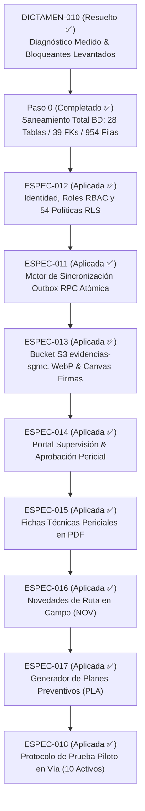

# ROADMAP de Implementación — SGMC v2

<!-- verificar_documentos: ignorar ST_DWithin -->
<!-- verificar_documentos: ignorar ST_SetSRID -->
<!-- verificar_documentos: ignorar ST_MakePoint -->

**Proyecto:** Sistema de Gestión de Mantenimiento en Campo v2  
**Cliente:** Concesión Transversal del Sisga S.A.S. (137 km)  
**Nueva Arquitectura:** Next.js 14 + PWA (Offline-First) + Supabase (PostgreSQL 16 / PostGIS) + Vercel  
**Repositorio Activo:** [github.com/dieleoz/SISGA2](https://github.com/dieleoz/SISGA2)  
**Despliegue en Vivo:** [https://sisga-2.vercel.app/](https://sisga-2.vercel.app/)  

---

## 1. Visión y Objetivos del SGMC v2

El SGMC v2 elimina definitivamente los cuellos de botella de la versión v1 (AppSheet / Google Sheets):
* **Cero cableado manual:** Desarrollo 100% como código en TypeScript / SQL con control de versiones en Git y despliegue continuo (CI/CD) en Vercel.
* **Geofencing Satelital de Alta Precisión:** Integración nativa de **PostGIS** (`ST_DWithin`), eliminando la latencia y los falsos rechazos de `HERE()`.
* **Operación Offline Nativa:** PWA instalable en dispositivos móviles con almacenamiento local en IndexedDB (Dexie.js), permitiendo inspecciones, fotos y firmas sin conexión en túneles y montaña.
* **Base de Datos Relacional Robusta:** 28 tablas en PostgreSQL 16 con 39 Claves Foráneas (`FOREIGN KEY`), integridad referencial estricta y 954 registros maestros poblados.

---

## 2. Pipeline de Especificaciones SDD (Fases 1, 2 y 3)

---

## 3. Detalle de Fases y Criterios de Aceptación

### Fase 1: Arquitectura Base & Saneamiento de BD — **[COMPLETADA ✅]**
* [x] **Modelo Relacional en Supabase:** Creación y saneamiento de las 28 tablas relacionales mediante [`BD/supabase_schema.sql`](../BD/supabase_schema.sql).
* [x] **Integridad Referencial:** 39 Claves Foráneas verificadas con `ON DELETE RESTRICT`.
* [x] **Población Total:** 954 registros sembrados en las 20 tablas maestras desde la plantilla oficial (`ACT_Activos`=368, `FRM_Preguntas`=333, `USR_Usuarios`=12, etc.).
* [x] **Geofencing Espacial:** Función `validar_geofencing_cierre` con PostGIS fail-closed.
* [x] **Auditoría de BD:** Verificador [`scripts/verificar_supabase.py`](../scripts/verificar_supabase.py) en **0 fallos**.
* [x] **Frontend Web y PWA:** Despliegue de Next.js en Vercel con vistas para CCO, Supervisores (`/supervisor`), Técnicos (`/tecnico`) y Catálogo (`/activos`).

### Fase 2: Identidad, RLS, Outbox y Evidencias — **[COMPLETADA ✅]**
* [x] **ESPEC-010:** Bloqueantes de frontend levantados (cámara WebP real, firma canvas táctil y bypass de GPS eliminado con CierreConExcepcion).
* [x] **ESPEC-012 (Identidad y RLS):** 54 políticas Row Level Security en PostgreSQL vinculadas a `auth.jwt() ->> 'email'` y `ASG_AsignacionZona`.
* [x] **ESPEC-011 (Sincronización Offline):** Motor de sincronización bidireccional (Outbox Pattern con Dexie.js) y función RPC atómica `public.sgmc_sincronizar_mantenimiento`.
* [x] **ESPEC-013 (Evidencias y Storage):** Bucket S3 `evidencias-sgmc` con compresión WebP (<150KB), canvas de firmas y upload service.

### Fase 3: Supervisión, Novedades, Planes y Piloto en Campo — **[COMPLETADA ✅]**
* [x] **ESPEC-014 (Supervisión y Auditoría Pericial):** Bandeja `/supervisor` con visor de fotos WebP, mapa PostGIS, checklist y acciones de aprobación/rechazo.
* [x] **ESPEC-015 (Fichas Periciales en PDF):** Generador nativo en cliente de Fichas Técnicas de Mantenimiento con membrete oficial de la Concesión.
* [x] **ESPEC-016 (Novedades de Ruta en Campo):** Captura de fallas imprevistas en PWA móvil y conversión a OT Correctiva (`NOV_Novedades`).
* [x] **ESPEC-017 (Generador de Planes de Mantenimiento):** Programador automático mensual por Unidad Funcional (`PLA_PlanMantenimiento`).
* [x] **ESPEC-018 (Protocolo de Prueba Piloto en Vía):** Matriz de 10 activos seleccionados en UF1/UF2 y procedimiento de certificación con Interventoría.

### Fase 4: Ciclo de Escritura en Campo y Robustecimiento Operativo — **[EN EJECUCIÓN 🟡]**
* [x] **1. ESPEC-020 (Corrección Atómica de Coordenadas de Cierre):** Relajado `NOT NULL` en `MAN_Mantenimientos.Coordenadas_Cierre_LatLong` y `FOT_Fotografias.Ubicacion_LatLong`. Retirado todo `COALESCE` con coordenadas simuladas/fabricadas en la RPC `sgmc_sincronizar_mantenimiento` y triggers geométricos.
* [x] **2. Idempotencia en Sincronización Outbox:** Blindada la inserción en `sgmc_sincronizar_mantenimiento` para retornar éxito sin duplicar registros ante reintentos de red sobre una misma OT.
* [x] **3. Órdenes en Estado Ejecutable:** Habilitadas órdenes en estado `Asignada` en la base de datos y conectada la vista `/tecnico` con Supabase y Dexie para recorrer el ciclo de ejecución real.
* [x] **4. Normalización de Estados GPS y Tolerancias:** Tres estados claros (Válido / Excepción Justificada / Fuera de Rango) con umbral de precisión estricto (fail-closed) y validación pericial sin bypass.
* [x] **5. Coordenada Real por Fotografía:** Captura georreferenciada en tiempo real en `CameraCapture` con estampa pericial y metadatos de ubicación.
* [ ] **6. Blindaje RLS (31 Políticas Pendientes):** Ajustar políticas RLS para aislar acceso por técnico/supervisor/unidad en `ACT_Activos` y tablas maestras.
* [ ] **7. Formularios Dinámicos por Subsistema:** Asignación estricta de checklists según el `TipoActivoID` y versión de formulario.
* [ ] **8. Almacenamiento Seguro en Supabase Storage:** Flujo directo y autenticado al bucket privado `evidencias-sgmc`.

---

## 4. Matriz de Componentes y Estado

| Componente | Stack Tecnológico | Estado | Criterio de Verificación |
|---|---|---|---|
| **Base de Datos** | Supabase (PostgreSQL 16 + PostGIS) | ✅ **Activo** | 28 tablas creadas, 39 FKs, función de geofencing y RPC outbox |
| **Identidad y RLS** | Supabase Auth + RBAC | ✅ **Verificado** | Aislamiento por UF (`ASG_AsignacionZona`), 5 cuentas en Auth y 13 en `USR_Usuarios` |
| **Inventario de Activos** | 368 Activos con PKs y coordenadas | ✅ **Poblado** | Inserción en `ACT_Activos` con radios de tolerancia |
| **Portal Web y Supervisión** | Next.js 14 + Tailwind + shadcn/ui | ✅ **Desplegado** | Accesible en [sisga-2.vercel.app](https://sisga-2.vercel.app/) |
| **App Móvil de Campo (PWA)** | PWA Offline-First + Dexie.js | ✅ **Desplegado** | Instalable en móviles y operativa sin conexión |
| **Despliegue Continuo** | Vercel CI/CD + GitHub SISGA2 | ✅ **Automatizado** | Despliegue automático en cada `git push` a `main` |

---
Concesión Transversal del Sisga S.A.S. — SGMC v2
