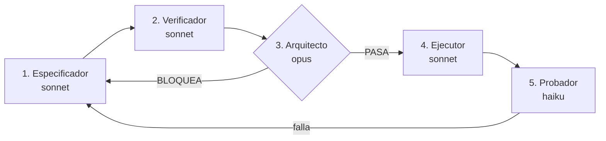

# Pipeline SDD del SGMC

Cómo se construye cualquier cambio en este proyecto: especificado y probado sobre papel y sobre el
modelo **antes** de gastar tokens y riesgo manejando el navegador contra producción.

Adoptado el 7 de agosto de 2026.

## 1. Por qué existe

Este proyecto tiene un historial concreto, no una preocupación abstracta:

- Se documentó durante meses una fórmula de geofencing que nunca funcionó.
- Un dictamen declaró 100% conforme un modelo cuyas referencias no existían, y describió un
  mantenimiento ejecutado en vivo que no existe: la tabla tiene 0 filas.
- `bd.md` y el Excel describieron modelos distintos y nadie lo detectó.

El patrón es siempre el mismo: **el documento se escribió desde otro documento, no desde el
archivo.** El pipeline lo corta metiendo un gate adversarial antes del paso caro.

## 2. El principio

> **Nada se ejecuta contra producción hasta que la especificación, las pruebas y el arquitecto
> están cerrados.**

El paso que maneja el navegador contra AppSheet es el más caro en tokens y el más frágil: los
desplegables no siempre abren y el viewport desplaza las coordenadas entre llamadas. Todo lo
anterior existe para que cuando se encienda no haya nada que decidir, solo que aplicar.

## 3. Los cinco pasos

| # | Agente | Modelo | Produce | Toca producción |
|---|---|---|---|---|
| 1 | `sgmc-especificador` | sonnet | `ESPEC-NNN` | No |
| 2 | `sgmc-verificador` | sonnet | `PRUEBA-NNN` | No |
| 3 | `sgmc-arquitecto` | opus | Veredicto | No |
| 4 | `sgmc-ejecutor` | sonnet | `ORDEN-NNN` y `ACTA-NNN` | **Sí** |
| 5 | `sgmc-probador` | haiku | `ACTA-NNN-pruebas` | Lectura |

### Por qué estos modelos y no todo en el más barato

El criterio no es el precio por token sino **el costo del error de cada rol**.

- **El arquitecto va en el modelo más fuerte** porque es el único gate. Un especificador flojo
  produce una especificación pobre que el arquitecto rechaza; un arquitecto flojo aprueba una
  especificación plausible y falsa, y eso llega a producción. Y producir documentos plausibles y
  falsos es exactamente la patología documentada de este proyecto.
- **Especificador y verificador en sonnet.** Requieren juicio sobre un dominio lleno de medias
  verdades, pero tienen quien los revise.
- **El probador en haiku.** Ejecutar comandos, copiar salidas y compararlas contra un valor
  esperado es mecánico. Su única exigencia es no reinterpretar el resultado.
- **El ejecutor en sonnet.** Es mecánico, pero maneja una interfaz frágil sobre producción y tiene
  que reconocer cuándo la pantalla no coincide con lo esperado, para detenerse.

## 4. El gate

El paso 4 no arranca sin las tres firmas, y una de ellas no es una opinión:

| Firma | Qué comprueba | Objetiva |
|---|---|---|
| Especificación | El cambio está descrito contra el archivo, con evidencia | No |
| Pruebas | Positiva, negativa y lectura de vuelta, con criterio de cierre | No |
| Arquitecto | Las siete preguntas, más `validar_modelo.py` en 0 errores | Parcialmente |

**`python scripts/validar_modelo.py` es el único gate totalmente objetivo del pipeline.** Si
devuelve errores, no hay veredicto que valga. Todo lo demás es juicio, y por eso el arquitecto
trabaja con presunción de rechazo: ante la duda, bloquea.

### La limitación que hay que tener presente

Tres agentes del mismo modelo base **tienden a estar de acuerdo entre sí**. Un gate de tres
aprobaciones puede ser una sola opinión repetida tres veces. Se mitiga de dos maneras, ambas ya
incorporadas:

1. El arquitecto tiene el encargo explícito de **refutar**, no de aprobar, y de verificar por su
   cuenta al menos dos afirmaciones de estado antes de opinar.
2. El gate se ancla a `validar_modelo.py`, que no opina.

No se elimina del todo. Conviene saberlo en lugar de confiar en el número de firmas.

## 5. Artefactos

Todos en `docs/sdd/`, numerados en serie y compartiendo número dentro de un mismo cambio:

| Archivo | Quién | Cuándo |
|---|---|---|
| `ESPEC-NNN-nombre.md` | Especificador | Antes de nada |
| `PRUEBA-NNN-nombre.md` | Verificador | Antes de ejecutar |
| `ORDEN-NNN-nombre.md` | Ejecutor | Solo con las tres firmas |
| `ACTA-NNN-nombre.md` | Ejecutor | Al aplicar |
| `ACTA-NNN-pruebas.md` | Probador | Al terminar |

## 5.1 Dos fases, dos gates de peso distinto

Un cambio no se especifica entero de una vez. Se parte por **dónde se aplica**, porque el costo y
la reversibilidad de las dos mitades no se parecen en nada.

| | Alcance | Gate |
|---|---|---|
| **Fase A — Sheets** | Renombrados, columnas nuevas, tablas nuevas, limpieza, datos de prueba | **Ligero.** Es barato, reversible y se verifica leyendo de vuelta |
| **Fase B — Navegador** | *Regenerate Structure*, tipado, cableado de referencias, reglas | **Pesado.** Es el paso caro y frágil. Aquí sí se exigen las tres firmas |

Hay una razón técnica además de la económica: **AppSheet deriva su estructura leyendo la hoja e
infiere el tipo a partir de los datos.** Si toda la Fase A está hecha, la Fase B necesita **un solo
*Regenerate Structure* por tabla** en vez de uno por cambio, y una columna que ya trae
`4.728512, -74.114531` tiene opción de salir tipada como `LatLong` sin intervención.

Lo que la Fase A **no** consigue: las referencias no se infieren de forma fiable. AppSheet leerá una
columna de enteros y dirá `Number`, no `Ref`. El cableado sigue siendo trabajo de navegador, columna
por columna. La Fase A reduce el paso caro; no lo elimina.

### Orden dentro de la Fase A

**Primero la estructura, después los datos.** Poblar antes de renombrar obliga a migrar lo que
acabas de escribir. Y los datos de prueba se escriben ya con la forma final: si la clave de la orden
es `OT-0001`, la fila de prueba lleva `OT-0001` y no `1`, o la conversión de la Fase B la deja
huérfana.

### Higiene de los datos de prueba

**Toda fila de prueba lleva el prefijo `TEST-` en su clave, y el paso que la borra se escribe en la
misma especificación que la crea.** No en otra, y no «después».

No es celo: es que este proyecto ya arrastra basura de prueba en producción. `CHK_Checklists`
todavía tiene una fila con `TecnicoID = "Santiago Moreno"` y `FechaInicio = "NOW()"` como texto
literal. Entró así, sin marca y sin fecha de caducidad, y hoy es una tarea de limpieza. Poblar sin
esta regla es fabricar el próximo hallazgo.

## 6. Qué NO pasa por el pipeline

Meter todo por aquí lo volvería inútil por burocrático. Van por la vía corta:

- Correcciones de redacción y de enlaces en documentos.
- Lecturas y auditorías que no escriben nada.
- Cambios en `scripts/` que no alteran el modelo.

**Pasa por el pipeline todo lo que escriba en el Sheets de producción, en el editor de AppSheet, o
en `scripts/modelo_objetivo.py`.**

## 7. Estado de los frentes

| Frente | Estado |
|---|---|
| Cableado, Fase A (Sheets) | **Aplicada el 7 de agosto, reportada como cerrada al 100%. No lo está:** 27 conformes y 23 fallos. Corrección en `ESPEC-001B` |
| Cableado, Fase B (navegador) | `ESPEC-002` escrita. **Bloqueada** hasta que `verificar_faseA.py` imprima `FASE A CERRADA` |
| Coordenadas reales (D-01) | Bloqueado por levantamiento en campo |
| Código QR | **Fuera de alcance por decisión del 2026-08-07.** Ver sección 8 |

## 8. Decisión sobre el código QR

Se descarta del alcance actual. La razón es de secuencia, no de mérito: **primero tiene que
funcionar el ciclo básico.**

Lo verificado, que se conserva porque el hallazgo es real: `ACT_Activos.CodigoQR` está poblado en
los 34 activos, pero su valor es una copia literal de `CodigoActivo` (`SOS-001`, `CCTV-001`). Nada
en el repositorio genera, imprime ni asigna una etiqueta física, y AppSheet **lee** códigos pero no
los produce.

Consecuencias de descartarlo, que hay que asumir a conciencia:

1. **El activo se abre por lista, no por escaneo.** `MAN_Mantenimientos.OrigenApertura` debe admitir
   `Lista` como valor normal y no como excepción.
2. **La cadena de presencia pierde un eslabón.** Queda sostenida por la coordenada del cierre, las
   fotografías con su propia coordenada y la marca de tiempo del servidor. Sigue siendo defendible,
   pero es más débil que la ofrecida.
3. **La propuesta enviada a Dirección menciona el escaneo del QR como pilar y lo marca «Incluido».**
   Esa discrepancia está abierta y es una decisión de Dirección, no técnica.

Si se retoma, lo que falta decidir está en `ROADMAP.md`: qué se codifica, quién genera las
imágenes, en qué material se imprime, quién las instala y cómo se verifica que cada etiqueta quedó
en su equipo.
