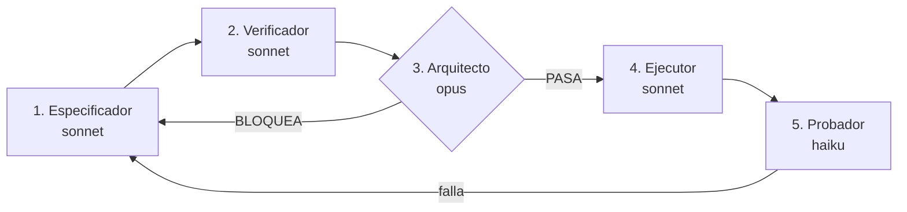

# Pipeline SDD del SGMC

> ## Qué cambió desde que se escribió (revisado el 2026-08-10)
>
> **El pipeline sigue vigente y sus cinco agentes existen**, con los modelos que esta tabla declara:
> `sgmc-especificador`, `sgmc-verificador`, `sgmc-arquitecto`, `sgmc-ejecutor` y `sgmc-probador`,
> todos en `.claude/agents/`. Se comprueba con `ls .claude/agents/`.
>
> Lo que cambió es **el frente sobre el que corre**:
>
> - **La Fase A dejó de ser trabajo manual sobre el Sheets.** La hoja se genera del modelo con
>   `python scripts/generar_plantilla.py`, y dos ejecuciones seguidas dan las 29 pestañas idénticas.
> - **La Fase B dejó de ser «convertir 15 columnas».** La aplicación se reconstruyó desde cero,
>   porque *Regenerate* fusiona en vez de reemplazar. Sobre una aplicación nueva no sobrevive
>   ninguna referencia: son **39**.
> - **El 2026-08-10 se fijó un punto de partida y se volvió a reconstruir.** El sistema es la
>   aplicación `_SISGA_-323965761` sobre la hoja `Modelo_Datos_10082026` —vuélquelo con
>   `python scripts/sistema.py`—; las **cinco** aplicaciones y las **dos** hojas anteriores están
>   nombradas en su lista `SUPERADOS` con el motivo por el que dejaron de serlo. **La aplicación
>   tiene las 28 tablas dadas de alta y nada más.**
> - **Y el modelo de datos cambió el mismo día**, que es lo que reordena la Fase A: claves
>   alfanuméricas con prefijo en las 28 tablas, sufijo `_LatLong` en las seis columnas de
>   coordenada, `USR_Usuarios.SedeID` retirada —la zona de trabajo del técnico vive en
>   `ASG_AsignacionZona` y solo ahí—, `SED_Sedes` de vuelta como padre de ubicación del equipo bajo
>   techo con cinco columnas nuevas, y `PK`, `TramoINVIAS` y `SedeID` en `ACT_Activos` además del
>   `PR` que ya tenía. Las diez reglas que manda el motor están en
>   [`REGLAS_DEL_MODELO_DE_DATOS.md`](REGLAS_DEL_MODELO_DE_DATOS.md), generado.
> - **Los verificadores son cinco, no cuatro.** Se añadió `verificar_reproducible.py`, que genera la
>   plantilla dos veces y compara celda a celda: es el único que ve un defecto que solo existe
>   **entre dos ejecuciones**, y los otros cuatro no pueden.
> - **Hay dos documentos generados nuevos**: `REGLAS_DEL_MODELO_DE_DATOS.md` y
>   [`PROMPT_CABLEADO.md`](PROMPT_CABLEADO.md), el encargo de cableado entero y autocontenido.
> - **El apartado 7 está reescrito** con los frentes de hoy.
>
> Lo que no cambió, y es lo importante: nada se ejecuta contra producción sin las tres firmas, y
> `validar_modelo.py` en 0 errores sigue siendo el único gate objetivo.

Cómo se construye cualquier cambio en este proyecto: especificado y probado sobre papel y sobre el
modelo **antes** de gastar tokens y riesgo manejando el navegador contra producción.

Adoptado el 7 de agosto de 2026. Revisado el 10 de agosto de 2026.

## 1. Por qué existe

Este proyecto tiene un historial concreto, no una preocupación abstracta:

- Se documentó durante meses una fórmula de geofencing que nunca funcionó.
- Un dictamen declaró 100% conforme un modelo cuyas referencias no existían, y describió un
  mantenimiento ejecutado en vivo que no existe: la tabla tiene 0 filas.
- `bd.md` y el Excel describieron modelos distintos y nadie lo detectó.

El patrón es siempre el mismo: **el documento se escribió desde otro documento, no desde el
archivo.** El pipeline lo corta metiendo un gate adversarial antes del paso caro.

## 2. El principio

> **Nada se ejecuta contra producción hasta que la especificación, las pruebas y el arquitecto
> están cerrados.**

El paso que maneja el navegador contra AppSheet es el más caro en tokens y el más frágil: los
desplegables no siempre abren y el viewport desplaza las coordenadas entre llamadas. Todo lo
anterior existe para que cuando se encienda no haya nada que decidir, solo que aplicar.

## 3. Los cinco pasos

| # | Agente | Modelo | Produce | Toca producción |
|---|---|---|---|---|
| 1 | `sgmc-especificador` | sonnet | `ESPEC-NNN` | No |
| 2 | `sgmc-verificador` | sonnet | `PRUEBA-NNN` | No |
| 3 | `sgmc-arquitecto` | opus | Veredicto | No |
| 4 | `sgmc-ejecutor` | sonnet | `ORDEN-NNN` y `ACTA-NNN` | **Sí** |
| 5 | `sgmc-probador` | haiku | `ACTA-NNN-pruebas` | Lectura |

### Por qué estos modelos y no todo en el más barato

## El gate tiene salida, y hasta hoy no la tenía

El arquitecto está definido como **«refutar, no aprobar»**, y eso es correcto para entrar. Pero un
papel cuyo criterio de éxito es *encontrar algo* siempre encuentra algo, y `ESPEC-006` llegó a una
tercera pasada en la que **se inventó un bloqueo que no existía**, fundado en un instrumento
incapaz de observarlo.

Dos reglas, y están en `CLAUDE.md` §7.18 con el análisis entero:

**Un hallazgo bloquea solo si nombra qué se rompe en producción.** Si no puede decir «un técnico
hará X y pasará Y», es una **nota**: se apunta, se arregla después, y no detiene la ejecución.

**Dos pasadas de arquitecto por especificación.** A la tercera, lo que quede se escribe como
**riesgo aceptado** —con nombre y fecha— y se ejecuta. Una especificación que no se ejecuta nunca
protege igual que una regla que no hace nada.

Y una consecuencia práctica: cuando una ronda empieza a encontrar solo desajustes de prosa, la
respuesta no es otra ronda. Es **ir a mirar el editor**, que es donde han salido todos los defectos
reales.

El criterio no es el precio por token sino **el costo del error de cada rol**.

- **El arquitecto va en el modelo más fuerte** porque es el único gate. Un especificador flojo
  produce una especificación pobre que el arquitecto rechaza; un arquitecto flojo aprueba una
  especificación plausible y falsa, y eso llega a producción. Y producir documentos plausibles y
  falsos es exactamente la patología documentada de este proyecto.
- **Especificador y verificador en sonnet.** Requieren juicio sobre un dominio lleno de medias
  verdades, pero tienen quien los revise.
- **El probador en haiku.** Ejecutar comandos, copiar salidas y compararlas contra un valor
  esperado es mecánico. Su única exigencia es no reinterpretar el resultado.
- **El ejecutor en sonnet.** Es mecánico, pero maneja una interfaz frágil sobre producción y tiene
  que reconocer cuándo la pantalla no coincide con lo esperado, para detenerse.

## 4. El gate

El paso 4 no arranca sin las tres firmas, y una de ellas no es una opinión:

| Firma | Qué comprueba | Objetiva |
|---|---|---|
| Especificación | El cambio está descrito contra el archivo, con evidencia | No |
| Pruebas | Positiva, negativa y lectura de vuelta, con criterio de cierre | No |
| Arquitecto | Las siete preguntas, más `validar_modelo.py` en 0 errores | Parcialmente |

**Hay una tercera fuente que verificar, y el pipeline no la cubría:** la documentación oficial de
AppSheet. Los tres primeros pasos verifican datos contra `BD/*.xlsx`, pero todo lo que una
especificación afirma sobre **cómo se comporta la plataforma** salía de la memoria. Lo verificado
está en `BASE_CONOCIMIENTO_APPSHEET.md`, con cita y URL; de ahí salieron dos correcciones que
ninguna otra comprobación habría encontrado.

**`python scripts/validar_modelo.py` es el único gate totalmente objetivo del pipeline.** Si
devuelve errores, no hay veredicto que valga. Todo lo demás es juicio, y por eso el arquitecto
trabaja con presunción de rechazo: ante la duda, bloquea.

### La limitación que hay que tener presente

Tres agentes del mismo modelo base **tienden a estar de acuerdo entre sí**. Un gate de tres
aprobaciones puede ser una sola opinión repetida tres veces. Se mitiga de dos maneras, ambas ya
incorporadas:

1. El arquitecto tiene el encargo explícito de **refutar**, no de aprobar, y de verificar por su
   cuenta al menos dos afirmaciones de estado antes de opinar.
2. El gate se ancla a `validar_modelo.py`, que no opina.

No se elimina del todo. Conviene saberlo en lugar de confiar en el número de firmas.

## 5. Artefactos

Todos en `docs/sdd/`, numerados en serie y compartiendo número dentro de un mismo cambio:

| Archivo | Quién | Cuándo |
|---|---|---|
| `ESPEC-NNN-nombre.md` | Especificador | Antes de nada |
| `PRUEBA-NNN-nombre.md` | Verificador | Antes de ejecutar |
| `ORDEN-NNN-nombre.md` | Ejecutor | Solo con las tres firmas |
| `ACTA-NNN-nombre.md` | Ejecutor | Al aplicar |
| `ACTA-NNN-pruebas.md` | Probador | Al terminar |

**Un acta no caduca:** registra un hecho fechado y se queda en `docs/sdd/` aunque después se
demuestre que lo que certificó era incompleto. Las especificaciones y las órdenes sí caducan, y
cuando su frente se cierra o se abandona se retiran del repositorio.

> **La limpieza del 2026-08-10 retiró también las actas**, junto con `docs/historico/` entero.
> Fue deliberado: al fijar un punto de partida, todo lo que certificaba estados anteriores describía
> un sistema que ya no existe, y un documento vigente que remita a él manda a quien retoma el
> proyecto al sitio equivocado. **Lo retirado no se perdió**: la etiqueta
> `antes-de-la-limpieza-2026-08-10` devuelve el repositorio entero tal como estaba.

## 5.1 Dos fases, dos gates de peso distinto

Un cambio no se especifica entero de una vez. Se parte por **dónde se aplica**, porque el costo y
la reversibilidad de las dos mitades no se parecen en nada.

| | Alcance | Gate |
|---|---|---|
| **Fase A — la hoja** | Estructura y datos del libro que AppSheet va a leer | **Ligero.** Es barato, reversible y se verifica leyendo de vuelta |
| **Fase B — Navegador** | Dar de alta las tablas, tipado, cableado de referencias, reglas | **Pesado.** Es el paso caro y frágil. Aquí sí se exigen las tres firmas |

> **La Fase A ya no se ejecuta a mano.** Cuando esto se escribió consistía en renombrar columnas y
> crear tablas dentro del Sheets heredado. Hoy la hoja **se genera del modelo** con
> `python scripts/generar_plantilla.py`, y lo que queda de la fase es verificarla:
> `python scripts/verificar_faseA.py "BD/Modelo_Datos_PLANTILLA.xlsx"` hasta `FASE A CERRADA`, más
> `python scripts/verificar_reproducible.py`, que genera dos veces y compara celda a celda. El gate
> ligero sigue siendo el mismo; lo que desapareció es el trabajo de edición manual que lo hacía
> necesario.

Hay una razón técnica además de la económica: **AppSheet deriva su estructura leyendo la hoja e
infiere el tipo a partir del nombre del encabezado y de los datos.** De ahí salen las dos
convenciones que la Fase A tiene que respetar, y que no son cosméticas:

- **El nombre de la columna de coordenada acaba en `_LatLong`.** AppSheet infiere `LatLong` cuando
  la cabecera contiene `latlong` o `geolocation`; `Ubicacion` no dispara nada y entraba como
  `Text`, sobre el que `DISTANCE()` no opera. Son nombres feos a cambio de que el tipo entre solo
  en cada reconstrucción.
- **Toda clave es alfanumérica con prefijo.** AppSheet tipa la clave según la mayoría de sus
  valores: si son `1`, `2`, `3` la tipa `Number` y **descarta sin avisar** la fila cuya clave es
  alfanumérica. Pasó con `USR_Usuarios`, que tenía diez claves numéricas y una generada con
  `UNIQUEID`: la API devolvía 10 filas y la hoja tenía 11.

Lo que la Fase A **no** consigue: las referencias no se infieren de forma fiable. AppSheet leerá una
columna de enteros y dirá `Number`, no `Ref`, y el prefijo de nuestras tablas —`UNF_UnidadesFuncionales`,
no `UnidadFuncional`— rompe además el parecido de nombre del que se serviría. El cableado sigue
siendo trabajo de navegador, columna por columna, y son **39**. La Fase A reduce el paso caro; no lo
elimina.

**Y hay dos cosas que la Fase A tiene que dejar hechas o la Fase B no arranca:** ninguna pestaña
oculta —AppSheet las ignora sin avisar, y por eso solo cargaban 24 tablas de 32— y la clave de cada
tabla con el valor que ya guardan los datos.

### Orden dentro de la Fase A

**Primero la estructura, después los datos.** Poblar antes de renombrar obliga a migrar lo que
acabas de escribir. Y los datos de prueba se escriben ya con la forma final: si la clave de la orden
es `OT-0001`, la fila de prueba lleva `OT-0001` y no `1`, o la conversión de la Fase B la deja
huérfana.

### Higiene de los datos de prueba

**Toda fila de prueba lleva la marca `TEST` en su clave, y el paso que la borra se escribe en la
misma especificación que la crea.** No en otra, y no «después».

No es celo: es que este proyecto ya lo pagó. `CHK_Checklists` llegó a tener una fila con
`TecnicoID = "Santiago Moreno"` y `FechaInicio = "NOW()"` como texto literal, entrada sin marca y
sin fecha de caducidad. **La hoja vigente va sin registros de prueba** —`OT`, `MAN`, `CHK`, `CHD`,
`FOT`, `FIR` y `NOV` están vacías, y se comprueba contando sus filas—, y es la primera vez que eso
pasa. Poblar sin esta regla es fabricar el próximo hallazgo.

## 6. Qué NO pasa por el pipeline

Meter todo por aquí lo volvería inútil por burocrático. Van por la vía corta:

- Correcciones de redacción y de enlaces en documentos.
- Lecturas y auditorías que no escriben nada.
- Cambios en `scripts/` que no alteran el modelo.

**Pasa por el pipeline todo lo que escriba en el Sheets de producción, en el editor de AppSheet, o
en `scripts/modelo_objetivo.py`.**

## 7. Estado de los frentes

Actualizado el 2026-08-10. **La verdad del estado está en `ESTADO.md`**; esto solo dice qué frente
corre por el pipeline y cuál no.

| Frente | Estado |
|---|---|
| Fase A, la hoja | **CERRADA.** Hoy la hoja se genera del modelo y la fase se reduce a verificarla: `FASE A CERRADA` con **82 conformes, 4 avisos y 0 fallos** sobre `BD/Modelo_Datos_PLANTILLA.xlsx`. El recuento de conformes se lee de la salida y no se cita de memoria: `F-11` y `F-20` emiten una línea por cada tabla poblada, así que sube o baja con las tablas que tengan filas |
| Reconstrucción de la aplicación | **Hecha el 2026-08-10.** La aplicación es `_SISGA_-323965761`, **con las 28 tablas dadas de alta y nada más** |
| Fase B, el editor | **Frente activo, y se repone entero:** las 39 referencias, las 23 reglas, los dos filtros de seguridad, las cuatro marcas de tiempo y retirar `Deletes`. **El encargo entero, generado del modelo y autocontenido, es [`PROMPT_CABLEADO.md`](PROMPT_CABLEADO.md)**, y es lo que se sigue dentro del editor. Complementan: `MANUAL_DESPLIEGUE.md` la ficha por tabla, `GUIA_IMPLEMENTACION_FUNCIONAL.md` cómo se comprueba cada etapa, y `sdd/RECONSTRUCCION_EXPRESIONES.md` las expresiones sin cortar |
| Migración a la hoja limpia | **CERRADA. Ya no es trabajo de nadie.** La hoja vigente se genera del modelo, así que las columnas sobrantes y las tres trampas no existen. Lo comprueba la regla `F-19` en cada verificación |
| `ESPEC-003`, modelo de dominio | **BLOQUEADA** por el arquitecto, con 14 condiciones sin resolver. No es un paso disponible: es un documento por terminar |
| Coordenadas reales (D-01) | Bloqueado por levantamiento en campo |
| Código QR | **Fuera de alcance por decisión del 2026-08-07.** Ver sección 8 |

**Hubo una especificación de Fase B que hablaba de convertir 15 columnas**, y era correcta sobre la
aplicación de entonces, donde otras 23 ya estaban puestas. Sobre una aplicación reconstruida no
sobrevive ninguna: son 39. Ese documento y su orden están retirados, y nunca hubo acta de cierre.
**Cuando una especificación y `modelo_objetivo.py` discrepan, manda el modelo.**

## 8. Decisión sobre el código QR

Se descarta del alcance actual. La razón es de secuencia, no de mérito: **primero tiene que
funcionar el ciclo básico.**

Lo verificado, que se conserva porque el hallazgo es real: `ACT_Activos.CodigoQR` está poblado en
**34 de los 368 activos** de la hoja vigente, y en 33 de esos 34 su valor es una copia literal de
`CodigoActivo` (`SOS-001`, `CCTV-001`). Nada en el repositorio genera, imprime ni asigna una
etiqueta física, y AppSheet **lee** códigos pero no los produce.

Consecuencias de descartarlo, que hay que asumir a conciencia:

1. **El activo se abre por lista, no por escaneo.** `MAN_Mantenimientos.OrigenApertura` debe admitir
   `Lista` como valor normal y no como excepción.
2. **La cadena de presencia pierde un eslabón.** Queda sostenida por la coordenada del cierre, las
   fotografías con su propia coordenada y la marca de tiempo del servidor. Sigue siendo defendible,
   pero es más débil que la ofrecida.
3. **La propuesta enviada a Dirección menciona el escaneo del QR como pilar y lo marca «Incluido».**
   Esa discrepancia está abierta y es una decisión de Dirección, no técnica.

Si se retoma, lo que falta decidir está en `ROADMAP.md`: qué se codifica, quién genera las
imágenes, en qué material se imprime, quién las instala y cómo se verifica que cada etiqueta quedó
en su equipo.
