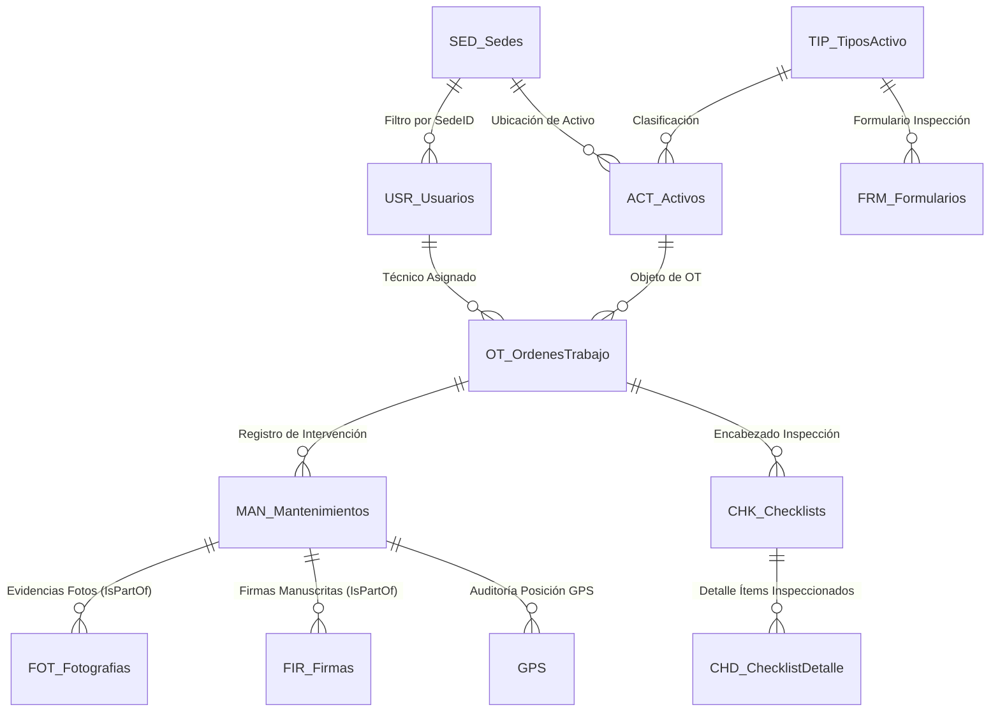

# 🗄️ DICCIONARIO DE DATOS Y MODELO DE PRODUCCIÓN (bd.md)

**Proyecto:** Sistema de Gestión de Mantenimiento en Campo (SGMC)  
**Cliente:** Concesión Transversal del Sisga S.A.S.  
**Plataforma Cloud:** Google AppSheet + Google Sheets (Producción en la Web)  
**URL de la Base de Datos en Producción (Google Sheets):** [Google Sheets Backend Producción SGMC](https://docs.google.com/spreadsheets/d/1a4MmZ0u9sNgWmyiR2OPJo9YuUEKJFftbJWMW-KbITRc/edit?gid=1353886072#gid=1353886072)  
**Archivo Maestro Local de Respaldo:** `d:\@Proyect\Sisga\BD\Modelo de Datos (2).xlsx`  
**Aplicación en Vivo en AppSheet:** [SGMC AppSheet](https://www.appsheet.com/start/060b99df-2037-4049-b94d-03c1eefc3219?platform=desktop#appName=SGMC-886843353&vss=H4sIAAAAAAAAA6XOvQ7CIBQF4Hc5M0_AahyM0cWfRTpguU2ILTQF1Ibw7t6qjbM6csh37sm4Wrrtoq4vkKf8ea1phERW2I89KUiFhXdx8K2CUNjq7hUeQtKD9UGhoFRi9pECZP6Oy_-uC1hDLtrG0jB1TZI73o6_J8XBbFAEuhT1uaXnYDalcNb4OgUyR57yw4Swcst7r53ZeMOVjW4DlQcPF0XqZQEAAA==&view=Usuarios)  
**Fecha de Actualización:** Agosto de 2026 | **Versión:** 2.0 (24 Hojas Producción)  

---

## 📌 1. Visión General de la Arquitectura de Datos

La base de datos de producción del SGMC opera como un backend relacional en **Google Sheets** conectado en tiempo real a la aplicación móvil AppSheet. Consta de **24 Hojas / Tablas** organizadas en 4 capas operacionales:

---

## 📋 2. Catálogo Completo de las 24 Hojas de Producción

| Capa / Grupo | Hoja en Google Sheets | Cant. Columnas | Propósito y Función en Producción |
|---|---|---|---|
| **A. Soporte y Catálogos** | `USR_Usuarios` | 11 | Usuarios, credenciales M365/Google, roles y SedeID obligatoria |
| | `ROL_Roles` | 4 | Perfiles RBAC (Admin, Supervisor, Técnico, Consulta) |
| | `SED_Sedes` | 4 | Sedes y sectores del corredor vial (Sutatenza, Machetá, SLG) |
| | `TIP_TiposActivo` | 7 | Tipos de activos (SOS, CCTV, PMVF, PMVM, Sensores, Báscula) |
| | `FRM_Formularios` | 6 | Registro maestro de formularios dinámicos |
| | `EST_Activo` | 2 | Estados físicos del activo (Operativo, Fuera de Servicio) |
| | `FRE_Frecuencias` | 4 | Frecuencias de mantenimiento (Mensual, Trimestral, Anual) |
| | `CAL_Calzadas` | 2 | Calzadas viales (Calzada Principal, Calzada Secundaría) |
| | `SEN_Sentidos` | 2 | Sentidos de circulación (Bogotá-Sutatenza, Sisga-Guateque) |
| **B. Maestras y Checklists** | `ACT_Activos` | 14 | Catálogo de activos viales, PR, Coordenadas GPS y QR |
| | `CHK_Checklists` | 21 | Encabezados de inspecciones en campo realizadas |
| | `CHD_ChecklistDetalle` | 21 | Detalle ítem por ítem del resultado de las inspecciones |
| **C. Transaccionales y Evidencias** | `OT_OrdenesTrabajo` | 12 | Órdenes de trabajo programadas por el CCO |
| | `MAN_Mantenimientos` | 25 | Registro de mantenimientos ejecutados con `Coordenadas_Cierre` y `Precision_GPS` |
| | `FOT_Fotografias` | 5 | Evidencias fotográficas comprimidas (600px, `IsPartOf`) |
| | `FIR_Firmas` | 4 | Firmas digitales táctiles del técnico y supervisor (`IsPartOf`) |
| | `GPS` | 8 | Log histórico de coordenadas y auditoría satelital |
| **D. Formularios Dinámicos** | `FRM_Preguntas` | 17 | Repositorio unificado de preguntas de inspección |
| | `TPR_TiposRespuesta` | 2 | Tipos de respuesta (Conforme/No Conforme, Texto, Número) |
| | `FRM_SOS` | 11 | Plantilla de preguntas específicas para Postes SOS |
| | `FRM_CCTV` | 11 | Plantilla de preguntas específicas para Cámaras CCTV |
| | `FRM_PMVF` | 11 | Plantilla de preguntas para Paneles de Mensaje Variable |
| | `FRM_Secciones` | 4 | Secciones de los formularios (Estructura, Solar, Red, etc.) |
| | `LST_ValoresLista` | 5 | Opciones de listas desplegables para respuestas |

---

## 🔍 3. Estructura Detallada de Hojas Críticas

### 3.1 Hoja `MAN_Mantenimientos` (25 Columnas - Backend Producción)
Encargada de almacenar los datos de cierre del técnico en campo, incluyendo la georreferenciación GPS:

`MttoID`, `OTID`, `Tecnico_Asignado`, `Fecha`, `Fecha_Hora_Inicio`, `Fecha_Hora_Fin`, `Duracion_Minutos`, `Tipo`, `Diagnostico`, `Trabajo_Realizado`, `Repuestos_Utilizados`, `Requiere_Repuesto`, `Requiere_Segunda_Visita`, `Motivo_Pendiente`, `Estado_Intervencion`, `Localizacion`, `Imagen_Inicio`, `Imagen_Final`, `Observaciones`, `Firma_Tecnico`, `Firma_Supervisor`, `Aprobado_Supervisor`, `Usuario_Registro`, `Fecha_Hora_Registro`, `Activo`, **`Coordenadas_Cierre`**, **`Precision_GPS`**.

### 3.2 Hoja `ACT_Activos` (14 Columnas)
Catálogo oficial de activos del corredor vial:
`ActivoID`, `CodigoActivo`, `Nombre`, `TipoActivoID`, `SedeID`, `PR`, `CalzadaID`, `Ubicacion`, `EstadoID`, `CodigoQR`, `SentidoID`, `Activo`, `FrecuenciaID`, `Observaciones`.

---

## 🌐 4. Edición Directa en Producción (Google Sheets)

> **⚠️ PROCEDIMIENTO DE EDICIÓN TRAS APROBACIÓN DEL PLAN DE TRABAJO:**  
> Una vez aprobado el `plan_de_trabajo.md`, las modificaciones de la **Fase 0** (verificación e inserción de encabezados `Coordenadas_Cierre` y `Precision_GPS` en `MAN_Mantenimientos`) se realizan directamente en la URL de producción:  
> 🔗 [https://docs.google.com/spreadsheets/d/1a4MmZ0u9sNgWmyiR2OPJo9YuUEKJFftbJWMW-KbITRc/edit?gid=1353886072#gid=1353886072](https://docs.google.com/spreadsheets/d/1a4MmZ0u9sNgWmyiR2OPJo9YuUEKJFftbJWMW-KbITRc/edit?gid=1353886072#gid=1353886072)

---
*Referencias Cruzadas:* [README.md](../README.md) | [plan_de_trabajo.md](../docs/plan_de_trabajo.md) | [MAP.md](../MAP.md) | [especificaciones.md](../docs/especificaciones.md)
