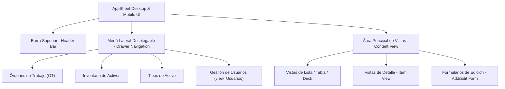

# 🖼️ ESPECIFICACIONES VISUALES Y DE INTERFAZ (especificaciones_visuales.md)

**Proyecto:** Sistema de Gestión de Mantenimiento en Campo (SGMC)  
**Cliente:** Concesión Transversal del Sisga S.A.S.  
**Plataforma Deployed:** Google AppSheet (`SGMC-886843353`)  
**URL de la Aplicación en Vivo:** [SGMC en AppSheet](https://www.appsheet.com/start/060b99df-2037-4049-b94d-03c1eefc3219?platform=desktop#appName=SGMC-886843353&vss=H4sIAAAAAAAAA6XOvQ7CIBQF4Hc5M0_AahyM0cWfRTpguU2ILTQF1Ibw7t6qjbM6csh37sm4Wrrtoq4vkKf8ea1phERW2I89KUiFhXdx8K2CUNjq7hUeQtKD9UGhoFRi9pECZP6Oy_-uC1hDLtrG0jB1TZI73o6_J8XBbFAEuhT1uaXnYDalcNb4OgUyR57yw4Swcst7r53ZeMOVjW4DlQcPF0XqZQEAAA==&view=Usuarios)  
**Origen:** Levantamiento Visual Directo de Pantallas y Nodos DOM  
**Fecha:** Agosto de 2026  

---

## 📌 1. Visión General de la Interfaz Capturada

Este documento detalla la estructura visual, componentes de UI, campos de formulario y navegación levantados directamente durante la interacción en vivo con la aplicación AppSheet.

---

## 🔍 2. Levantamiento Detallado por Vistas Capturadas

### 2.1 Vista 1: Órdenes de Trabajo (`OT` / `OT_OrdenesTrabajo`)
* **Nombre de Vista:** `OT` / `OT_OrdenesTrabajo_Deck`
* **Tipo de Layout:** Table / Deck View
* **Componentes Visuales Observados:**
  * Encabezado con buscador rápido y filtro por estado (`Pendiente`, `En Proceso`, `Cerrada`).
  * Filas de trabajo con número de OT (`OT-0001`, `OT-0002`, `OT-0003`), técnico asignado (ej. *Santiago Moreno*), activo objetivo (ej. *Poste SOS-002*) y fecha programada.
* **Acciones de Fila:** Al hacer clic sobre una fila, la aplicación abre la **Vista de Detalle de OT**.

---

### 2.2 Vista 2: Detalle de Orden de Trabajo (`OT Detail View`)
* **Nombre de Vista:** `OT_Detail`
* **Tipo de Layout:** Detail View con Sublistas Relacionadas (Parent-Child View)
* **Secciones Desplegadas:**
  * **Datos Generales:** Número OT, Activo vinculado, Técnico asignado, Estado actual.
  * **Sección Relacionada `Related CHK_Checklists`:** Lista de checklists e inspecciones ejecutadas bajo esa orden.
  * **Botón de Acción Prima `Agregar`:** Abre el formulario de creación de checklist vinculado automáticamente al `OTID` actual.

---

### 2.3 Vista 3: Formulario de Creación de Checklist (`Add CHK_Checklists Form`)
* **Nombre de Vista:** `CHK_Checklists_Form`
* **Tipo de Layout:** Modal Form View (Wizard de Inspección)
* **Campos e Interacciones Probadas:**
  1. `OTID` (Ref a `OT_OrdenesTrabajo` — Autoseleccionado según la OT origen).
  2. `FormularioID` (Dropdown Autocompletable — Muestra la lista de los 18 formularios, ej: *Checklist SOS*, *Checklist CCTV*, *Checklist UPS*).
  3. `ActivoID` (Dropdown Autocompletable — Filtra el activo asignado, ej: *Poste SOS-002*).
  4. `TecnicoID` (Dropdown con búsqueda de texto — Selecciona técnicos activos como *Santiago Moreno*).
  5. `FechaInicio` y `FechaFin` (Pickers de Fecha y Hora con formato `DD/MM/YYYY HH:mm`).
  6. `Estado` (Enum — `Pendiente`, `En Proceso`, `Finalizado`).
* **Botones de Control:**
  * **`Guardar`:** Procesa la validación y sincronización del formulario.
  * **`Cancelar`:** Descarta los cambios sin alterar la base de datos.

---

### 2.4 Vista 4: Inventario de Activos (`Activos` / `ACT_Activos`)
* **Nombre de Vista:** `Activos`
* **Tipo de Layout:** Dual View (Mapa de Calor / Coordenadas + Lista de Tarjetas)
* **Componentes Observados:**
  * Icono flotante de **Escáner QR** para activación de la cámara.
  * Tarjetas de activo mostrando `CodigoActivo`, `Nombre`, `PR` (Punto de Referencia), `SedeID` y foto miniatura del activo.

---

### 2.5 Vista 5: Gestión de Usuarios (`Usuarios` / `view=Usuarios`)
* **Nombre de Vista:** `Usuarios`
* **Tipo de Layout:** Card / Table View
* **Atributos Visualizados:** `usuarioID`, `Nombres`, `Apellidos`, `Correo`, `Cargo`, `RolID` (Admin, Supervisor, Técnico, Consulta), `SedeID` (Sutatenza, Peaje Machetá, Peaje SLG, etc.) y Estado `Activo`.

---

## 3. 🚦 Trazabilidad de Evidencias Capturadas

| Captura de Pantalla | Elemento UI / Acción Probada | Resultado Observado en Navegador |
|---|---|---|
| `ot_view` | Carga de lista de Órdenes de Trabajo | Despliegue correcto de filas `OT-0001`, `OT-0002`, `OT-0003` |
| `ot_detail_view` | Vista de detalle de `OT-0001` | Despliegue de datos y sección `Related CHK_Checklists` |
| `add_checklist_form` | Formulario de adición de checklist | Apertura de modal con campos de fecha, técnico y activo |
| `formulario_id_dropdown` | Despliegue del menú desplegable `FormularioID` | Selección exitosa de `Checklist SOS` |
| `tecnico_id_dropdown` | Búsqueda y selección de `TecnicoID` | Autocompletado y selección de *Santiago Moreno* |
| `screen_after_ok` | Guardado de checklist | Generación exitosa de registro ID `d02d8a3d` en `OT-0001` |

---
*Referencias Cruzadas:* [README.md](../README.md) | [especificaciones.md](../docs/especificaciones.md) | [bd.md](../docs/bd.md) | [MAP.md](../MAP.md)
