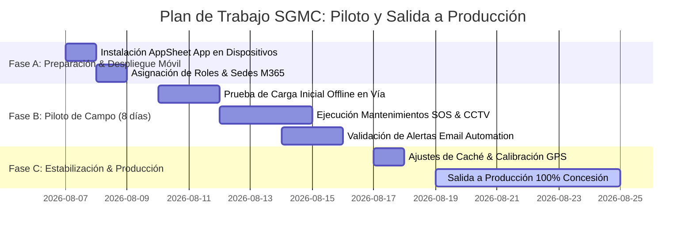

# 📅 PLAN DE TRABAJO — SALIDA A PRODUCCIÓN Y GRUPO PILOTO (SGMC)

**Proyecto:** Sistema de Gestión de Mantenimiento en Campo (SGMC)  
**Cliente:** Concesión Transversal del Sisga S.A.S.  
**Plataforma:** Google AppSheet (`SGMC-886843353`) + Microsoft 365  
**URL de la Aplicación:** [SGMC en AppSheet](https://www.appsheet.com/start/060b99df-2037-4049-b94d-03c1eefc3219?platform=desktop#appName=SGMC-886843353&vss=H4sIAAAAAAAAA6XOvQ7CIBQF4Hc5M0_AahyM0cWfRTpguU2ILTQF1Ibw7t6qjbM6csh37sm4Wrrtoq4vkKf8ea1phERW2I89KUiFhXdx8K2CUNjq7hUeQtKD9UGhoFRi9pECZP6Oy_-uC1hDLtrG0jB1TZI73o6_J8XBbFAEuhT1uaXnYDalcNb4OgUyR57yw4Swcst7r53ZeMOVjW4DlQcPF0XqZQEAAA==&view=Usuarios)  
**Objetivo:** Guía operativa de ejecución paso a paso para el despliegue del Grupo Piloto y la Salida a Producción.  
**Fecha:** Agosto de 2026 | **Versión:** 1.0 Ready for Execution  

---

## 📌 1. Visión General del Plan

Una vez completada la **Auditoría As-Built 100% Conforme** ([DICTAMEN_AUDITORIA_LOCAL_SGMC.md](./DICTAMEN_AUDITORIA_LOCAL_SGMC.md)), este plan establece las actividades exactas que debe ejecutar el Agente Técnico / Equipo de Despliegue para la entrada en operación de la Fase 1 en un plazo de **8 a 15 días**.

---

## 🗓️ 2. Cronograma de Trabajo y Diagrama de Gantt

---

## 📋 3. Matriz de Tareas Detallada por Agente / Rol

### 🛠️ TAREAS DEL AGENTE TÉCNICO (AppSheet Administrator)
- [ ] **Tarea T-01:** Verificar que el archivo `Modelo_Datos_SGMC_AsBuilt.xlsx` en Microsoft 365 / OneDrive esté conectado como Data Source principal en AppSheet.
- [ ] **Tarea T-02:** Confirmar que la columna `SedeID` en `USR_Usuarios` esté marcada como `Required` en AppSheet para evitar descargas masivas no deseadas.
- [ ] **Tarea T-03:** Validar la regla de Geofencing GPS en AppSheet:
  `DISTANCE([Coordenadas_Cierre], LATLONG([ActivoID].[Latitud], [ActivoID].[Longitud])) <= 1.0`
- [ ] **Tarea T-04:** Verificar que la compresión de imagen en `FOT_Fotografias[Archivo]` esté configurada en calidad `Low` (600px).
- [ ] **Tarea T-05:** Probar el Automation Bot de notificaciones por email al marcar un activo como *Fuera de servicio*.

### 📱 TAREAS DEL AGENTE DE CAMPO / TESTER QA
- [ ] **Tarea Q-01:** Instalar la aplicación gratuita **AppSheet** desde Google Play Store / App Store en los 10 teléfonos móviles del grupo piloto.
- [ ] **Tarea Q-02:** Iniciar sesión con el correo corporativo M365 (`USEREMAIL()`) de cada técnico y verificar que solo se descarguen los activos de su sede asignada.
- [ ] **Tarea Q-03:** Ejecutar prueba de escáner QR en vía sobre 5 activos tipo `SOS` y `CCTV`.
- [ ] **Tarea Q-04:** Probar el bloqueo de distancia GPS: intentar cerrar un mantenimiento a más de 1.0 km del activo y verificar el mensaje de bloqueo.
- [ ] **Tarea Q-05:** Probar la operación Offline: activar Modo Avión, registrar un checklist con 3 fotos y firmas, reconectar la red y validar que la sincronización en segundo plano envíe los datos a Excel sin errores.

### 👤 TAREAS DEL SUPERVISOR / CCO
- [ ] **Tarea S-01:** Ingresar al portal Web de AppSheet ([#view=Usuarios](https://www.appsheet.com/start/060b99df-2037-4049-b94d-03c1eefc3219?platform=desktop#appName=SGMC-886843353&vss=H4sIAAAAAAAAA6XOvQ7CIBQF4Hc5M0_AahyM0cWfRTpguU2ILTQF1Ibw7t6qjbM6csh37sm4Wrrtoq4vkKf8ea1phERW2I89KUiFhXdx8K2CUNjq7hUeQtKD9UGhoFRi9pECZP6Oy_-uC1hDLtrG0jB1TZI73o6_J8XBbFAEuhT1uaXnYDalcNb4OgUyR57yw4Swcst7r53ZeMOVjW4DlQcPF0XqZQEAAA==&view=Usuarios)) y validar la asignación de Órdenes de Trabajo (`OT-0001` en adelante).
- [ ] **Tarea S-02:** Monitorear el **Tablero KPI** de indicadores de cumplimiento y tiempos promedio de atención.
- [ ] **Tarea S-03:** Verificar la recepción de correos de alerta con informe PDF adjunto ante fallas críticas en carretera.

---

## 🎯 4. Hitos de Entrega y Criterios de Aceptación

| Hito | Nombre del Hito | Criterio de Aceptación | Estado |
|---|---|---|---|
| **HITO-01** | Despliegue Móvil Completado | 100% de técnicos del piloto con AppSheet instalada y autenticada | 🔲 Pendiente |
| **HITO-02** | Primer Registro Offline Exitoso | Checklist registrado sin señal móvil y sincronizado en Excel | 🔲 Pendiente |
| **HITO-03** | Calibración GPS Verificada | Valid_If Geofencing (1.0 km) probado en vía con cero falsos negativos | 🔲 Pendiente |
| **HITO-04** | Alerta de Servicio Operativa | Email con informe PDF recibido en el CCO tras falla en activo | 🔲 Pendiente |
| **HITO-05** | Acta de Aceptación Final | Firma de visto bueno por la Concesión Transversal del Sisga S.A.S. | 🔲 Pendiente |

---

## 🚨 5. Plan de Contingencia y Mitigación de Riesgos

* **Riesgo 1 (Baja Cobertura Satelital en Túneles):** Si el celular no obtiene señal GPS en túneles, el técnico debe usar la función de *Bypass Supervisado*, registrando la observación e ingresando la coordenada de la boca del túnel.
* **Riesgo 2 (Red Móvil 2G/EDGE en Montaña):** Para evitar congelamiento de pantalla al subir imágenes, verificar que el envío sea asíncrono (*Background Sync* habilitado).
* **Riesgo 3 (Suspensión de Licencia):** La información se conserva intacta en el repositorio Microsoft 365 (OneDrive/Excel) de la Concesión en todo momento.

---
*Plan de trabajo listo para ser asignado y ejecutado por un agente de desarrollo o técnico.*  
*Referencias Cruzadas:* [README.md](./README.md) | [MAP.md](./MAP.md) | [especificaciones.md](./especificaciones.md) | [DICTAMEN_AUDITORIA_LOCAL_SGMC.md](./DICTAMEN_AUDITORIA_LOCAL_SGMC.md)
